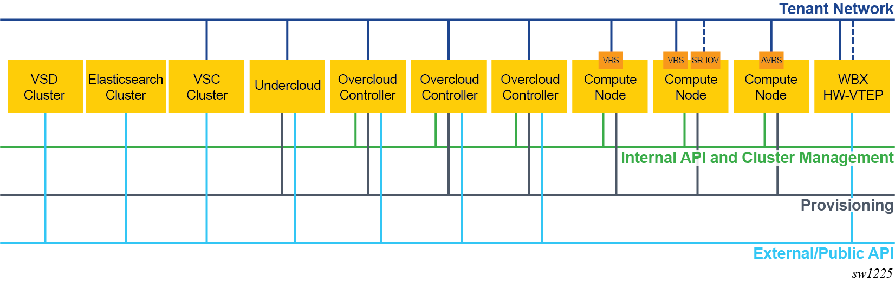
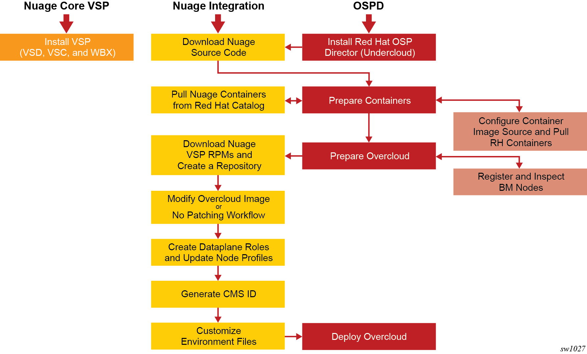

.. Don't use default python highlighting for code blocks http://www.sphinx-doc.org/en/stable/markup/code.html

========================================================================
Integrating Nuage VSP 20.10 with Red Hat OpenStack Platform Director 16
========================================================================

This document has the following topics:

.. contents::
   :local:
   :depth: 3

This document describes how the Nuage VSP integrates with Red Hat OpenStack Platform Director (OSPD).
The Nuage OpenStack plugins allow users to deploy flexible network configurations, including routers, subnets, and security groups along with other Nuage OpenStack extensions such as VSD-managed routers and subnets, which are shared between OpenStack and other cloud management systems.
For more information about the Nuage OpenStack ML2 driver, see the "Nuage Neutron ML2 Driver Guide."

This document has information about the requirements and recommended network topologies to deploy Red Hat OSP Director with Nuage VSP.
It describes the deployment workflow that includes downloading the required packages, setting up the Undercloud and Overcloud, and creating and configuring environment files and Heat templates for the deployment. It also provides sample environment files that you can modify for your deployment.

Red Hat OpenStack Platform Director
-----------------------------------

The Red Hat OpenStack Platform Director (OSPD) is a toolset for installing and managing an OpenStack environment. It is based primarily on the OpenStack TripleO project. It uses an OpenStack deployment, referred to as the Undercloud, to deploy an OpenStack cluster, referred to as an Overcloud.

The OpenStack Platform Director is an image-based installer. It uses a single image (for example, overcloud-full.qcow2) that is deployed on the Controller and Compute nodes belonging to the OpenStack cluster (Overcloud). This image contains all the packages needed during the deployment. The deployment creates only the configuration files and databases required by the different services and starts the services in the correct order. During a deployment, no new software is installed.

For integration of OpenStack Platform Director with the Nuage VSP, use the command-line based deployment option.

OpenStack Platform Director uses Heat to orchestrate the deployment of an OpenStack environment. The actual deployment is done through Heat templates and Puppet. Users provide any custom input in templates using the ``openstack overcloud deploy`` command. When this command is run, all the templates are parsed to create the Hiera database, and then a set of Puppet manifests, also referred to as TripleO Heat templates, are run to complete the deployment. The Puppet code in turn uses the Puppet modules developed to deploy different services of OpenStack (such as puppet-nova, puppet-neutron, and puppet-cinder).

The OpenStack Platform Director architecture allows partners to create custom templates. Partners create new templates to expose parameters specific to their modules.  These templates can then be passed through the ``openstack overcloud deploy`` command during the deployment. Changes to the Puppet manifests are required to handle the new values in the Hiera database and to act on them to deploy the partner software.

Requirements and Best Practices
---------------------------------

For Nuage Networks Virtualized Services Platform (VSP) (Virtualized Services Directory [VSD] and Virtualized Services Controller [VSC]) requirements and best practices, see the *VSP User Guide* for the deployment requirements. Before deploying OpenStack, the VSP components (VSD and VSC) should already be deployed.

For Red Hat OpenStack Platform Director 16.1 requirements and best practices, see the Red Hat upstream documentation:
https://access.redhat.com/documentation/en-us/red_hat_openstack_platform/16.1/html/director_installation_and_usage/

Recommended Topologies
-----------------------

The deployment topology and networking segmentation varies depending on the OpenStack end-to-end requirements and underlay topology. A typical OpenStack setup with Nuage integration has the following topology:

Workflow Overview of the Nuage VSP Integration with OpenStack Platform Director
--------------------------------------------------------------------------------

The workflow to integrate Nuage VSP with OpenStack Platform Director includes these phases:

* **Phase 0: Install the VSP Core Components**

  Before installing OSPD on the Undercloud, install and configure VSD and VSC. See `Recommended Topologies`_ for a typical OpenStack setup with Nuage integration.

  Depending on your deployment, you may also install and configure WBX as a leaf/spine switch for Data Center and Enterprise networks deployments. See the WBX documentation for more details.

* **Phase 1: Install Red Hat OpenStack Platform Director**

  In this phase, you install Director on the Undercloud system by following the process in the Red Hat documentation. RedHat recommends to install the latest RHEL 8 release, which may be different from the one that was used for validation by Nuage. The RHEL release and packages versions used for validation can be found in the release notes.

* **Phase 2: Prepare Nuage Repository and Containers**

  In this phase, you prepare Nuage Repository and Containers for the integration.

  - **Phase 2.1: Download the Nuage VSP RPMs and Create a Yum Repository**

    In this phase, you download the Nuage RPMs and create a repository for them.

  - **Phase 2.2: Install nuage-tripleo-heat-templates**

    In this phase, you will install nuage-tripleo-heat-templates package on Undercloud

    **Phase 2.3: Prepare Nuage Containers**

    In this phase, you prepare Nuage containers for the integration.

* **Phase 3: Prepare the Overcloud**

  In this phase, you follow procedures in this document and in the Red Hat documentation to do the basic configuration of the Overcloud.

  - **Phase 3.1: Register and Inspect the Bare Metal Nodes**

    Follow the procedures in the Red Hat documentation for registering and inspecting the hardware nodes in the "Configuring a Basic Overcloud using the CLI Tools" section and check the node status.

  - **Phase 3.2: Modify the Overcloud Image**

    Install nuage-image-patching-scripts package and run this script to patch the Overcloud image with required Nuage packages

    If you are using the *No Patching* process, skip this phase and follow the steps in the `Phase 3.3: No Patching Workflow`_

  - **Phase 3.3: No Patching Workflow**

    In this phase, follow the steps in this document to automatically install all the required Nuage packages on the Overcloud without running the script to patch the image.

  - **Phase 3.4: Create the Dataplane Roles and Update the Node Profiles**

    In this phase, you add the Nuage Heat templates and dataplane roles for the Nuage integration.
    Roles define which actions users can perform. For more information about the supported roles, go to `Phase 3: Prepare the Overcloud`_

  - **Phase 3.5: Generate a CMS ID for the OpenStack Deployment**

    The Cloud Management System (CMS) ID is created to identify a specific Compute or Controller node.

  - **Phase 3.6: Customize the Environment Files**

    In this phase, you modify the environment files for your deployment and assign roles (profiles) to the Compute and Controller nodes.
    The files are populated with the required parameters.
    Nuage provides Heat templates and environment files to configure Neutron on the Controller node and RPMs (such as nuage-openvswitch and nuage-metadata-agent) on Compute nodes.

* **Phase 4: Deploy Overcloud**

  In this phase, you use the ``openstack overcloud deploy`` command with different options to deploy the various use cases.

Deployment Workflow
---------------------

Phase 0: Install the VSP Core Components
~~~~~~~~~~~~~~~~~~~~~~~~~~~~~~~~~~~~~~~~~~

To install VSD and VSC, see the *VSP Install Guide* and the  *VSP User Guide* for the deployment requirements and procedures.

To install WBX, see the WBX documentation.

Phase 1: Install Red Hat OpenStack Platform Director
~~~~~~~~~~~~~~~~~~~~~~~~~~~~~~~~~~~~~~~~~~~~~~~~~~~~~

To prepare for the Nuage VSP integration, install Director on the Undercloud system by following the steps in the Red Hat documentation:

https://access.redhat.com/documentation/en-us/red_hat_openstack_platform/16.1/html/director_installation_and_usage/director_installation_and_configuration

Phase 2: Prepare Nuage Repository and Containers
~~~~~~~~~~~~~~~~~~~~~~~~~~~~~~~~~~~~~~~~~~~~~~~~

Phase 2.1: Download the Nuage VSP RPMs and Create a Yum Repository
++++++++++++++++++++++++++++++++++++++++++++++++++++++++++++++++++++

For Nuage VSP integrations, download all the required components and create a yum repository reachable from the Undercloud hypervisor or any other machine used to modify the Overcloud image (see `Phase 3.2: Modify the Overcloud Image`_).

The repository contents may change depending on the roles configured for your deployment.

::

   +----------------+------------------------------------------------+-------------------------------------------------------------------------------------------+
   | Group          | Packages                                       | Location (tar.gz or link)                                                                 |
   +================+================================================+===========================================================================================+
   |                | nuage-bgp                                      | nuage-vrs-el8 or nuage-avrs-el8                                                           |
   |                +------------------------------------------------+-------------------------------------------------------------------------------------------+
   | Nuage          | nuage-openstack-neutronclient                  | nuage-openstack                                                                           |
   | Common         +------------------------------------------------+-------------------------------------------------------------------------------------------+
   | Packages       | nuage-puppet-modules-16.1-20.10.2_42           | https://github.com/nuagenetworks/nuage-ospdirector/tree/OSPD16/nuage-rpms                 |
   |                +------------------------------------------------+-------------------------------------------------------------------------------------------+
   |                | nuage-metadata-agent                           | nuage-vrs-el8 or nuage-avrs-el8                                                           |
   |                +------------------------------------------------+-------------------------------------------------------------------------------------------+
   |                | python-openswitch-nuage                        | nuage-vrs-el8 or nuage-avrs-el8                                                           |
   |                +------------------------------------------------+-------------------------------------------------------------------------------------------+
   |                | nuage-openstack-neutron                        | nuage-openstack                                                                           |
   |                +------------------------------------------------+-------------------------------------------------------------------------------------------+
   |                | nuage-openstack-horizon                        | nuage-openstack                                                                           |
   |                +------------------------------------------------+-------------------------------------------------------------------------------------------+
   |                | nuage-openstack-heat                           | nuage-openstack                                                                           |
   +----------------+------------------------------------------------+-------------------------------------------------------------------------------------------+
   | Nuage OSP      | nuage-tripleo-heat-templates-16.1-20.10.2_377  | https://github.com/nuagenetworks/nuage-ospdirector/tree/OSPD16/nuage-rpms                 |
   | Director       +----------------------------------------------+---------------------------------------------------------------------------------------------+
   | Packages       | nuage-image-patching-scripts-16.1-20.10.2_377  | https://github.com/nuagenetworks/nuage-ospdirector/tree/OSPD16/nuage-rpms                 |
   +----------------+------------------------------------------------+-------------------------------------------------------------------------------------------+
   | Nuage VRS      | nuage-openvswitch                              | nuage-vrs-el8                                                                             |
   | Packages       +------------------------------------------------+-------------------------------------------------------------------------------------------+
   |                | selinux-policy-nuage                           | nuage-selinux                                                                             |
   +----------------+------------------------------------------------+-------------------------------------------------------------------------------------------+
   | Nuage SR-IOV   | nuage-topology-collector (for Nuage SR-IOV)    | https://github.com/nuagenetworks/topology-collector/releases/tag/release-20.10.2          |
   | packages       |                                                |                                                                                           |
   |----------------+------------------------------------------------+-------------------------------------------------------------------------------------------+
   |                | 6windgate-dpdk                                 | nuage-avrs-el8                                                                            |
   |                +------------------------------------------------+-------------------------------------------------------------------------------------------+
   | Accelerated    | 6windgate-dpdk-pmd-mellanox-rdma-core          | nuage-avrs-el8                                                                            |
   | VRS (AVRS)     +------------------------------------------------+-------------------------------------------------------------------------------------------+
   | 6WIND          | 6windgate-dpdk-pmd-virtio-host                 | nuage-avrs-el8                                                                            |
   | Packages       +------------------------------------------------+-------------------------------------------------------------------------------------------+
   |                | 6windgate-dpdk-crypto-base                     | nuage-avrs-el8                                                                            |
   |                +------------------------------------------------+-------------------------------------------------------------------------------------------+
   |                | 6windgate-dpdk-crypto-intel-ipsec-mb           | nuage-avrs-el8                                                                            |
   |                +------------------------------------------------+-------------------------------------------------------------------------------------------+
   |                | 6windgate-dpdk-crypto-intel-mb                 | nuage-avrs-el8                                                                            |
   |                +------------------------------------------------+-------------------------------------------------------------------------------------------+
   |                | 6windgate-fp-ovs                               | nuage-avrs-el8                                                                            |
   |                +------------------------------------------------+-------------------------------------------------------------------------------------------+
   |                | 6windgate-fp                                   | nuage-avrs-el8                                                                            |
   |                +------------------------------------------------+-------------------------------------------------------------------------------------------+
   |                | 6windgate-fpn-sdk-dpdk                         | nuage-avrs-el8                                                                            |
   |                +------------------------------------------------+-------------------------------------------------------------------------------------------+
   |                | 6windgate-linux-fp-sync                        | nuage-avrs-el8                                                                            |
   |                +------------------------------------------------+-------------------------------------------------------------------------------------------+
   |                | 6windgate-linux-fp-sync-fptun                  | nuage-avrs-el8                                                                            |
   |                +------------------------------------------------+-------------------------------------------------------------------------------------------+
   |                | 6windgate-linux-fp-sync-ovs                    | nuage-avrs-el8                                                                            |
   |                +------------------------------------------------+-------------------------------------------------------------------------------------------+
   |                | 6windgate-linux-fp-sync-vrf                    | nuage-avrs-el8                                                                            |
   |                +------------------------------------------------+-------------------------------------------------------------------------------------------+
   |                | 6windgate-product-base                         | nuage-avrs-el8                                                                            |
   |                +------------------------------------------------+-------------------------------------------------------------------------------------------+
   |                | 6windgate-tools-common-libs-daemonctl          | nuage-avrs-el8                                                                            |
   |                +------------------------------------------------+-------------------------------------------------------------------------------------------+
   |                | 6windgate-tools-common-libs-libconsole         | nuage-avrs-el8                                                                            |
   |                +------------------------------------------------+-------------------------------------------------------------------------------------------+
   |                | 6windgate-tools-common-libs-libvrf             | nuage-avrs-el8                                                                            |
   |                +------------------------------------------------+-------------------------------------------------------------------------------------------+
   |                | 6windgate-licensing                            | nuage-avrs-el8                                                                            |
   |                +------------------------------------------------+-------------------------------------------------------------------------------------------+
   |                | 6windgate-mgmt-base-vrl                        | nuage-avrs-el8                                                                            |
   |                +------------------------------------------------+-------------------------------------------------------------------------------------------+
   |                | iptables-libs                                  | nuage-avrs-el8                                                                            |
   |                +------------------------------------------------+-------------------------------------------------------------------------------------------+
   |                | iptables-1.8.4-6windgate                       | nuage-avrs-el8                                                                            |
   |                +------------------------------------------------+-------------------------------------------------------------------------------------------+
   |                | iptables-services                              | nuage-avrs-el8                                                                            |
   |                +------------------------------------------------+-------------------------------------------------------------------------------------------+
   |                | iptables-utils                                 | nuage-avrs-el8                                                                            |
   |                +------------------------------------------------+-------------------------------------------------------------------------------------------+
   |                | ebtables-2.0.11-6windgate                      | nuage-avrs-el8                                                                            |
   |                +------------------------------------------------+-------------------------------------------------------------------------------------------+
   |                | nuage-openvswitch-6wind                        | nuage-avrs-el8                                                                            |
   |                +------------------------------------------------+-------------------------------------------------------------------------------------------+
   |                | virtual-accelerator-base                       | nuage-avrs-el8                                                                            |
   |                +------------------------------------------------+-------------------------------------------------------------------------------------------+
   |                | python3-pyelftools                             | nuage-avrs-el8                                                                        |
   |                +------------------------------------------------+-------------------------------------------------------------------------------------------+
   |                | selinux-policy-nuage-avrs                      | nuage-avrs-selinux                                                                        |
   +----------------+------------------------------------------------+-------------------------------------------------------------------------------------------+

Phase 2.2: Install nuage-tripleo-heat-templates
+++++++++++++++++++++++++++++++++++++++++++++++

In this phase, you will enable Nuage repository on Undercloud and install nuage-tripleo-heat-templates

1. Enable Nuage repository that is created in Phase 2.1 on Undercloud machine.

2. Install nuage-tripleo-heat-templates package by using

::

    $ sudo yum install -y nuage-tripleo-heat-templates

3. Copy nuage-tripleo-heat-templates to /home/stack before customizing environment files

::

    $ cp -r /usr/share/nuage-tripleo-heat-templates /home/stack/

Phase 2.3: Prepare Nuage Containers
+++++++++++++++++++++++++++++++++++

In this phase, you prepare Nuage containers for the integration.

1. Add the below contents to /home/stack/containers-prepare-parameter.yaml. A complete file can be found in `Sample Environment Files`_.

::

      ContainerImageRegistryCredentials:
        <Truncated output>
        registry.connect.redhat.com:
          <username>: "<pwd>"

      ContainerImagePrepare:
        <Truncated output>
          excludes:
           - horizon
           - heat-engine
           - heat-api-cfn
           - neutron-server
           - heat-api

        - push_destination: true
          set:
            name_prefix: "rhosp16-openstack-"
            name_suffix: "-20-10-2"
            namespace: registry.connect.redhat.com/nuagenetworks
            neutron_driver: null
            rhel_containers: false
            tag: 'latest'
          includes:
            - horizon
            - heat-engine
            - heat-api-cfn
            - neutron-server
            - heat-api

.. Note:: If during overcloud deploy image prepare, it tries to pull "nuagenetworks/rhosp16-openstack-neutron-server-ovn-20-10-2" ("-ovn" was added to the name by overcloud deploy) please add below overwrites
   (https://bugzilla.redhat.com/show_bug.cgi?id=1844239):

::

    parameter_defaults:
      ContainerNeutronApiImage: undercloud.ctlplane.localdomain:8787/nuagenetworks/rhosp16-openstack-neutron-server-20-10-2:latest
      ContainerNeutronConfigImage: undercloud.ctlplane.localdomain:8787/nuagenetworks/rhosp16-openstack-neutron-server-20-10-2:latest

Phase 2.4: Pull AVRS Containers from the Red Hat Catalog (This step is only necessary for AVRS deployments.)
++++++++++++++++++++++++++++++++++++++++++++++++++++++++++++++++++++++++++++++++++++++

In this phase, you pull the AVRS containers for the integration.

Nuage provides the customized OpenStack containers with Nuage plugins and extensions. The container names change from release to release. This is a sample from Release 20.10.2 with 16.1-2 as an example (this version may change):

* registry.connect.redhat.com/nuagenetworks/rhosp16-openstack-nova-compute-20-10-2:16.1-2
* registry.connect.redhat.com/nuagenetworks/rhosp16-openstack-neutron-openvswitch-agent-20-10-2:16.1-2

For the list of containers against which the Nuage integration was tested, see the `Release Notes <https://github.com/nuagenetworks/nuage-ospdirector/releases>`_ for this release.

The Nuage containers are now available in the Red Hat Partner Container Catalog. To get the Nuage containers, follow these instructions to connect to a registry remotely:

1. On the Undercloud, use the following instructions to get Nuage images from a Red Hat container registry using registry service account tokens.

   Make sure to `create a registry service account <https://access.redhat.com/terms-based-registry>`_ before completing this step.

::

    $ sudo podman login registry.connect.redhat.com
    Username: ${REGISTRY-SERVICE-ACCOUNT-USERNAME}
    Password: ${REGISTRY-SERVICE-ACCOUNT-PASSWORD}
    Login Succeeded!

2. Change the working directory to `/home/stack/nuage-tripleo-heat-templates/scripts/pull_nuage_containers/`.

::

    $ cd /home/stack/nuage-tripleo-heat-templates/scripts/pull_nuage_containers/

3. Configure `nuage_container_config.yaml` with appropriate values. See the following example.

::

    #OpenStack version number
    version: 16
    #Nuage Release and format is <Major-release, use '-' instead of '.'>-<Minor-release>-<Updated-release>
    # for example: Nuage release 20.10.2 please enter following
    release: 20-10-2
    #Tag for AVRS container images
    tag: latest
    # Undercloud Local Registry IP Address:Port <hostname>.ctlplane.localdomain:8787
    local_registry: undercloud.ctlplane.localdomain:8787
    #List of AVRS containers
    nuage_images: ['nova-compute', 'neutron-openvswitch-agent']

4. Run the `nuage_container_pull.py` script by passing `nuage_container_config.yaml` to the ``--nuage-config`` argument.

   This command does the following actions:

      a. Pull AVRS container images from Red Hat Registry.

      b. Retag the AVRS container images, by modifying the registry to point to the local registry.

      c. Push the retagged AVRS container images to the local registry.

      d. Remove the container images that got created in Step 1 and Step 2 in this phase from the Undercloud machine.

   After running `nuage_container_pull.py`, the `nuage_overcloud_images.yaml` file is created in the `/home/stack/nuage-tripleo-heat-templates/environments` directory.

      ::

          $ sudo python3 nuage_container_pull.py --nuage-config nuage_container_config.yaml

   This example shows how nuage_overcloud_images.yaml should be used when deploying overcloud:

     ::

         openstack overcloud deploy --templates -e /home/stack/containers-prepare-parameter.yaml -e /home/stack/nuage-tripleo-heat-templates/environments/nuage_overcloud_images.yaml - e <remaining environment files>

.. Note:: The `/home/stack/templates/overcloud_images.yaml` file should take precedence over this file.

Phase 3: Prepare the Overcloud
~~~~~~~~~~~~~~~~~~~~~~~~~~~~~~~~~~~~

In this phase, you perform the basic configuration of the Overcloud.

The process includes modifying the Overload image and environment file, creating the dataplane roles and updating node profiles, and assigning the roles to a Compute or Controller node.

**Role**: A role is a personality assigned to a node where a specific set of operations is allowed.
For more information about roles, see the Red Hat OpenStack documentation:

   * https://access.redhat.com/documentation/en-us/red_hat_openstack_platform/16.1/html/director_installation_and_usage/planning-your-overcloud

   * https://access.redhat.com/documentation/en-us/red_hat_openstack_platform/16.1/html/advanced_overcloud_customization/chap-roles#sect-Creating_a_Custom_Roles_File

You only need to configure the roles for your deployment and assign the roles to the appropriate nodes. For example, the network topology diagram in `Workflow Overview of the Nuage VSP Integration with OpenStack Platform Director`_ shows that each Compute node has different roles:

   * Compute node with VRS only
   * Compute node with VRS and SR-IOV
   * Compute node with AVRS only
   * Compute node with OVRS only

Phase 3.1: Register and Inspect the Bare Metal Nodes
+++++++++++++++++++++++++++++++++++++++++++++++++++++++

In the Red Hat OpenStack Platform Director documentation, follow the steps using the CLI *up to where* the ``openstack overcloud deploy`` command is run:

https://access.redhat.com/documentation/en-us/red_hat_openstack_platform/16.1/html/director_installation_and_usage/creating-a-basic-overcloud-with-cli-tools

To verify the Ironic node status, follow these steps:

1. Check the bare metal node status.

   The results should show the *Provisioning State* status as *available* and the *Maintenance* status as *False*.

::

    openstack baremetal node list

2. If profiles are being set for a specific placement in the deployment, check the Overcloud profile status.

   The results should show the *Provisioning State* status as *available* and the *Current Profile* status as *control* or *compute*.

::

    openstack overcloud profiles list

Phase 3.2: Modify the Overcloud Image
++++++++++++++++++++++++++++++++++++++++

In this phase, you modify the overcloud-full.qcow2 image with the required Nuage packages.

When using the *No Patching* feature, skip this phase and follow the instructions in `Phase 3.3: No Patching Workflow`_

Follow these steps to modify the the Overcloud qcow image (overcloud-full.qcow2):

.. Note:: Please use rhel8 machine for image patching and do not run this on Undercloud Director (https://bugs.launchpad.net/tripleo/+bug/1823226)

1. Install the required packages: libguestfs-tools and python-yaml

::

    yum install -y libguestfs-tools python3-pyyaml

2. Enable Nuage repository that is created in Phase 2.1 on this machine and install nuage-image-patching-scripts package using

::

    yum install -y nuage-image-patching-scripts

3. Copy *overcloud-full.qcow2* from /home/stack/images/ on the Undercloud director to /root/ location and make a backup of *overcloud-full.qcow2*.

::

    cp overcloud-full.qcow2 overcloud-full-bk.qcow2

4. This script takes in *nuage_patching_config.yaml* as input parameters. A sample can be found in /etc/nuage-image-patching/nuage_patching_config.yaml, copy this to /root/.

::

    cp /etc/nuage-image-patching/nuage_patching_config.yaml /root/

5. You need to configure the following parameters:

   * ImageName (required) is the name and absolute path of the qcow2 image (for example, /root/overcloud-full.qcow2).
   * DeploymentType (required) is for type of deployment specifed by the user. Select *vrs* or *avrs*.

     - For any combination of VRS, OVRS and SR-IOV deployments, specify the deployment type as ["vrs"].
     - For any combination of AVRS, OVRS, VRS and SR-IOV, specify the deployment type as ["avrs"].

   * RhelUserName (optional) is the user name for the Red Hat Enterprise Linux (RHEL) subscription.
   * RhelPassword (optional) is the password for the Red Hat Enterprise Linux subscription.
   * RhelPool (optional) is the Red Hat Enterprise Linux pool to which the base packages are subscribed. If deployment type is AVRS, than this should be a pool id with access to OpenStack 16.x RPM's repository
   * RhelSatUrl (optional) is the URL for the Red Hat Satellite server.
   * RhelSatOrg (optional) is the organization for the Red Hat Satellite server.
   * RhelSatActKey (optional) is the activation key for the Red Hat Satellite server.

     .. Note:: If Nuage packages are available using the activation key parameter, *RepoFile* becomes optional.

   * RpmPublicKey (optional) is where you pass all the file paths of the GPG key that you want to add to your Overcloud images before deploying the required packages for your deployment.

     .. Note::

        * Any Nuage package signing keys are delivered with other Nuage artifacts.  See ``nuage-package-signing-keys-*.tar.gz``.

   * RepoFile (usually required but optional for Red Hat Satellite) is the name and absolute path of the repository hosting the RPMs required for patching.

     - If Nuage packages are available using the activation key of a Red Hat Satellite server, *RepoFile* becomes optional.
     - RepoFile can contain only a single Nuage repository with the required Nuage packages and can also have extra repositories with non-Nuage packages.

   * logFileName is used to pass log filename.

   For examples of nuage.repo and nuage_patching_config.yaml, go to `Nuage Patching Configuration`_.

6. Run the following command that provides the parameter values to start the image patching workflow:

::

    cd /root/
    nuage-image-patching --nuage-config nuage_patching_config.yaml

.. Note:: If the image patching fails, remove the partially patched overcloud-full.qcow2 and create a copy of it from the backup image before retrying the image patching workflow.

    ::

        rm overcloud-full.qcow2
        cp overcloud-full-bk.qcow2 overcloud-full.qcow2

7. Verify that the *machine-id* is clear in the Overcloud image. The result should be empty output.

::

    guestfish -a overcloud-full.qcow2 run : mount /dev/sda / : cat /etc/machine-id

8. Copy the patched image back to /home/stack/images/ on the Undercloud and upload it to Glance.

   a. Check that the current images are uploaded:

        ::

            [stack@director ~]$ source ~/stackrc
            (undercloud) [stack@director ~]$ openstack image list

   b. If the ``openstack image list`` command returns null, run the following command to upload all images in /home/stack/images/ to Glance.

        ::

            [stack@director images]$ openstack overcloud image upload --image-path /home/stack/images/

   c. If the ``openstack image list`` command returns the output similar to this:

        ::

            +--------------------------------------+---------------------------------+--------+
            | ID                                   | Name                            | Status |
            +--------------------------------------+---------------------------------+--------+
            | 90cec28e-9609-4d2e-b87b-030804a99090 | overcloud-full                  | active |
            | 4c3dad99-1463-4391-9663-9b8074f714f1 | overcloud-full-initrd           | active |
            | 66e3ba1e-d080-4199-8ad6-2e54439c8d11 | overcloud-full-vmlinuz          | active |
            +--------------------------------------+---------------------------------+--------+

      Run the following commands to update the images to Glance:

        ::

            (undercloud) [stack@director images]$ openstack overcloud image upload --update-existing --image-path /home/stack/images/
            (undercloud) [stack@director images]$ openstack overcloud node configure $(openstack baremetal node list -c UUID -f value)

Phase 3.3: No Patching Workflow
++++++++++++++++++++++++++++++++

The *No Patching* feature installs all the required Nuage packages on Overcloud nodes during the Overcloud deployment, instead of patching the Overcloud image.

Follow these instructions:

1. Make sure that the following servers are available:

    a. Red Hat Satellite Server with an activation_key that has both the Red Hat and Nuage repositories enabled by default.
    b. HTTP(S) server hosting the required Nuage GPGKeys.

2. Set NuageGpgKeys to the location where Nuage GPGKeys are hosted inside nuage-tripleo-heat-temaplates/environment/nova-nuage-config.yaml

   For example, if you have Nuage GPGKeys Nuage-RPM-GPG-Key1 Nuage-RPM-GPG-Key2 hosted in the 1.2.3.4 HTTP server, set NuageGpgKeys as follows:

   ::

        NuageGpgKeys: ['http://1.2.3.4/Nuage-RPM-GPG-Key1', 'http://1.2.3.4/Nuage-RPM-GPG-Key2']

3. Follow the instructions in the  Red Hat documentation for `Registering to Red Hat Satellite Server <https://access.redhat.com/documentation/en-us/red_hat_openstack_platform/16.1/html/advanced_overcloud_customization/ansible-based-registration#registering-the-overcloud-to-red-hat-satellite>`_

Phase 3.4: Create the Dataplane Roles and Update the Node Profiles
+++++++++++++++++++++++++++++++++++++++++++++++++++++++++++++++++++

In this phase, you add the Nuage Heat templates and dataplane roles for the Nuage integration.

1. Copy the roles from `/usr/share/openstack-tripleo-heat-templates/roles` to `/home/stack/nuage-tripleo-heat-templates/roles`.

    ::

        cp /usr/share/openstack-tripleo-heat-templates/roles/* /home/stack/nuage-tripleo-heat-templates/roles/

2. Create the ComputeAvrs, ComputeOvrs, ComputeAvrsSingle and ComputeAvrsDual Nuage Compute roles, by following command:

   ::

        cd /home/stack/nuage-tripleo-heat-templates/scripts/create_roles
        ./create_all_roles.sh

3. Create a *nuage_roles_data.yaml* file with all the required roles for the current Overcloud deployment.

   This example shows how to create *nuage_roles_data.yaml* with a Controller and Compute nodes for VRS, AVRS and SR-IOV. The respective roles are specified in the same order. The following example has the respective role names mentioned in the same order.

::

    Syntax:
    openstack overcloud roles generate --roles-path /home/stack/nuage-tripleo-heat-templates/roles -o /home/stack/nuage-tripleo-heat-templates/templates/nuage_roles_data.yaml Controller Compute <role> <role> ...

    Example:
    openstack overcloud roles generate --roles-path /home/stack/nuage-tripleo-heat-templates/roles -o /home/stack/nuage-tripleo-heat-templates/templates/nuage_roles_data.yaml Controller Compute ComputeAvrs ComputeOvrs ComputeSriov

.. Note:: Only specify the required roles for your deployment. The error `Property ContainerNovaComputeAvrsImage not assigned` will be thrown when including the AVRS role in this step without having AVRS in your deployment.

4. Create ``node-info.yaml`` in /home/stack/templates/ and specify the roles and number of nodes.

  This example shows how to create a *node-info.yaml* file for deployment with three Controller, two Compute, two ComputeAvrs, two ComputeOvrs, and two ComputeSriov roles:

::

    Syntax:

    parameter_defaults:
      Overcloud<Role Name>Flavor: <flavor name>
      <Role Name>Count: <number of nodes for this role>

    Example:

    parameter_defaults:
      OvercloudControllerFlavor: control
      ControllerCount: 3
      OvercloudComputeFlavor: compute
      ComputeCount: 2
      OvercloudComputeAvrsFlavor: computeavrs
      ComputeAvrsCount: 2
      OvercloudComputeOvrsFlavor: computeovrs
      ComputeOvrsCount: 2
      OvercloudComputeSriovFlavor: computesriov
      ComputeSriovCount: 2

.. Note:: It is not mandatory to provide node info for all the roles shown in the example. You can specify the node information only for the required roles.

Phase 3.5: Generate a CMS ID for the OpenStack Deployment
++++++++++++++++++++++++++++++++++++++++++++++++++++++++++

The Cloud Management System (CMS) ID is used to identify a specific Compute or Controller node.

In this phase, you generate the CMS ID used to configure your OpenStack deployment with the VSD deployment.

1. Go to `Generate CMS ID <../../nuage-tripleo-heat-templates/scripts/generate-cms-id>`_ for the files and script to generate the CMS ID, and follow the instructions in the README.md file.

   The CMS ID is displayed in the output, and a copy of it is stored in a file called cms_id.txt in the same folder.

2. Add the CMS ID to the /home/stack/nuage-tripleo-heat-templates/environments/neutron-nuage-config.yaml template file for the ``NeutronNuageCMSId`` parameter.

Phase 3.6: Customize the Environment Files
+++++++++++++++++++++++++++++++++++++++++++

In this phase, you create and customize environment files and tag nodes for specific profiles. These profile tags match your nodes to flavors, which assign the flavors to deployment roles.

For more information about the parameters in the environment files, go to `Parameters in Environment Files`_.

For sample environment files, go to `Sample Environment Files`_.

1. Go to `/home/stack/nuage-tripleo-heat-templates/environments/` on the Undercloud machine.

2. Customize these environment files, and add required values, such as CMS ID, and other parameters.

    * neutron-nuage-config.yaml - Add the generated ``cms_id`` to the ``NeutronNuageCMSId`` parameter.
    * nova-nuage-config.yaml

   Go to `Parameters in Environment Files`_ for details about the required parameters.

3. Assign roles to the Compute and Controller nodes, as described in the following steps.

   This is the mapping of the Nuage OpenvSwitch packages to role names:

::

   +----------------+----------------------------------------------------+
   | Dataplane      | Role Name                                          |
   +================+====================================================+
   | VRS            | Compute                                            |
   |----------------+----------------------------------------------------+
   | AVRS           | ComputeAvrs, ComputeAvrsSingle, or ComputeAvrsDual |
   +----------------+----------------------------------------------------+
   | OVRS           | ComputeOvrs                                        |
   |----------------+----------------------------------------------------+
   | SR-IOV         | ComputeSriov                                       |
   +----------------+----------------------------------------------------+

Nuage Controller Role (Controller)
''''''''''''''''''''''''''''''''''''

      For a Controller node, assign the Controller role to each of the Controller nodes:

::

   openstack baremetal node set --property capabilities='profile:control,boot_option:local' <node-uuid>

VRS Compute Role (Compute)
'''''''''''''''''''''''''''

    For a VRS Compute node, assign the appropriate profile:

::

    openstack baremetal node set --property capabilities='profile:compute,boot_option:local' <node-uuid>

Single AVRS Role (ComputeAvrs)
''''''''''''''''''''''''''''''

    AVRS runs inside the hypervisor and removes performance bottlenecks by offloading virtual switching from the networking stack. For more information about AVRS, go to the *VSP User Guide*.

    For ComputeAvrs Integration, perform the following steps:

    1. Create a flavor and profile:

    ::

        openstack flavor create --id auto --ram 4096 --disk 40 --vcpus 1 computeavrs
        openstack flavor set --property "cpu_arch"="x86_64" --property "capabilities:boot_option"="local" --property "capabilities:profile"="computeavrs" --property resources:CUSTOM_BAREMETAL='1' --property resources:DISK_GB='0' --property resources:MEMORY_MB='0' --property resources:VCPU='0' computeavrs

    2. Set the profile on the AVRS nodes:

    ::

         openstack baremetal node set --property capabilities='profile:computeavrs,boot_option:local' <node-uuid>

    3. Modify the AVRS environment file in `/home/stack/nuage-tripleo-heat-templates/environments/compute-avrs-environment`.yaml.

       You can also create a new AVRS role similar to the upstream Compute role.

       The following examples show the settings in the Sample Environment Files. The parameter values can be customized for your deployment. Contact Nuage for the recommended values for these parameters.

       a. For AVRS deployment, Virtual Accelerator requires information including which logical cores run the fast path, list of ports enabled in the fast path, additional fast path options, and so on to be set in `/etc/fast-path.env`.

          Some parameters in ``fast-path.env`` need to be configured in the Heat templates. Use the ``compute-avrs-environment.yaml`` environment file to configure them. Go to `Sample Environment Files`_ for probable values in ``compute-avrs-environment.yaml``.

          Go to `Parameters Required for Nuage AVRS`_ for the mapping between parameters in the environment files to the parameters in `fast-path.env`.

       b. Virtual Accelerator requires that the NeutronFastpathOptVolumes parameters be set in `nova.conf`. This example shows how to configure them.

       ::

           parameter_defaults:
             NeutronFastpathOptVolumes:
               - /run/fp_rpcd:/run/fp_rpcd

       c. Virtual Accelerator requires hugepages to be configured. This example shows how to configure hugepages and enable VT-d.

       ::

            KernelArgs: "default_hugepagesz=1G hugepagesz=1G hugepages=64 iommu=pt intel_iommu=on isolcpus=1-7"

       .. Note::

            You can set GpgCheck to ``no`` in environment files if you want to disable GPG Check while installing packages on the AVRS node.

       d. For IsolatedCPU or CPUAffinity to be respected, CPUSET_ENABLE needs to be set to 0. This does not need to be explicitly set because CPUSET_ENABLE is set to 0 by default in the templates.

          Go to `Parameters Required for Nuage AVRS`_ for the mapping between parameters in the environment files to the parameters in `cpuset.env`.

Multiple AVRS Roles (ComputeAvrsSingle and ComputeAvrsDual)
'''''''''''''''''''''''''''''''''''''''''''''''''''''''''''''

    AVRS runs inside the hypervisor and removes performance bottlenecks by offloading virtual switching from the networking stack. For more information about AVRS, go to the *VSP User Guide*.

    When a single AVRS role is created, users are required to have same set of nodes in their environment because the AVRS Computes all get the same configuration.

    When multiple roles are created, each role can pass a different configuration to specific AVRS Compute nodes. Users can have a pool of servers that require same configuration and assign them the same role.

    For example, 10 nodes are being deployed. Six nodes are identical, and the remaining 4 nodes are identical.
    You can assign the first six nodes to the ComputeAvrsSingle role and the remaining four nodes to the ComputeAvrsDual role. The configurations for ComputeAvrsSingle role do not overlap with ComputeAvrsDual.

    For ComputeAvrsSingle and ComputeAvrsDual integration, perform the following steps:

    1. Create a flavor and profile:

    ::

       openstack flavor create --id auto --ram 4096 --disk 40 --vcpus 1 computeavrssingle
       openstack flavor set --property "cpu_arch"="x86_64" --property "capabilities:boot_option"="local" --property "capabilities:profile"="computeavrssingle" --property resources:CUSTOM_BAREMETAL='1' --property resources:DISK_GB='0' --property resources:MEMORY_MB='0' --property resources:VCPU='0' computeavrssingle

       openstack flavor create --id auto --ram 4096 --disk 40 --vcpus 1 computeavrsdual
       openstack flavor set --property "cpu_arch"="x86_64" --property "capabilities:boot_option"="local" --property "capabilities:profile"="computeavrsdual" --property resources:CUSTOM_BAREMETAL='1' --property resources:DISK_GB='0' --property resources:MEMORY_MB='0' --property resources:VCPU='0' computeavrsdual

    2. Set the profile on the AVRS nodes:

    ::

        openstack baremetal node set --property capabilities='profile:computeavrssingle,boot_option:local' <node-uuid>
        openstack baremetal node set --property capabilities='profile:computeavrsdual,boot_option:local' <node-uuid>

    3. Modify the AVRS environment file in the `/home/stack/nuage-tripleo-heat-templates/environments/compute-avrs-multirole-environment.yaml`.

       For an example of an environment file with multiple AVRS roles, see a `sample file <../../nuage-tripleo-heat-templates/environments/compute-avrs-multirole-environment.yaml>`_.

       The following examples for the AVRS deployment show the Sample Environment Files. The parameter values can be customized for your deployment. Contact Nuage for the recommended values for these parameters.

       a. Virtual Accelerator requires information including which logical cores run the fast path, list of ports enabled in the fast path, additional fast path options, and so on to be set in `/etc/fast-path.env`.

          Go to `Parameters Required for Nuage AVRS`_ for the mapping between parameters in the environment files to the parameters in `fast-path.env`.

       b. Virtual Accelerator requires that the NeutronFastpathOptVolumes parameters be set in `nova.conf`. This example shows how to configure them.

       ::

           parameter_defaults:
             NeutronFastpathOptVolumes:
               - /run/fp_rpcd:/run/fp_rpcd

       c. Virtual Accelerator requires hugepages to be configured. This shows how to configure hugepages and enable VT-d.

       ::

           KernelArgs: "default_hugepagesz=1G hugepagesz=1G hugepages=64 iommu=pt intel_iommu=on isolcpus=1-7"

       .. Note::

          You also can set GpgCheck to ``no`` in environment files if you want to disable GPG Check while installing packages on the AVRS node.

       d. For IsolatedCPU or CPUAffinity to be respected, CPUSET_ENABLE needs to be set to 0. This does not need to be set explicitly because CPUSET_ENABLE is set to 0 by default in the templates.

          Go to `Parameters Required for Nuage AVRS`_ for the mapping between parameters in the environment files to the parameters in `cpuset.env`.

Offload VRS Role (ComputeOvrs)
'''''''''''''''''''''''''''''''''

    OVRS improves performance by offloading the vSwitch or vRouter to a hardware `eswitch` on the NICs in some NFVi deployments. This feature provides higher performance in NFVi deployments that are I/O heavy. For more information about OVRS, go to the *VSP User Guide*.

    To enable Offload VRS (OVRS) with Mellanox ConnectX-5 NICs, perform the following steps:

    1. Create a flavor and profile for ComputeOvrs:

       Refer to https://access.redhat.com/documentation/en-us/red_hat_openstack_platform/16.1/html/director_installation_and_usage/creating-a-basic-overcloud-with-cli-tools#tagging-nodes-into-profiles for the detailed steps.

    ::

        openstack flavor create --id auto --ram 4096 --disk 40 --vcpus 1 computeovrs
        openstack flavor set --property "cpu_arch"="x86_64" --property "capabilities:boot_option"="local" --property "capabilities:profile"="computeovrs" computeovrs

    2. Assign OVRS Compute nodes with the appropriate profiles:

    ::

       openstack baremetal node set --property capabilities='profile:computeovrs,boot_option:local' <node-uuid>

    3. As part of the Overcloud deployment, the Mellanox firstboot template ``/home/stack/nuage-tripleo-heat-templates/firstboot/mellanox_fw_update.yaml`` updates firmware on the Mellanox ConnectX-5 NIC interface.

       Create a firmware (FW) folder for all the Mellanox Firmware bin files on a machine on which the httpd server is running. You can use the Undercloud to do this.

    ::

        $ mkdir -p /var/www/html/FW_<VERSION>

    4. Download and place all the Mellanox Firmware bins to the folder created in the previous step and set ``BIN_DIR_URL`` in ``/home/stack/nuage-tripleo-heat-templates/environments/mellanox-environment.yaml`` to the above URL.

       For an example, go to `Sample Environment Files`_.

SR-IOV Role (ComputeSriov)
'''''''''''''''''''''''''''

Nuage supports the Virtual Routing and Switching (VRS) role (Compute) and the Single Root I/O Virtualization (SR-IOV) role (ComputeSriov).
The Nuage plugin supports Single Root I/O Virtualization (SR-IOV)-attached VMs (https://wiki.openstack.org/wiki/SR-IOV-Passthrough-For-Networking) with VSP-managed VMs on the same KVM hypervisor cluster.
For more information, go to the "VSP OpenStack ML2 Driver Guide*.

    To enable SR-IOV, perform the following steps:

    1. Create a flavor and profile for ComputeSriov:

       Refer to https://access.redhat.com/documentation/en-us/red_hat_openstack_platform/16.1/html/director_installation_and_usage/creating-a-basic-overcloud-with-cli-tools

    ::

        openstack flavor create --id auto --ram 4096 --disk 40 --vcpus 1 computesriov
        openstack flavor set --property "cpu_arch"="x86_64" --property "capabilities:boot_option"="local" --property "capabilities:profile"="computesriov" --property resources:CUSTOM_BAREMETAL='1' --property resources:DISK_GB='0' --property resources:MEMORY_MB='0' --property resources:VCPU='0' computesriov

    2. Assign SR-IOV nodes with the appropriate ComputeSriov profile:

    ::

        openstack baremetal node set --property capabilities='profile:computesriov,boot_option:local' <node-uuid>

    3. To deploy the Overcloud, additional parameters and template files are required.

       * Include the following parameter values in the Heat template *neutron-nuage-config.yaml*:

         ::

             NeutronServicePlugins: 'NuagePortAttributes,NuageAPI,NuageL3,trunk,NuageNetTopology'
             NeutronTypeDrivers: "vlan,vxlan,flat"
             NeutronMechanismDrivers: ['nuage','nuage_sriov','sriovnicswitch']
             NeutronFlatNetworks: '*'
             NeutronTunnelIdRanges: "1:1000"
             NeutronNetworkVLANRanges: "physnet1:2:100,physnet2:2:100"
             NeutronVniRanges: "1001:2000"

       * Include  the *neutron-sriov.yaml* file in the Overcloud deployment command. For an example, go to `Sample Environment Files`_.

         For more information, refer to the `CONFIGURING SR-IOV <https://access.redhat.com/documentation/en-us/red_hat_openstack_platform/16.1/html/network_functions_virtualization_planning_and_configuration_guide/part-sriov-nfv-configuration#sect-configuring-sriov>`_ section from Red Hat.

       .. Note:: Make sure that the physical network mappings parameters in neutron-nuage-config.yaml and neutron-sriov.yaml match with your hardware profile. To check interface information for your inspected nodes, run ``openstack baremetal introspection interface list [node uuid]``.

Network Isolation
''''''''''''''''''

   The Nuage plugin supports Network Isolation on the Overcloud nodes. It provides fully distributed L2 and L3 networking, including L2 and L3 network isolation, without requiring centralized routing instances such as the Neutron L3 agent.

   **Linux Bonding with VLANs**

    The plugin uses the default Linux bridge and Linux bonding. Go to https://access.redhat.com/documentation/en-us/red_hat_openstack_platform/16.1/html/advanced_overcloud_customization/overcloud-network-interface-bonding for more information about Linux bonding on OpenStack.

    To deploy the Overcloud Controller and ComputeSriov, Nuage provides `bond-with-vlans network templates <../../nuage-tripleo-heat-templates/network/config/bond-with-vlans/>`_ that configure the Linux bonding with VLANs.

    By default, these network templates support the following topology. You can modify the templates to match your topology.

    * controller.yaml expects the Controller nodes to have three interfaces, where the first interface is for provisioning and the others are for Linux bonding with VLANs for all networks.
    * compute.yaml expects Compute nodes to have three interfaces, where the first interface is for provisioning and the others are for Linux bonding with VLANs for all networks
    * computeavrs.yaml expects the ComputeAvrs nodes to have three interfaces, where the first interface is for provisioning and the rest are for Linux bonding with VLANs for all networks..
    * computeavrssingle.yaml expects the ComputeAvrssingle nodes to have three interfaces, where the first interface is for provisioning and the rest are for Linux bonding with VLANs for all networks.
    * computeavrsdual.yaml expects the ComputeAvrsdual nodes to have three interfaces, where the first interface is for provisioning and the rest ones are for Linux bonding with VLANs for all networks.
    * computesriov.yaml expects the ComputeSriov nodes to have five interfaces. The first interface is for provisioning. The second and third interfaces are for Linux bonding with VLANs for all networks except the Tenant network. The others are for creating VF's for SR-IOV to configure Linux bonding with VLANs for the Tenant network.
    * computeovrs.yaml expects the ComputeOvrs nodes to have five interfaces. The first interface is for provisioning. The second and third interfaces are for Linux bonding with VLANs for all networks except the Tenant network. The others are for OVRS with the Mellanox ConnectX-5 NICs to configure Linux bonding with VLANs for the Tenant network.

    The following example shows the changes to the sample network template for the Linux bonding with VLANs for all interface types.

    To customize the template, modify ``/home/stack/nuage-tripleo-heat-templates/environments/network-environment.yaml`` with the appropriate values.

     ::

                ...
                  - type: linux_bond
                    name: bond1
                    mtu:
                      get_attr: [MinViableMtu, value]
                    bonding_options:
                      get_param: BondInterfaceOvsOptions
                    use_dhcp: false
                    dns_servers:
                      get_param: DnsServers
                    members:
                    - type: interface
                      name: nic2
                      mtu:
                        get_attr: [MinViableMtu, value]
                      primary: true
                    - type: interface
                      name: nic3
                      mtu:
                        get_attr: [MinViableMtu, value]
                  - type: vlan
                    device: bond1
                    mtu:
                      get_param: StorageMtu
                    vlan_id:
                      get_param: StorageNetworkVlanID
                    addresses:
                    - ip_netmask:
                        get_param: StorageIpSubnet
                    routes:
                      list_concat_unique:
                        - get_param: StorageInterfaceRoutes
                  - type: vlan
                    device: bond1
                    mtu:
                      get_param: StorageMgmtMtu
                    vlan_id:
                      get_param: StorageMgmtNetworkVlanID
                    addresses:
                    - ip_netmask:
                        get_param: StorageMgmtIpSubnet
                    routes:
                      list_concat_unique:
                        - get_param: StorageMgmtInterfaceRoutes
                  - type: vlan
                    device: bond1
                    mtu:
                      get_param: InternalApiMtu
                    vlan_id:
                      get_param: InternalApiNetworkVlanID
                    addresses:
                    - ip_netmask:
                        get_param: InternalApiIpSubnet
                    routes:
                      list_concat_unique:
                        - get_param: InternalApiInterfaceRoutes
                  - type: vlan
                    device: bond1
                    mtu:
                      get_param: TenantMtu
                    vlan_id:
                      get_param: TenantNetworkVlanID
                    addresses:
                    - ip_netmask:
                        get_param: TenantIpSubnet
                    routes:
                      list_concat_unique:
                        - get_param: TenantInterfaceRoutes
                  - type: vlan
                    device: bond1
                    mtu:
                      get_param: ExternalMtu
                    vlan_id:
                      get_param: ExternalNetworkVlanID
                    addresses:
                    - ip_netmask:
                        get_param: ExternalIpSubnet
                    routes:
                      list_concat_unique:
                        - get_param: ExternalInterfaceRoutes
                        - - default: true
                            next_hop:
                              get_param: ExternalInterfaceDefaultRoute
                ...

    **OVRS using a Single Mellanox ConnectX-5 NIC**

    1. Nuage provides `single-nic-hw-offload network templates <../../nuage-tripleo-heat-templates/network/config/single-nic-hw-offload/>`_ for deploying the Overcloud Controller and ComputeOvrs by configuring a single Mellanox ConnectX-5 NIC for OVRS.

    2. By default, the Nuage-provided network templates support the following topology. You can modify these network templates to match your topology.

       * controller.yaml expects the Controller nodes to have three interfaces, where the first interface is for provisioning, the second one is for all networks except the Tenant network with VLANs, and the third one is only for the Tenant without VLANs.
       * computeovrs.yaml expects the ComputeOvrs nodes to have three interfaces, where the first interface is for provisioning, the second one is for all networks except the Tenant network with VLANs, and the Mellanox ConnectX-5 NIC interface (third interface) is only for the Tenant without VLANs.

    3. These are the changes to the sample network template changes for a single Mellanox ConnectX-5 NIC:

       ::

           - Define "MellanoxTenantPort1" as type string in parameters section

               ...
                   MellanoxTenantPort1:
                     description: Mellanox Tenant Port1
                     type: string
               ...

      This is a sample network_config for the Mellanox ConnectX-5 NIC on Compute nodes using the os-net-config:

       ::

              ...
                  - type: sriov_pf
                    name:
                      get_param: MellanoxTenantPort1
                    link_mode: switchdev
                    numvfs: 15
                    use_dhcp: false
                    addresses:
                    - ip_netmask:
                        get_param: TenantIpSubnet
              ...

    **VF lag with VLANs for Mellanox ConnectX-5 NICs**

    1. Nuage uses the default Linux bridge and Linux bonding.

    2. Nuage provides `bond-with-vlans network templates <../../nuage-tripleo-heat-templates/network/config/bond-with-vlans/>`_ to deploy the Overcloud Controller and ComputeOvrs by configuring Linux bonding with VLANs.

    3. By default, the Nuage-provided network template supports the following topology. You can modify the template to match your topology.

       * computeovrs.yaml expects the ComputeOvrs nodes to have five interfaces. The first interface is for provisioning. The second and third interfaces for Linux bonding with VLANs for all networks except the Tenant network. The rest are for OVRS using Mellanox ConnectX-5 NICs to configure Linux bonding with VLANs for the Tenant network.

    4. These are the changes in the sample network template for Linux bonding with VLANs for OVRS with Mellanox ConnectX-5 NICs without controlplane protection.

    ::

        - Define "MellanoxTenantPort1" and "MellanoxTenantPort2" as type string in parameters section

            ...
                MellanoxTenantPort1:
                  description: Mellanox Tenant Port1
                  type: string
                MellanoxTenantPort2:
                  description: Mellanox Tenant Port2
                  type: string
            ...

    - This is a sample network_config for Linux Bonding over Mellanox ConnectX-5 NICs on Compute nodes using the os-net-config.

    ::

            ...
              - type: linux_bond
                name: tenant-bond
                dns_servers:
                  get_param: DnsServers
                bonding_options:
                  get_param: BondInterfaceOvsOptions
                members:
                 - type: sriov_pf
                   name:
                    get_param: MellanoxTenantPort1
                  link_mode: switchdev
                  numvfs: 8
                  promisc: true
                  use_dhcp: false
                  primary: true
                - type: sriov_pf
                  name:
                    get_param: MellanoxTenantPort2
                  link_mode: switchdev
                  numvfs: 8
                  promisc: true
                  use_dhcp: false
              - type: vlan
                device: tenant-bond
                vlan_id:
                  get_param: TenantNetworkVlanID
                addresses:
                - ip_netmask:
                    get_param: TenantIpSubnet
            ...

    5. These are the changes in the sample network template for Linux bonding with VLANs for OVRS with Mellanox ConnectX-5 NICs with control plane protection. Control plane protection is performed by steering control plane traffic to a dedicated NIC Rx queue. This is achieved by configuring a set of ethtool configuration on each PF.

    ::

        - Define "MellanoxTenantPort1" and "MellanoxTenantPort2" as type string in parameters section

            ...
                MellanoxTenantPort1:
                  description: Mellanox Tenant Port1
                  type: string
                MellanoxTenantPort2:
                  description: Mellanox Tenant Port2
                  type: string
                TenantPortEthtoolOptions:
                  description: Port ethtool options for Control Plane Protectionn
                  type: string
            ...

    - This is the sample network_config for Linux Bonding over Mellanox ConnectX-5 NICs on Compute nodes using the os-net-config.

    ::

            ...
              - type: linux_bond
                name: tenant-bond
                dns_servers:
                  get_param: DnsServers
                bonding_options:
                  get_param: BondInterfaceOvsOptions
                members:
                 - type: sriov_pf
                   name:
                    get_param: MellanoxTenantPort1
                  link_mode: switchdev
                  numvfs: 8
                  promisc: true
                  use_dhcp: false
                  primary: true
                  ethtool_opts:
                    get_param: TenantPortEthtoolOptions
                - type: sriov_pf
                  name:
                    get_param: MellanoxTenantPort2
                  link_mode: switchdev
                  numvfs: 8
                  promisc: true
                  use_dhcp: false
                  ethtool_opts:
                    get_param: TenantPortEthtoolOptions
              - type: vlan
                device: tenant-bond
                vlan_id:
                  get_param: TenantNetworkVlanID
                addresses:
                - ip_netmask:
                    get_param: TenantIpSubnet
            ...

    - Later define the parameter inside network-environment.yaml and set this to appropriate values.

     The following set of ethtool options need to be configured.

     1) additional Rx queues::

          ethtool -L ${DEVICE} combined <lower of 60 or number of CPU’s available on the host>

     2) general RSS for the NIC queues to be received by all but 2 queues::

          ethtool -X ${DEVICE} <number of queues from above minus 2. Ie. if -L = 60, then -X = 58>

     3) rules and steering for the control plane traffic::

         Openflow: ethtool -U ${DEVICE} flow-type tcp4 src-port 6633 action <(value from #1) - 1> above loc 1
         JSON RPC: ethtool -U ${DEVICE} flow-type tcp4 src-port 7406 action <(value from #1) - 1> above loc 2
         Statistics: ethtool -U ${DEVICE} flow-type tcp4 src-port 39090 action <(value from #1) - 1> above loc 3
         BGP: ethtool -U ${DEVICE} flow-type tcp4 src-port 179 action <(value from #1) - 1> above loc 4

     An example of how to set this for a setup with 60 queues total is shown below

     ::

         TenantPortEthtoolOptions: "-L ${DEVICE} combined 60; -X ${DEVICE} equal 58; -U ${DEVICE} flow-type tcp4 src-port 6633 action 59 loc 1; -U ${DEVICE} flow-type tcp4 src-port 7406 action 59 loc 2; -U ${DEVICE} flow-type tcp4 src-port 39090 action 59 loc 3;-U ${DEVICE} flow-type tcp4 src-port 179 action 59 loc 4"

     An example of how to set this for a setup with 40 queues total is shown below

     ::

         TenantPortEthtoolOptions: "-L ${DEVICE} combined 40; -X ${DEVICE} equal 38; -U ${DEVICE} flow-type tcp4 src-port 6633 action 39 loc 1; -U ${DEVICE} flow-type tcp4 src-port 7406 action 39 loc 2; -U ${DEVICE} flow-type tcp4 src-port 39090 action 39 loc 3;-U ${DEVICE} flow-type tcp4 src-port 179 action 39 loc 4"

    .. Note::

       In OSPD 9 and later, a verification step was added where the Overcloud nodes ping the gateway to verify connectivity on the external network VLAN. Without this verification step, the deployment, such as one with Linux bonding and Network Isolation, would fail.

       For this verification step, the *ExternalInterfaceDefaultRoute* IP configured in the network-environment.yaml template should be reachable from the Overcloud Controller nodes on the external API VLAN. This gateway can also be on the Undercloud. The gateway needs to be tagged with the same VLAN ID as that for the external API network of the Controller. The *ExternalInterfaceDefaultRoute* IP should be able to reach outside because the Overcloud Controller uses this IP address as a default route to reach the Red Hat Registry to pull the Overcloud container images.

Phase 4: Deploy the Overcloud
~~~~~~~~~~~~~~~~~~~~~~~~~~~~~~~~~~~~

Use the ``openstack overcloud deploy`` command options to pass the environment files and to create or update an Overcloud deployment where:

    * neutron-nuage-config.yaml has the Nuage-specific Controller parameter values.
    * node-info.yaml has information specifying the count and flavor for the Controller and Compute nodes.
    * nova-nuage-config.yaml has the Nuage-specific Compute parameter values.

For AVRS, also include the following role and environment files.

    For single AVRS role deployment:

        * nuage_roles_data.yaml
        * compute-avrs-environment.yaml

    For multiple AVRS roles deployment:

        * nuage_roles_data.yaml
        * compute-avrs-multirole-environment.yaml

    .. Note::

        For AVRS there are some issues with running overcloud deploy twice on the same AVRS compute.
        This impacts certain scenarios such as scale-out with an overcloud that has an AVRS node.
        To work around this issue, please blacklist existing overcloud AVRS nodes before running a
        scale-out. More information on how to use a blacklist during overcloud deploy can be found in the
        RHOSP documentation https://access.redhat.com/documentation/en-us/red_hat_openstack_platform/16.1/html/director_installation_and_usage/scaling-overcloud-nodes#blacklisting-nodes

For SR-IOV, also include the following role and environment files.

        * nuage_roles_data.yaml
        * neutron-sriov.yaml

For OVRS, also include the following role and environment files.

        * nuage_roles_data.yaml
        * ovs-hw-offload.yaml
        * mellanox-environment.yaml

1. For VRS Overcloud deployment, use one of the following commands:

::

    For VRS Computes as bare metal, use:
    openstack overcloud deploy --templates -r /home/stack/nuage-tripleo-heat-templates/templates/nuage_roles_data.yaml -e /home/stack/containers-prepare-parameter.yaml -e /home/stack/templates/node-info.yaml -e /home/stack/nuage-tripleo-heat-templates/nuage-overcloud-resource-registry.yaml -e /home/stack/nuage-tripleo-heat-templates/environments/neutron-nuage-config.yaml -e /home/stack/nuage-tripleo-heat-templates/environments/nova-nuage-config.yaml --ntp-server ntp-server --timeout timeout

    For VRS Computes as virtual machines, add the --libvirt-type parameter:
    openstack overcloud deploy --templates --libvirt-type qemu -r /home/stack/nuage-tripleo-heat-templates/templates/nuage_roles_data.yaml -e /home/stack/containers-prepare-parameter.yaml -e /home/stack/templates/node-info.yaml -e /home/stack/nuage-tripleo-heat-templates/nuage-overcloud-resource-registry.yaml -e /home/stack/nuage-tripleo-heat-templates/environments/neutron-nuage-config.yaml -e /home/stack/nuage-tripleo-heat-templates/environments/nova-nuage-config.yaml --ntp-server ntp-server --timeout timeout

    For single AVRS role deployment, use:
    openstack overcloud deploy --templates -r /home/stack/nuage-tripleo-heat-templates/templates/nuage_roles_data.yaml -e /home/stack/nuage-tripleo-heat-templates/environments/nuage_overcloud_images.yaml -e /home/stack/containers-prepare-parameter.yaml -e /home/stack/templates/node-info.yaml -e /home/stack/nuage-tripleo-heat-templates/nuage-overcloud-resource-registry.yaml  -e /home/stack/nuage-tripleo-heat-templates/environments/nova-nuage-config.yaml -e /home/stack/nuage-tripleo-heat-templates/environments/neutron-nuage-config.yaml -e /home/stack/nuage-tripleo-heat-templates/environments/compute-avrs-environment.yaml --ntp-server ntp-server --timeout timeout

    For multiple AVRS roles deployment, use:
    openstack overcloud deploy --templates -r /home/stack/nuage-tripleo-heat-templates/templates/nuage_roles_data.yaml -e /home/stack/nuage-tripleo-heat-templates/environments/nuage_overcloud_images.yaml -e /home/stack/containers-prepare-parameter.yaml -e /home/stack/templates/node-info.yaml -e /home/stack/nuage-tripleo-heat-templates/nuage-overcloud-resource-registry.yaml  -e /home/stack/nuage-tripleo-heat-templates/environments/nova-nuage-config.yaml -e /home/stack/nuage-tripleo-heat-templates/environments/neutron-nuage-config.yaml -e /home/stack/nuage-tripleo-heat-templates/environments/compute-avrs-multirole-environment.yaml --ntp-server ntp-server --timeout timeout

2. For OVRS using Mellanox ConnectX-5 NICs, use:

::

    For hardware offloading using a single Mellanox ConnectX-5 NIC:
    openstack overcloud deploy --templates -r /home/stack/nuage-tripleo-heat-templates/templates/nuage_roles_data.yaml -e /home/stack/containers-prepare-parameter.yaml -e /home/stack/templates/node-info.yaml  -e /home/stack/nuage-tripleo-heat-templates/nuage-overcloud-resource-registry.yaml -e /usr/share/openstack-tripleo-heat-templates/environments/network-isolation.yaml -e /home/stack/nuage-tripleo-heat-templates/environments/network-environment.yaml -e /home/stack/nuage-tripleo-heat-templates/environments/net-single-nic-hw-offload.yaml -e /home/stack/nuage-tripleo-heat-templates/environments/neutron-nuage-config.yaml -e /home/stack/nuage-tripleo-heat-templates/environments/nova-nuage-config.yaml -e /home/stack/nuage-tripleo-heat-templates/environments/mellanox-environment.yaml -e /home/stack/nuage-tripleo-heat-templates/environments/ovs-hw-offload.yaml --ntp-server ntp-server

    For VF lag with VLANs using Mellanox ConnectX-5 NICs:
    openstack overcloud deploy --templates -r /home/stack/nuage-tripleo-heat-templates/templates/nuage_roles_data.yaml  -e /home/stack/containers-prepare-parameter.yaml -e /home/stack/templates/node-info.yaml -e /home/stack/nuage-tripleo-heat-templates/nuage-overcloud-resource-registry.yaml -e /usr/share/openstack-tripleo-heat-templates/environments/network-isolation.yaml -e /home/stack/nuage-tripleo-heat-templates/environments/network-environment.yaml -e /home/stack/nuage-tripleo-heat-templates/environments/net-bond-with-vlans.yaml -e /home/stack/nuage-tripleo-heat-templates/environments/neutron-nuage-config.yaml -e /home/stack/nuage-tripleo-heat-templates/environments/nova-nuage-config.yaml -e /home/stack/nuage-tripleo-heat-templates/environments/mellanox-environment.yaml -e /home/stack/nuage-tripleo-heat-templates/environments/ovs-hw-offload.yaml --ntp-server ntp-server

3. For SR-IOV, use following command:

::

   openstack overcloud deploy --templates -r /home/stack/nuage-tripleo-heat-templates/templates/nuage_roles_data.yaml -e /home/stack/containers-prepare-parameter.yaml -e /home/stack/templates/node-info.yaml -e /home/stack/nuage-tripleo-heat-templates/nuage-overcloud-resource-registry.yaml -e /home/stack/nuage-tripleo-heat-templates/environments/neutron-nuage-config.yaml -e /home/stack/nuage-tripleo-heat-templates/environments/nova-nuage-config.yaml -e /home/stack/templates/neutron-sriov.yaml --ntp-server ntp-server --timeout timeout

4. For VRS Linux-bonding HA deployment with Nuage, use the following:

::

    openstack overcloud deploy --templates -r /home/stack/nuage-tripleo-heat-templates/templates/nuage_roles_data.yaml -e /home/stack/containers-prepare-parameter.yaml -e /home/stack/templates/node-info.yaml -e /home/stack/nuage-tripleo-heat-templates/nuage-overcloud-resource-registry.yaml -e /usr/share/openstack-tripleo-heat-templates/environments/network-isolation.yaml -e /home/stack/nuage-tripleo-heat-templates/environments/network-environment.yaml -e /home/stack/nuage-tripleo-heat-templates/environments/net-bond-with-vlans.yaml -e /home/stack/nuage-tripleo-heat-templates/environments/neutron-nuage-config.yaml -e /home/stack/nuage-tripleo-heat-templates/environments/nova-nuage-config.yaml  --ntp-server ntp-server --timeout timeout

    For single AVRS role deployment, use:
    openstack overcloud deploy --templates -r /home/stack/nuage-tripleo-heat-templates/templates/nuage_roles_data.yaml -e /home/stack/nuage-tripleo-heat-templates/environments/nuage_overcloud_images.yaml -e /home/stack/containers-prepare-parameter.yaml -e /home/stack/templates/node-info.yaml -e /home/stack/nuage-tripleo-heat-templates/nuage-overcloud-resource-registry.yaml -e /usr/share/openstack-tripleo-heat-templates/environments/network-isolation.yaml -e /home/stack/nuage-tripleo-heat-templates/environments/network-environment.yaml -e /home/stack/nuage-tripleo-heat-templates/environments/net-bond-with-vlans.yaml -e /home/stack/nuage-tripleo-heat-templates/environments/neutron-nuage-config.yaml -e /home/stack/nuage-tripleo-heat-templates/environments/nova-nuage-config.yaml -e /home/stack/nuage-tripleo-heat-templates/environments/compute-avrs-environment.yaml --ntp-server ntp-server --timeout timeout

    For multiple AVRS role deployment, use:
    openstack overcloud deploy --templates -r /home/stack/nuage-tripleo-heat-templates/templates/nuage_roles_data.yaml -e /home/stack/nuage-tripleo-heat-templates/environments/nuage_overcloud_images.yaml -e /home/stack/containers-prepare-parameter.yaml -e /home/stack/templates/node-info.yaml -e /home/stack/nuage-tripleo-heat-templates/nuage-overcloud-resource-registry.yaml -e /usr/share/openstack-tripleo-heat-templates/environments/network-isolation.yaml -e /home/stack/nuage-tripleo-heat-templates/environments/network-environment.yaml -e /home/stack/nuage-tripleo-heat-templates/environments/net-bond-with-vlans.yaml -e /home/stack/nuage-tripleo-heat-templates/environments/neutron-nuage-config.yaml -e /home/stack/nuage-tripleo-heat-templates/environments/nova-nuage-config.yaml -e /home/stack/nuage-tripleo-heat-templates/environments/compute-avrs-multirole-environment.yaml --ntp-server ntp-server --timeout timeout

5. For VRS, SR-IOV, and AVRS deployment with Nuage using Linux-bonding, use the following:

::

    openstack overcloud deploy --templates -r /home/stack/nuage-tripleo-heat-templates/templates/nuage_roles_data.yaml -e /home/stack/nuage-tripleo-heat-templates/environments/nuage_overcloud_images.yaml -e /home/stack/containers-prepare-parameter.yaml -e /home/stack/templates/node-info.yaml -e /home/stack/nuage-tripleo-heat-templates/nuage-overcloud-resource-registry.yaml -e /usr/share/openstack-tripleo-heat-templates/environments/network-isolation.yaml -e /home/stack/nuage-tripleo-heat-templates/environments/network-environment.yaml -e /home/stack/nuage-tripleo-heat-templates/environments/net-bond-with-vlans.yaml -e /home/stack/nuage-tripleo-heat-templates/environments/neutron-nuage-config.yaml -e /home/stack/nuage-tripleo-heat-templates/environments/nova-nuage-config.yaml -e /home/stack/templates/neutron-sriov.yaml -e /home/stack/nuage-tripleo-heat-templates/environments/compute-avrs-environment.yaml  --ntp-server ntp-server --timeout timeout

where:

   * ``nuage_roles_data.yaml`` has the roles required for overcloud deployment.
   * ``nuage-overcloud-resource-registry.yaml`` has the services mapping to respective deployment heat template
   * ``node-info.yaml`` has information about the count and flavor for Controller and Compute nodes.
   * ``neutron-nuage-config.yaml`` has Controller-specific parameter values.
   * ``nova-nuage-config.yaml`` has Compute-specific parameter values.
   * ``neutron-sriov.yaml`` has the Neutron SR-IOV-specific parameter values.
   * ``network-environment.yaml`` configures additional network environment variables.
   * ``network-isolation.yaml`` enables the creation of networks for isolated Overcloud traffic.
   * ``net-single-nic-hw-offload.yaml``  configures an IP address with a VLAN on each network except for the Tenant network.
   * ``net-bond-with-vlans.yaml`` configures an IP address and a pair of bonded NICs on each network.
   * ``nuage_overcloud_images.yaml`` has AVRS specific images.
   * ``ovs-hw-offload.yaml`` enables OVS hardware offloading on OVRS Compute nodes.
   * ``compute-avrs-environment.yaml``  configures the parameters for ComputeAvrs.
   * ``mellanox-environment.yaml`` has the Mellanox First Boot Firmware configuration.
   * ``ntp-server`` has the NTP settings for the Overcloud nodes.

Phase 5: Verify that OpenStack Platform Director Has Been Deployed Successfully
~~~~~~~~~~~~~~~~~~~~~~~~~~~~~~~~~~~~~~~~~~~~~~~~~~~~~~~~~~~~~~~~~~~~~~~~~~~~~~~~~~

1. Run ``openstack stack list`` to verify that the stack was created.

::

    [stack@director ~]$ openstack stack list

    +--------------------------------------+------------+----------------------------------+-----------------+----------------------+-----------------+
    | ID                                   | Stack Name | Project                          | Stack Status    | Creation Time        | Updated Time    |
    +--------------------------------------+------------+----------------------------------+-----------------+----------------------+-----------------+
    | 75810b99-c372-463c-8684-f0d7b4e5743e | overcloud  | 1c60ab81cc924fe78355a76ee362386b | CREATE_COMPLETE | 2020-04-14T20:55:42Z | None            |
    +--------------------------------------+------------+----------------------------------+-----------------+----------------------+-----------------+

2. Run ``nova list`` to view the Overcloud Compute and Controller nodes.

::

    [stack@director ~]$ nova list
    +--------------------------------------+--------------------------+--------+------------+-------------+------------------------+
    | ID                                   | Name                     | Status | Task State | Power State | Networks               |
    +--------------------------------------+--------------------------+--------+------------+-------------+------------------------+
    | 3ca9a740-5f02-41f9-8596-4556964996f8 | overcloud-computesriov-0 | ACTIVE | -          | Running     | ctlplane=192.168.24.19 |
    | 1f220c11-6fc2-4ca8-a3f5-ed353f02ad89 | overcloud-controller-0   | ACTIVE | -          | Running     | ctlplane=192.168.24.13 |
    | b8982526-e308-4d6f-b370-38b6079f06e5 | overcloud-novacompute-0  | ACTIVE | -          | Running     | ctlplane=192.168.24.22 |
    +--------------------------------------+--------------------------+--------+------------+-------------+------------------------+

3. Verify that the services are running.

4. Check the VRS and VSC connection on an Overcloud Compute node.

::

    [heat-admin@overcloud-compute-1 ~]$ sudo ovs-vsctl show
    cc87b725-7107-4917-b239-8dea497f5624
        Bridge "alubr0"
            Controller "ctrl1"
                target: "tcp:101.0.0.21:6633"
                role: master
                is_connected: true
            Controller "ctrl2"
                target: "tcp:101.0.0.22:6633"
                role: slave
                is_connected: true
            Port "alubr0"
                Interface "alubr0"
                    type: internal
            Port svc-spat-tap
                Interface svc-spat-tap
                    type: internal
            Port svc-pat-tap
                Interface svc-pat-tap
                    type: internal
            Port "svc-rl-tap1"
                Interface "svc-rl-tap1"
            Port "svc-rl-tap2"
                Interface "svc-rl-tap2"
        ovs_version: "20.10.2-106-nuage"

Phase 6: Install the nuage-openstack-neutronclient RPM in the Undercloud (Optional)
~~~~~~~~~~~~~~~~~~~~~~~~~~~~~~~~~~~~~~~~~~~~~~~~~~~~~~~~~~~~~~~~~~~~~~~~~~~~~~~~~~~~~

The nuage-openstack-neutronclient RPM was downloaded and add to the repository with the other Nuage base packages in `Phase 2.1: Download the Nuage VSP RPMs and Create a Yum Repository`_

To complete the installation:

1. Enable the Nuage repository hosting the nuage-openstack-neutronclient on the Undercloud.

2. Run ``yum install -y nuage-openstack-neutronclient``

Phase 7: Manually Install and Run the Topology Collector for SR-IOV (Optional)
~~~~~~~~~~~~~~~~~~~~~~~~~~~~~~~~~~~~~~~~~~~~~~~~~~~~~~~~~~~~~~~~~~~~~~~~~~~~~~~

See the "Installation and Configuration: Topology Collection Agent and LLDP" section in the *Nuage VSP OpenStack Neutron ML2 Driver Guide*.

For more information, see the OpenStack SR-IOV documentation: https://access.redhat.com/documentation/en-us/red_hat_enterprise_linux_openstack_platform/7/html/networking_guide/sr-iov-support-for-virtual-networking

Nuage Patching Configuration
-----------------------------

For a local repository for Nuage OpenStack packages and Red Hat OpenStack-dependent packages:

1. This is an example of nuage_ospd16.repo:

::

    [nuage]
    name=nuage_osp16_nuage
    baseurl=http://1.2.3.4/nuage_osp16/nuage_repo
    enabled=1
    gpgcheck=1

    [extra]
    name=local_redhat_repo
    baseurl=http://1.2.3.4/extra_repo
    enabled=1
    gpgcheck=1

2. You can configure nuage_patching_config.yaml like this:

::

    ImageName: "overcloud-full.qcow2"
      # ["vrs"] --> VRS/OVRS/SRIOV deployment
      # ["avrs"] --> AVRS + VRS/OVRS/SRIOV deployment
    DeploymentType: ["vrs"]
    RpmPublicKey: ['RPM-GPG-Nuage-key', 'RPM-GPG-SOMEOTHER-key']
    RepoFile: './nuage_ospd16.repo'
    logFileName: "nuage_image_patching.log"

For a local repository for Nuage packages and a Red Hat Subscription for dependent packages:

1. This is an example of nuage_ospd16.repo:

::

    [nuage]
    name=nuage_osp16_nuage
    baseurl=http://1.2.3.4/nuage_osp16/nuage_repo
    enabled=1
    gpgcheck=1

2. You can configure nuage_patching_config.yaml like this:

::

    ImageName: "/root/overcloud-full.qcow2"
      # ["vrs"] --> VRS/OVRS/SRIOV deployment
      # ["avrs"] --> AVRS + VRS/OVRS/SRIOV deployment
    DeploymentType: ["vrs"]
    RhelUserName: 'abc'
    RhelPassword: '***'
    RhelPool: '1234567890123445'
    RpmPublicKey: ['/root/RPM-GPG-Nuage-key', '/root/RPM-GPG-SOMEOTHER-key']
    RepoFile: '/root/nuage_ospd16.repo'
    logFileName: "nuage_image_patching.log"

For a Red Hat Satellite Server for Nuage packages and Red Hat-dependent packages:

1. Make sure the Red Hat Satellite activation key is configured with:

   - the Red Hat OpenStack Platform subscription enabled
   - A Nuage product containing the Nuage packages and the Nuage product subscription enabled

2. You can configure the nuage_patching_config.yaml like this:

::

    ImageName: "/root/overcloud-full.qcow2"
      # ["vrs"] --> VRS/OVRS/SRIOV deployment
      # ["avrs"] --> AVRS + VRS/OVRS/SRIOV deployment
    DeploymentType: ["vrs"]
    RhelSatUrl: 'https://satellite.example.com'
    RhelSatOrg: 'example_organization'
    RhelSatActKey: 'example_key'
    RpmPublicKey: ['/root/RPM-GPG-Nuage-key', '/root/RPM-GPG-SOMEOTHER-key']
    logFileName: "nuage_image_patching.log"

Parameters in Environment Files
---------------------------------

This section has the details about the parameters specified in the Heat template files. It also describes the configuration files where the parameters are set and used.

Go to http://docs.openstack.org/developer/heat/template_guide/hot_guide.html and https://docs.openstack.org/queens/configuration/ for more information.

For the Heat templates used by OpenStack Platform Director, go to http://git.openstack.org/cgit/openstack/tripleo-heat-templates

Parameters on the Neutron Controller
~~~~~~~~~~~~~~~~~~~~~~~~~~~~~~~~~~~~~~

The following parameters are mapped to values in the /etc/neutron/plugins/nuage/plugin.ini file on the Neutron Controller:

::

    NeutronNuageNetPartitionName
    Maps to default_net_partition_name parameter

    NeutronNuageVSDIp
    Maps to server parameter

    NeutronNuageVSDUsername
    NeutronNuageVSDPassword
    Maps to serverauth as username:password

    NeutronNuageVSDOrganization
    Maps to organization parameter

    NeutronNuageBaseURIVersion
    Maps to the version in base_uri as /nuage/api/<version>

    NeutronNuageCMSId
    Maps to the cms_id parameter

The following parameters are mapped to values in the /etc/neutron/neutron.conf file on the Neutron Controller:

.. Note:: The values for these parameters depend on the Nuage VSP configuration.

::

    NeutronServicePlugins
    Maps to service_plugins parameter in [DEFAULT] section

The following parameters are mapped to values in the /etc/nova/nova.conf file on the Neutron Controller:

.. Note:: These values for the parameters depend on the Nuage VSP configuration.

::

    UseForwardedFor
    Maps to use_forwarded_for parameter in [DEFAULT] section

    NeutronMetadataProxySharedSecret
    Maps to metadata_proxy_shared_secret parameter in [neutron] section

The following parameters are mapped to values in the /etc/neutron/plugins/ml2/ml2_conf.ini file on the Neutron Controller:

::

    NeutronNetworkType
    Maps to tenant_network_types in [ml2] section

    NeutronPluginExtensions
    Maps to extension_drivers in [ml2] section

    NeutronTypeDrivers
    Maps to type_drivers in [ml2] section

    NeutronMechanismDrivers
    Maps to mechanism_drivers in [ml2] section

    NeutronFlatNetworks
    Maps to flat_networks parameter in [ml2_type_flat] section

    NeutronTunnelIdRanges
    Maps to tunnel_id_ranges in [ml2_type_gre] section

    NeutronNetworkVLANRanges
    Maps to network_vlan_ranges in [ml2_type_vlan] section

    NeutronVniRanges
    Maps to vni_ranges in [ml2_type_vxlan] section

The following parameter is mapped to value in the /etc/heat/heat.conf file on the Controller:

::

    HeatEnginePluginDirs
    Maps to plugin_dirs in [DEFAULT] section

The following parameter is mapped to value in the /usr/share/openstack-dashboard/openstack_dashboard/local/local_settings.py on the Controller:

::

    HorizonCustomizationModule
    Maps to customization_module in HORIZON_CONFIG dict

The following parameter is mapped to value in the /etc/httpd/conf.d/10-horizon_vhost.conf on the Controller:

::

    HorizonVhostExtraParams
    Maps to CustomLog, Alias in this file

The following parameters are used to set and/or disable services in the Undercloud Puppet code:

::

    OS::TripleO::Services::NeutronDHCPAgent
    OS::TripleO::Services::NeutronL3Agent
    OS::TripleO::Services::NeutronMetadataAgent
    OS::TripleO::Services::NeutronOVSAgent
    OS::TripleO::Services::OVNDBs
    OS::TripleO::Services::OVNController
    These parameters are used to disable the OpenStack default services as these are not used with Nuage integrated OpenStack cluster

The following parameter is to set values on the Controller using Puppet code:

::

    NeutronNuageDBSyncExtraParams
    String of extra command line parameters to append to the neutron-db-manage upgrade head command

Parameters on the Nova Compute
~~~~~~~~~~~~~~~~~~~~~~~~~~~~~~~

The following parameters are mapped to values in the /etc/default/openvswitch file on the Nova Compute:

::

    NuageActiveController
    Maps to ACTIVE_CONTROLLER parameter

    NuageStandbyController
    Maps to STANDBY_CONTROLLER parameter

    NuageBridgeMTU
    Maps to BRIDGE_MTU parameter

    VrsExtraConfigs
    Used to configure extra parameters and values for nuage-openvswitch

The following parameters are mapped to values in the /etc/nova/nova.conf file on the Nova Compute:

::

    NovaOVSBridge
    Maps to ovs_bridge parameter in [neutron] section

    NovaComputeLibvirtType
    Maps to virt_type parameter in [libvirt] section

    NovaIPv6
    Maps to use_ipv6 in [DEFAULT] section

The following parameters are mapped to values in the /etc/default/nuage-metadata-agent file on the Nova Compute:

::

    NuageMetadataProxySharedSecret
    Maps to METADATA_PROXY_SHARED_SECRET parameter. This need to match the setting in neutron controller above

    NuageNovaApiEndpoint
    Maps to NOVA_API_ENDPOINT_TYPE parameter. This needs to correspond to  the setting for the Nova API endpoint as configured by OSP Director

Parameters Required for Nuage AVRS
~~~~~~~~~~~~~~~~~~~~~~~~~~~~~~~~~~~

The following parameters are mapped to values in the /etc/fast-path.env on the Nova Compute AVRS:

::

    FastPathMask           =====>    FP_MASK
    Maps to FP_MASK.  FP_MASK defines which logical cores run the fast path.

    FastPathNics           =====>    FP_PORTS
    Maps to FP_PORTS. FP_PORTS defines the list of ports enabled in the fast path.

    CorePortMapping        =====>    CORE_PORT_MAPPING
    Maps to CORE_PORT_MAPPING. CORE_PORT_MAPPING maps fast path cores with network ports, specifying which logical cores poll which ports.

    FastPathMemory         =====>    FP_MEMORY
    Maps to FP_MEMORY. FP_MEMORY defines how much memory from the hugepages is reserved for the fast path in MegaBytes.

    VmMemory               =====>    VM_MEMORY
    Maps to VM_MEMORY. VM_MEMORY defines how much memory from the hugepages to allocate for virtual machines.

    NbMbuf                 =====>    NB_MBUF
    Maps to NB_MBUF. NB_MBUF defines the total number of mbufs to add in the mbufs pools

    FastPathOffload        =====>    FP_OFFLOAD
    Maps to FP_OFFLOAD.  FP_OFFLOAD enables or disables the offload support in the fast path.

    FastPathNicDescriptors =====>    FPNSDK_OPTIONS
    Maps to FPNSDK_OPTIONS. FPNSDK_OPTIONS specifies additional FPNSDK options.

    FastPathOptions        =====>    FP_OPTIONS
    Maps to FP_OPTIONS. FP_OPTIONS specifies additional fast path options.

The following parameters are mapped to values in the /etc/cpuset.env on the Nova Compute AVRS:

::

    CpuSetEnable        =====>    CPUSET_ENABLE
    Maps to CPUSET_ENABLE. CPUSET_ENABLE enabled (1) or disabled (0) the cpuset

Parameters Required for OVRS
~~~~~~~~~~~~~~~~~~~~~~~~~~~~~~~

The following parameter is mapped to values in the /etc/default/grub file on the OVRS-enabled Compute nodes:

::

    KernelArgs
    Maps to GRUB_CMDLINE_LINUX parameter. This is used to enable SRIOV feature in kernel.

The following parameter is used for Tune-d profile activation on the OVRS-enabled Compute nodes:

::

    TunedProfileName
    Tuned Profile to apply to the host

The following parameter is mapped to config value required to enable OVS hardware offloading on the OVRS-enabled Compute nodes:

::

    OvsHwOffload
    Maps to OVS config value other_config:hw-offload.

The following parameters are config values used while updating the Mellanox ConnectX-5 NIC firmware on OVRS-enabled Compute nodes:

::

    ESWITCH_IPV4_TTL_MODIFY_ENABLE
    Enable TTL modification by E-Switch

    PRIO_TAG_REQUIRED_EN
    Priority tag required

    FORCE_UPDATE
    Force update the fw even if it's older version

    NUM_OF_VFS
    Max number of vfs

    DEV_WHITE_LIST
    List of MLNX devices PCIs to be processed. If the value is empty, all MLNX devices will be processed.
    Example, ['0000:04:00.0', '0000:81:00.0']

    ESWITCH_HAIRPIN_TOT_BUFFER_SIZE: {"*": "17"}
    If a single key of "*" is provided, then its value will set to all indexes.
    If you need to set configuration for a set of specific indexes, you can pass the
    value as below for index 2 to be 17 and index 3 to be 16
    Example, {"2": "17", "3": "16"}
    Make sure to choose only the PCI ends with 0

    ESWITCH_HAIRPIN_DESCRIPTORS: {"*": "11"}
    If a single key of "*" is provided, then its value will set to all indexes.
    If you need to set configuration for a set of specific indexes, you can pass the
    value as below for index 2 to be 17 and index 3 to be 16
    Example, {"2": "17", "3": "16"}
    Make sure to choose only the PCI ends with 0

Sample Environment Files
-------------------------

For the latest templates, go to the `Links to Nuage and OpenStack Resources`_ section.

containers-prepare-parameter.yaml
~~~~~~~~~~~~~~~~~~~~~~~~~~~~~~~~~

::

    parameter_defaults:
      NtpServer: ['135.1.1.111']
      ContainerImageRegistryCredentials:
        registry.redhat.io:
          <user-name>: "<password>"
        registry.connect.redhat.com:
          <user-name>: "<password>"

      ContainerImagePrepare:
        - push_destination: true
          set:
            ceph_alertmanager_image: ose-prometheus-alertmanager
            ceph_alertmanager_namespace: registry.redhat.io/openshift4
            ceph_alertmanager_tag: 4.1
            ceph_grafana_image: rhceph-3-dashboard-rhel7
            ceph_grafana_namespace: registry.redhat.io/rhceph
            ceph_grafana_tag: 3
            ceph_image: rhceph-4-rhel8
            ceph_namespace: registry.redhat.io/rhceph
            ceph_node_exporter_image: ose-prometheus-node-exporter
            ceph_node_exporter_namespace: registry.redhat.io/openshift4
            ceph_node_exporter_tag: v4.1
            ceph_prometheus_image: ose-prometheus
            ceph_prometheus_namespace: registry.redhat.io/openshift4
            ceph_prometheus_tag: 4.1
            ceph_tag: latest
            name_prefix: openstack-
            name_suffix: ''
            namespace: registry.redhat.io/rhosp-rhel8
            neutron_driver: null
            rhel_containers: false
            tag: '16.1'
          tag_from_label: '{version}-{release}'
          excludes:
            - horizon
            - heat-engine
            - heat-api-cfn
            - neutron-server
            - heat-api

        - push_destination: true
          set:
            name_prefix: "rhosp16-openstack-"
            name_suffix: "-20-10-2"
            namespace: registry.connect.redhat.com/nuagenetworks
            neutron_driver: null
            rhel_containers: false
            tag: 'latest'
          includes:
            - horizon
            - heat-engine
            - heat-api-cfn
            - neutron-server
            - heat-api

.. Note:: If during overcloud deploy image prepare, it tries to pull "nuagenetworks/rhosp16-openstack-neutron-server-ovn-20-10-2" ("-ovn" was added to the name by overcloud deploy) please add below overwrites
   (https://bugzilla.redhat.com/show_bug.cgi?id=1844239):

::

    parameter_defaults:
      ContainerNeutronApiImage: undercloud.ctlplane.localdomain:8787/nuagenetworks/rhosp16-openstack-neutron-server-20-10-2:latest
      ContainerNeutronConfigImage: undercloud.ctlplane.localdomain:8787/nuagenetworks/rhosp16-openstack-neutron-server-20-10-2:latest

nuage-overcloud-resource-registry.yaml
~~~~~~~~~~~~~~~~~~~~~~~~~~~~~~~~~~~~~~

::

    resource_registry:
      # Below services are disabled on Controller for neutron_driver: null
      OS::TripleO::Services::NeutronDhcpAgent: OS::Heat::None
      OS::TripleO::Services::NeutronL3Agent: OS::Heat::None
      OS::TripleO::Services::NeutronMetadataAgent: OS::Heat::None
      OS::TripleO::Services::NeutronOvsAgent: OS::Heat::None

      # Below services are disabled on Controller for neutron_driver: ovn
      OS::TripleO::Services::OVNDBs: OS::Heat::None
      OS::TripleO::Services::OVNController: OS::Heat::None

      # Override the NeutronMl2PluginBase to use Nuage inside Docker container
      OS::TripleO::Docker::NeutronMl2PluginBase: deployment/neutron/neutron-plugin-ml2-nuage.yaml
      OS::TripleO::Services::NeutronCorePlugin: deployment/neutron/neutron-plugin-ml2-nuage-container-puppet.yaml

      # Below services are disabled on Compute for Nuage OpenvSwitch
      OS::TripleO::Services::OVNMetadataAgent:  OS::Heat::None
      OS::TripleO::Services::ComputeNeutronOvsAgent: OS::Heat::None

      # Override the ComputeNeutronCorePlugin to use Nuage OpenvSwitch on compute nodes
      OS::TripleO::Services::ComputeNeutronCorePlugin: deployment/nova/nuage-compute-vrs.yaml

network-environment.yaml
~~~~~~~~~~~~~~~~~~~~~~~~

::

    parameter_defaults:
      # This section is where deployment-specific configuration is done
      #
      # NOTE: (Since Rocky)
      # ControlPlaneSubnetCidr: It is no longer a requirement to provide the
      #                         parameter. The attribute is resolved from the
      #                         ctlplane subnet(s).
      # ControlPlaneDefaultRoute: It is no longer a requirement to provide this
      #                           parameter. The attribute is resolved from the
      #                           ctlplane subnet(s).
      # EC2MetadataIp: It is no longer a requirement to provide this parameter. The
      #                attribute is resolved from the ctlplane subnet(s).
      #

      # Customize the IP subnet to match the local environment
      StorageNetCidr: '172.16.1.0/24'
      # Customize the IP range to use for static IPs and VIPs
      StorageAllocationPools: [{'start': '172.16.1.4', 'end': '172.16.1.250'}]
      # Customize the VLAN ID to match the local environment
      StorageNetworkVlanID: 30

      # Customize the IP subnet to match the local environment
      StorageMgmtNetCidr: '172.16.3.0/24'
      # Customize the IP range to use for static IPs and VIPs
      StorageMgmtAllocationPools: [{'start': '172.16.3.4', 'end': '172.16.3.250'}]
      # Customize the VLAN ID to match the local environment
      StorageMgmtNetworkVlanID: 40

      # Customize the IP subnet to match the local environment
      InternalApiNetCidr: '172.16.2.0/24'
      # Customize the IP range to use for static IPs and VIPs
      InternalApiAllocationPools: [{'start': '172.16.2.4', 'end': '172.16.2.250'}]
      # Customize the VLAN ID to match the local environment
      InternalApiNetworkVlanID: 20

      # Customize the IP subnet to match the local environment
      TenantNetCidr: '172.16.0.0/24'
      # Customize the IP range to use for static IPs and VIPs
      TenantAllocationPools: [{'start': '172.16.0.4', 'end': '172.16.0.250'}]
      # Customize the VLAN ID to match the local environment
      TenantNetworkVlanID: 50
      # MTU of the underlying physical network. Neutron uses this value to
      # calculate MTU for all virtual network components. For flat and VLAN
      # networks, neutron uses this value without modification. For overlay
      # networks such as VXLAN, neutron automatically subtracts the overlay
      # protocol overhead from this value.
      TenantNetPhysnetMtu: 1500

      # Customize the IP subnet to match the local environment
      ExternalNetCidr: '10.0.0.0/24'
      # Customize the IP range to use for static IPs and VIPs
      # Leave room if the external network is also used for floating IPs
      ExternalAllocationPools: [{'start': '10.0.0.4', 'end': '10.0.0.250'}]
      # Gateway router for routable networks
      ExternalInterfaceDefaultRoute: '10.0.0.1'
      # Customize the VLAN ID to match the local environment
      ExternalNetworkVlanID: 10

      # Customize the IP subnet to match the local environment
      ManagementNetCidr: '10.0.1.0/24'
      # Customize the IP range to use for static IPs and VIPs
      ManagementAllocationPools: [{'start': '10.0.1.4', 'end': '10.0.1.250'}]
      # Gateway router for routable networks
      ManagementInterfaceDefaultRoute: '10.0.1.1'
      # Customize the VLAN ID to match the local environment
      ManagementNetworkVlanID: 60

      # Define the DNS servers (maximum 2) for the overcloud nodes
      # When the list is not set or empty, the nameservers on the ctlplane subnets will be used.
      # (ctlplane subnets nameservers are controlled by the ``undercloud_nameservers`` option in ``undercloud.conf``)
      DnsServers: ['135.1.1.111']
      BondInterfaceOvsOptions: "mode=active-backup"

neutron-nuage-config.yaml
~~~~~~~~~~~~~~~~~~~~~~~~~~

::

    parameter_defaults:
      NeutronNuageNetPartitionName: 'Nuage_Partition_16'
      NeutronNuageVSDIp: '192.168.24.118:8443'
      NeutronNuageVSDUsername: 'csproot'
      NeutronNuageVSDPassword: 'csproot'
      NeutronNuageVSDOrganization: 'csp'
      NeutronNuageBaseURIVersion: 'v6'
      NeutronNuageCMSId: 'a91a28b8-28de-436b-a665-6d08a9346464'
      UseForwardedFor: true
      NeutronPluginMl2PuppetTags: 'neutron_plugin_ml2,neutron_plugin_nuage'
      NeutronServicePlugins: 'NuagePortAttributes,NuageAPI,NuageL3'
      NeutronDBSyncExtraParams: '--config-file /etc/neutron/neutron.conf --config-file /etc/neutron/plugins/ml2/ml2_conf.ini --config-file /etc/neutron/plugins/nuage/plugin.ini'
      NeutronTypeDrivers: 'vxlan'
      NeutronNetworkType: 'vxlan'
      NeutronFirewallDriver: 'noop'
      NeutronMechanismDrivers: 'nuage'
      #  Use below NeutronMechanismDrivers config for AVRS deployments (order is important)
      #  NeutronMechanismDrivers: "ovs-fp,nuage"
      NeutronPluginExtensions: 'nuage_network,nuage_subnet,nuage_port,port_security'
      NeutronFlatNetworks: '*'
      NeutronTunnelIdRanges: ''
      NeutronNetworkVLANRanges: ''
      NeutronVniRanges: '1001:2000'
      NovaOVSBridge: 'alubr0'
      NeutronMetadataProxySharedSecret: 'NuageNetworksSharedSecret'
      HeatEnginePluginDirs: ['/usr/lib/python3.6/site-packages/nuage-heat/']
      HorizonCustomizationModule: 'nuage_horizon.customization'
      HorizonVhostExtraParams:
        add_listen: true
        priority: 10
        access_log_format: '%a %l %u %t \"%r\" %>s %b \"%%{}{Referer}i\" \"%%{}{User-Agent}i\"'
        aliases: [{'alias': '%{root_url}/static/nuage', 'path': '/usr/lib/python3.6/site-packages/nuage_horizon/static'}, {'alias': '%{root_url}/static', 'path': '/usr/share/openstack-dashboard/static'}]
        directories: [{'path': '/usr/lib/python3.6/site-packages/nuage_horizon', 'options': ['FollowSymLinks'], 'allow_override': ['None'], 'require': 'all granted'}]
      ControllerExtraConfig:
        neutron::config::server_config:
          DEFAULT/ipam_driver:
            value: nuage_internal
          DEFAULT/enable_snat_by_default:
            value: false
        neutron::config::plugin_nuage_config:
          RESTPROXY/nuage_pat:
            value: legacy_disabled
      #  Enable below config for AVRS deployments
      #  neutron::config::plugin_ml2_config:
      #    ml2_fp/ovs_agent_required:
      #       value: False
      #    ml2_fp/allowed_network_types:
      #       value: 'vxlan,gre,vlan'

neutron-sriov.yaml
~~~~~~~~~~~~~~~~~~~

Include this file in the ``openstack overcloud deploy`` command when you deploy the Overcloud:

::

    resource_registry:
      OS::TripleO::Services::NeutronSriovAgent: /usr/share/openstack-tripleo-heat-templates/deployment/neutron/neutron-sriov-agent-container-puppet.yaml
      OS::TripleO::Services::NeutronSriovHostConfig: /usr/share/openstack-tripleo-heat-templates/deployment/deprecated/neutron/neutron-sriov-host-config.yaml

    parameter_defaults:
      # Add PciPassthroughFilter to the scheduler default filters
      NovaSchedulerDefaultFilters: ['RetryFilter','AvailabilityZoneFilter','ComputeFilter','ComputeCapabilitiesFilter','ImagePropertiesFilter','ServerGroupAntiAffinityFilter','ServerGroupAffinityFilter','PciPassthroughFilter']
      NovaSchedulerAvailableFilters: ["nova.scheduler.filters.all_filters","nova.scheduler.filters.pci_passthrough_filter.PciPassthroughFilter"]
      NeutronPhysicalDevMappings:
        - physnet1:ens15f0
        - physnet2:ens15f1

      # Number of VFs that needs to be configured for a physical interface
      NeutronSriovNumVFs: "ens15f0:7,ens15f1:7"
      ComputeSriovParameters:
        KernelArgs: "intel_iommu=on iommu=pt pci=realloc"
        TunedProfileName: ""
        NovaPCIPassthrough:
          - devname: "ens15f0"
            physical_network: "physnet1"
          - devname: "ens15f1"
            physical_network: "physnet2"

nova-nuage-config.yaml For a Virtual Setup
~~~~~~~~~~~~~~~~~~~~~~~~~~~~~~~~~~~~~~~~~~~

::

    parameter_defaults:
      NuageActiveController: '192.168.24.119'
      NuageStandbyController: '0.0.0.0'
      NovaPCIPassthrough: ""
      NovaOVSBridge: 'alubr0'
      NovaComputeLibvirtType: 'qemu'
      NovaIPv6: True
      NuageMetadataProxySharedSecret: 'NuageNetworksSharedSecret'
      NuageNovaApiEndpoint: 'internalURL'
      NovaComputeLibvirtVifDriver: 'nova.virt.libvirt.vif.LibvirtGenericVIFDriver'
      # VrsExtraConfigs can be used to configure extra parameters in /etc/default/openvswitch
      # For example to set "NETWORK_UPLINK_INTF" see below sample:
      # VrsExtraConfigs: {"NETWORK_UPLINK_INTF": "eno1"}
      VrsExtraConfigs: {}

nova-nuage-config.yaml For a KVM Setup
~~~~~~~~~~~~~~~~~~~~~~~~~~~~~~~~~~~~~~~

::

    parameter_defaults:
      NuageActiveController: '192.168.24.119'
      NuageStandbyController: '0.0.0.0'
      NovaPCIPassthrough: ""
      NovaOVSBridge: 'alubr0'
      NovaComputeLibvirtType: 'kvm'
      NovaIPv6: True
      NuageMetadataProxySharedSecret: 'NuageNetworksSharedSecret'
      NuageNovaApiEndpoint: 'internalURL'
      NovaComputeLibvirtVifDriver: 'nova.virt.libvirt.vif.LibvirtGenericVIFDriver'
      # VrsExtraConfigs can be used to configure extra parameters in /etc/default/openvswitch
      # For example to set "NETWORK_UPLINK_INTF" see below sample:
      # VrsExtraConfigs: {"NETWORK_UPLINK_INTF": "eno1"}
      VrsExtraConfigs: {}

node-info.yaml for Non-HA Deployments
~~~~~~~~~~~~~~~~~~~~~~~~~~~~~~~~~~~~~~~

::

    # Compute and Controller count can be set here

    parameter_defaults:
      ControllerCount: 1
      ComputeCount: 1

node-info.yaml for HA and Linux-Bond HA Deployments
~~~~~~~~~~~~~~~~~~~~~~~~~~~~~~~~~~~~~~~~~~~~~~~~~~~~~

::

    # Compute and Controller count can be set here

    parameter_defaults:
      ControllerCount: 3
      ComputeCount: 1

node-info.yaml for OVRS Deployments
~~~~~~~~~~~~~~~~~~~~~~~~~~~~~~~~~~~~

::

    parameter_defaults:
      # OvercloudControllerFlavor is the flavor to use for Controller nodes
      OvercloudControllerFlavor: control
      # OvercloudComputeOvrsFlavor  is the flavor to use for Offload VRS Compute nodes
      OvercloudComputeOvrsFlavor: computeovrs
      # ControllerCount is number of Controller nodes
      ControllerCount: 1
      # ComputeOvrsCount  is number of Offload VRS Compute nodes
      ComputeOvrsCount: 2

compute-avrs-environment.yaml for AVRS Integration
~~~~~~~~~~~~~~~~~~~~~~~~~~~~~~~~~~~~~~~~~~~~~~~~~~~

::

    parameter_defaults:
      # An array of filters used by Nova to filter a node.These filters will be applied in the order they are listed,
      # so place your most restrictive filters first to make the filtering process more efficient.
      NovaSchedulerDefaultFilters: "RetryFilter,AvailabilityZoneFilter,ComputeFilter,ComputeCapabilitiesFilter,ImagePropertiesFilter,ServerGroupAntiAffinityFilter,ServerGroupAffinityFilter,PciPassthroughFilter,NUMATopologyFilter,AggregateInstanceExtraSpecsFilter"
      NeutronFastpathOptVolumes:
        - /run/fp_rpcd:/run/fp_rpcd
      ComputeAvrsParameters:
        KernelArgs: "default_hugepagesz=1G hugepagesz=1G hugepages=64 iommu=pt intel_iommu=on isolcpus=1-7,9-15"
        NovaComputeCpuSharedSet: [2-7]
        NovaComputeCpuDedicatedSet: [10-15]
        FastPathNics: "0000:06:00.1 0000:06:00.2"
        FastPathMask: "1,9"
        FastPathNicDescriptors: "--rx-cp-filter-mode=dedicated-queue --tx-cp-filter-mode=software-filter --cp-filter-virtual-ports=enable --cp-filter-cpu-budget=10 --nb-rxd=4096 --nb-txd=4096 --rx-cp-filter-threshold=75% --tx-cp-filter-threshold=75%"
        FastPathOptions: "--mod-opt=fp-vswitch:--flows=250000 --max-nfct=500000"
        FastPathOffload: "off"

compute-avrs-multirole-environment.yaml for AVRS Integration
~~~~~~~~~~~~~~~~~~~~~~~~~~~~~~~~~~~~~~~~~~~~~~~~~~~~~~~~~~~~

::

    parameter_defaults:
      NovaSchedulerDefaultFilters: "RetryFilter,AvailabilityZoneFilter,ComputeFilter,ComputeCapabilitiesFilter,ImagePropertiesFilter,ServerGroupAntiAffinityFilter,ServerGroupAffinityFilter,PciPassthroughFilter,NUMATopologyFilter,AggregateInstanceExtraSpecsFilter"
      NeutronFastpathOptVolumes:
        - /run/fp_rpcd:/run/fp_rpcd
      ComputeAvrsSingleParameters:
        KernelArgs: "default_hugepagesz=1G hugepagesz=1G hugepages=64 iommu=pt intel_iommu=on isolcpus=1-7"
        NovaComputeCpuSharedSet: [2-4]
        NovaComputeCpuDedicatedSet: [5-7]
        FastPathNics: "0000:06:00.1 0000:06:00.2"
        FastPathMask: "1"
        FastPathNicDescriptors: "--rx-cp-filter-mode=dedicated-queue --tx-cp-filter-mode=software-filter --cp-filter-virtual-ports=enable --cp-filter-cpu-budget=10 --nb-rxd=4096 --nb-txd=4096 --rx-cp-filter-threshold=75% --tx-cp-filter-threshold=75%"
        FastPathOptions: "--mod-opt=fp-vswitch:--flows=250000 --max-nfct=500000"
        FastPathOffload: "off"

      ComputeAvrsDualParameters:
        KernelArgs: "default_hugepagesz=1G hugepagesz=1G hugepages=64 iommu=pt intel_iommu=on isolcpus=1-7,9-15"
        NovaComputeCpuSharedSet: [2-7]
        NovaComputeCpuDedicatedSet: [10-15]
        FastPathNics: "0000:06:00.1 0000:06:00.2"
        FastPathMask: "1,9"
        FastPathNicDescriptors: "--rx-cp-filter-mode=dedicated-queue --tx-cp-filter-mode=software-filter --cp-filter-virtual-ports=enable --cp-filter-cpu-budget=10 --nb-rxd=4096 --nb-txd=4096 --rx-cp-filter-threshold=75% --tx-cp-filter-threshold=75%"
        FastPathOptions: "--mod-opt=fp-vswitch:--flows=250000 --max-nfct=500000"
        FastPathOffload: "off"

ovs-hw-offload.yaml for OVRS Deployments
~~~~~~~~~~~~~~~~~~~~~~~~~~~~~~~~~~~~~~~~

::

    parameter_defaults:

      NovaSchedulerDefaultFilters: ['RetryFilter','AvailabilityZoneFilter','ComputeFilter','ComputeCapabilitiesFilter','ImagePropertiesFilter','ServerGroupAntiAffinityFilter','ServerGroupAffinityFilter','PciPassthroughFilter']
      NovaSchedulerAvailableFilters: ["nova.scheduler.filters.all_filters","nova.scheduler.filters.pci_passthrough_filter.PciPassthroughFilter"]

      # Kernel arguments for ComputeOvrs node
      ComputeOvrsParameters:
        KernelArgs: "intel_iommu=on iommu=pt hugepagesz=1G hugepages=32 default_hugepagesz=1G pci=realloc"
        #NOTE: By default TunedProfileName is set to "cpu-partitioning" in ovrs-role.yaml.
        # If IsolCpusList is not set in your environment, then leave TunedProfileName below to set to empty string.
        # If planning on setting IsolCpusList in your environment
        #   1. You can comment the below line to set TunedProfileName to "cpu-partitioning" or
        #   2. You can pass your custom Tuned Profile to apply to the host
        TunedProfileName: ""
        OvsHwOffload: True
        # Mapping of SR-IOV PF interface to neutron physical_network.
        # In case of Vxlan/GRE physical_network should be null.
        # In case of flat/vlan the physical_network should as configured in neutron.
        NovaPCIPassthrough:
          - devname: "ens15f0"
            physical_network: null
          - devname: "ens15f1"
            physical_network: null

mellanox-environment.yaml for OVRS Deployments
~~~~~~~~~~~~~~~~~~~~~~~~~~~~~~~~~~~~~~~~~~~~~~

::

    parameter_defaults:
      ################
      # Nic's params #
      ################
      MellanoxTenantPort1: "ens15f0"
      MellanoxTenantPort2: "ens15f1"

      ########################
      # FIRST Boot FW config #
      ########################

      BIN_DIR_URL: "http://192.168.24.1/FW_16_25_0310/"
      NUM_OF_VFS: 64
      SRIOV_EN: True
      ESWITCH_IPV4_TTL_MODIFY_ENABLE: True
      PRIO_TAG_REQUIRED_EN: True
      DEV_WHITE_LIST: []
      ESWITCH_HAIRPIN_TOT_BUFFER_SIZE: {"*": "17"}
      ESWITCH_HAIRPIN_DESCRIPTORS: {"*": "11"}

net-bond-with-vlans.yaml for OVRS Deployments
~~~~~~~~~~~~~~~~~~~~~~~~~~~~~~~~~~~~~~~~~~~~~

::

    resource_registry:
      # Network Interface templates to use (these files must exist). You can
      # override these by including one of the net-*.yaml environment files,
      # such as net-bond-with-vlans.yaml, or modifying the list here.
      # Port assignments for the Controller
      OS::TripleO::Controller::Net::SoftwareConfig:
        ../network/config/bond-with-vlans/controller.yaml
      # Port assignments for the Compute
      OS::TripleO::Compute::Net::SoftwareConfig:
        ../network/config/bond-with-vlans/compute.yaml
      # Port assignments for the ComputeSriov
      OS::TripleO::ComputeSriov::Net::SoftwareConfig:
        ../network/config/bond-with-vlans/computesriov.yaml
      # Port assignments for the ComputeOvrs
      OS::TripleO::ComputeOvrs::Net::SoftwareConfig: ../network/config/bond-with-vlans/computeovrs.yaml

net-single-nic-hw-offload.yaml for OVRS Deployments
~~~~~~~~~~~~~~~~~~~~~~~~~~~~~~~~~~~~~~~~~~~~~~~~~~~

::

    resource_registry:
      # Port assignments for the Controller
      OS::TripleO::Controller::Net::SoftwareConfig: ../network/config/single-nic-hw-offload/controller.yaml
      # Port assignments for the ComputeOvrs
      OS::TripleO::ComputeOvrs::Net::SoftwareConfig: ../network/config/single-nic-hw-offload/computeovrs.yaml

node-info.yaml for SR-IOV Deployments
~~~~~~~~~~~~~~~~~~~~~~~~~~~~~~~~~~~~~~

::

    parameter_defaults:
      OvercloudControllerFlavor: control
      OvercloudComputeFlavor: compute
      # OvercloudComputeSriovFlavor is the flavor to use for Compute Sriov nodes
      OvercloudComputeSriovFlavor: computesriov
      ControllerCount: 1
      ComputeCount: 1
      # ComputeSriovCount is number of Compute Sriov nodes
      ComputeSriovCount: 1

Troubleshooting
----------------

This section describes issues that may happen and how to resolve them.

One or More of the Deployed Overcloud Nodes Stop
~~~~~~~~~~~~~~~~~~~~~~~~~~~~~~~~~~~~~~~~~~~~~~~~~

On the node that was shut down, enter ``nova start <node_name>``. An example of the <node_name> is overcloud-controller-0.

After the node comes up, enter these commands:

::

    pcs cluster start --all
    pcs status

If the services do not come up, enter ``pcs resource cleanup``.

While Running the Script to Patch and Modify the Overcloud qcow Image
~~~~~~~~~~~~~~~~~~~~~~~~~~~~~~~~~~~~~~~~~~~~~~~~~~~~~~~~~~~~~~~~~~~~~~

For the scripts to patch the Overcloud qcow image, go to `stopgap-script <../../image-patching/stopgap-script>`_

If the following issue occurs:

::

    virt-customize: error: libguestfs error: could not create appliance through libvirt.

    Try running qemu directly without libvirt using this environment variable:
    export LIBGUESTFS_BACKEND=direct

Run the ``export LIBGUESTFS_BACKEND=direct`` command before executing the script.

While Registering Nodes
~~~~~~~~~~~~~~~~~~~~~~~~

The ``No valid host found`` error occurs:

::

    openstack baremetal import --json instackenv.json
    No valid host was found. Reason: No conductor service registered which supports driver pxe_ipmitool. (HTTP 404)

The workaround is to install the python-dracclient python package, and restart the Ironic-Conductor service. Then enter the command to restart the service.

::

    sudo yum install -y python-dracclient
    exit (go to root user)
    systemctl restart openstack-ironic-conductor
    su - stack (switch to stack user)
    source stackrc (source stackrc)

The *openstack baremetal node list* Output Shows the Instance UUID after Deleting the Stack
~~~~~~~~~~~~~~~~~~~~~~~~~~~~~~~~~~~~~~~~~~~~~~~~~~~~~~~~~~~~~~~~~~~~~~~~~~~~~~~~~~~~~~~~~~~~~

The command output is similar to the following:

::

    [stack@instack ~]$ openstack stack list

    +----+------------+--------------+---------------+--------------+
    | id | stack_name | stack_status | creation_time | updated_time |
    +----+------------+--------------+---------------+--------------+
    +----+------------+--------------+---------------+--------------+
    [stack@instack ~]$ nova list
    +----+------+--------+------------+-------------+----------+
    | ID | Name | Status | Task State | Power State | Networks |
    +----+------+--------+------------+-------------+----------+
    +----+------+--------+------------+-------------+----------+
    [stack@instack ~]$ openstack baremetal node list
    +--------------------------------------+------+--------------------------------------+-------------+--------------------+-------------+
    | UUID                                 | Name | Instance UUID                        | Power State | Provisioning State | Maintenance |
    +--------------------------------------+------+--------------------------------------+-------------+--------------------+-------------+
    | 9e57d620-3ec5-4b5e-96b1-bf56cce43411 | None | 1b7a6e50-3c15-4228-85d4-1f666a200ad5 | power off   | available          | False       |
    | 88b73085-1c8e-4b6d-bd0b-b876060e2e81 | None | 31196811-ee42-4df7-b8e2-6c83a716f5d9 | power off   | available          | False       |
    | d3ac9b50-bfe4-435b-a6f8-05545cd4a629 | None | 2b962287-6e1f-4f75-8991-46b3fa01e942 | power off   | available          | False       |
    +--------------------------------------+------+--------------------------------------+-------------+--------------------+-------------+

The workaround is to manually remove the instance_uuid reference:

::

    ironic node-update <node_uuid> remove instance_uuid

    Example:
    ironic node-update 9e57d620-3ec5-4b5e-96b1-bf56cce43411 remove instance_uuid

Known Limitations
~~~~~~~~~~~~~~~~~

1. Using VrsExtraConfigs, you can configure extra parameters in /etc/default/openvswitch with these limitations:

   * Using the current approach, parameters that are not present in /etc/default/openvswitch by default may be configured.

   * VrsExtraConfigs can configure ACTIVE_CONTROLLER, STANDBY_CONTROLLER and BRIDGE_MTU by overwriting the values already assigned to them.

Links to Nuage and OpenStack Resources
---------------------------------------

* For the Heat templates used by OpenStack Platform Director, go to http://git.openstack.org/cgit/openstack/tripleo-heat-templates
* For the Puppet manifests, go to http://git.openstack.org/cgit/openstack/tripleo-heat-templates/tree/puppet
* For the nuage-puppet-modules RPM (nuage-puppet-modules-20.10.2_42), go to `nuage-puppet-modules <../../nuage-puppet-modules>`_
* For the scripts to patch the Overcloud qcow image, go to `nuage_image_patching_scripts <../../image-patching/nuage_image_patching_scripts>`_
* For the files and script to generate the CMS ID, go to `Generate CMS ID <../../nuage-tripleo-heat-templates/scripts/generate-cms-id>`_
