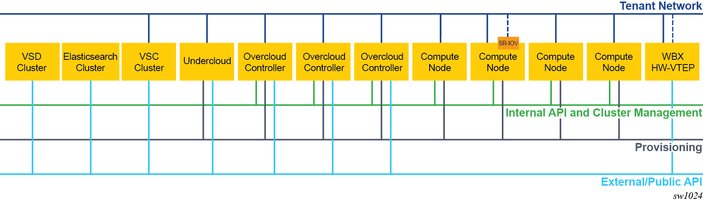
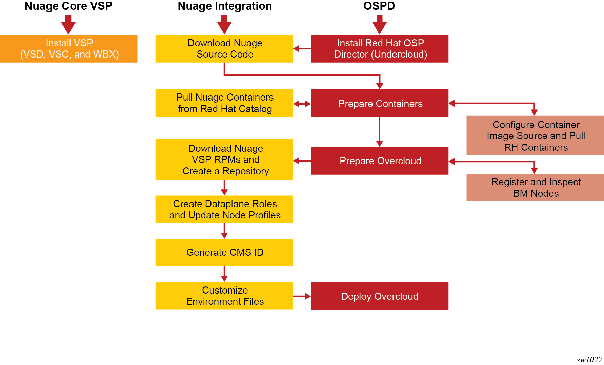

.. Don't use default python highlighting for code blocks http://www.sphinx-doc.org/en/stable/markup/code.html

===============================================================================
Integrating Nuage VSP 20.10-HW VTEP with Red Hat OpenStack Platform Director 16
===============================================================================

This document has the following topics:

.. contents::
   :local:
   :depth: 3

This document describes how the Nuage VSP HW VTEP solution integrates with Red Hat OpenStack Platform Director (OSPD).
The Nuage OpenStack plugins allow users to deploy flexible network configurations using standard OVS computes, with orchestrated HW VTEP configuration at the WBX.
For more information about the Nuage OpenStack ML2 driver, see the "Nuage Neutron ML2 Driver Guide."

This document contains information about the requirements and recommended network topologies to deploy Red Hat OSP Director with Nuage VSP.
It describes the deployment workflow that includes downloading the required packages, setting up the Undercloud and Overcloud, and creating and configuring environment files and Heat templates for the deployment. It also provides sample environment files that you can modify for your deployment.

Red Hat OpenStack Platform Director
-----------------------------------

The Red Hat OpenStack Platform Director (OSPD) is a toolset for installing and managing an OpenStack environment. It is based primarily on the OpenStack TripleO project. It uses an OpenStack deployment, referred to as the Undercloud, to deploy an OpenStack cluster, referred to as an Overcloud.

The OpenStack Platform Director is an image-based installer. It uses a single image (for example, overcloud-full.qcow2) that is deployed on the Controller and Compute nodes belonging to the OpenStack cluster (Overcloud). This image contains all the packages needed during the deployment. The deployment creates only the configuration files and databases required by the different services and starts the services in the correct order. During a deployment, no new software is installed.

For integration of OpenStack Platform Director with the Nuage VSP, use the command-line based deployment option.

OpenStack Platform Director uses Heat to orchestrate the deployment of an OpenStack environment. The actual deployment is done through Heat templates and Puppet. Users provide any custom input in templates using the ``openstack overcloud deploy`` command. When this command is run, all the templates are parsed to create the Hiera database, and then a set of Puppet manifests, also referred to as TripleO Heat templates, are run to complete the deployment. The Puppet code in turn uses the Puppet modules developed to deploy different services of OpenStack (such as puppet-nova, puppet-neutron, and puppet-cinder).

The OpenStack Platform Director architecture allows partners to create custom templates. Partners create new templates to expose parameters specific to their modules.  These templates can then be passed through the ``openstack overcloud deploy`` command during the deployment. Changes to the Puppet manifests are required to handle the new values in the Hiera database and to act on them to deploy the partner software.

Requirements and Best Practices
---------------------------------

For Nuage Networks Virtualized Services Platform (VSP) (Virtualized Services Directory [VSD] and Virtualized Services Controller [VSC]) requirements and best practices, see the *VSP User Guide* for the deployment requirements. Before deploying OpenStack, the VSP components (VSD and VSC) should already be deployed.

For Red Hat OpenStack Platform Director 16.2 requirements and best practices, see the Red Hat upstream documentation:
https://access.redhat.com/documentation/en-us/red_hat_openstack_platform/16.2/html/director_installation_and_usage/

Recommended Topologies
-----------------------

The deployment topology and networking segmentation varies depending on the OpenStack end-to-end requirements and underlay topology. A typical OpenStack setup with Nuage integration has the following topology:

Workflow Overview of the Nuage VSP Integration with OpenStack Platform Director
--------------------------------------------------------------------------------

The workflow to integrate Nuage VSP with OpenStack Platform Director includes these phases:

* **Phase 0: Install the VSP Core Components**

  Before installing OSPD on the Undercloud, install and configure VSD. See `Recommended Topologies`_ for a typical OpenStack setup with Nuage integration.

  The hardware VTEP solution requires a WBX as a leaf/spine switch for Data Center and Enterprise networks deployments. See the WBX documentation for more details.

* **Phase 1: Install Red Hat OpenStack Platform Director**

  In this phase, you install Director on the Undercloud system by following the process in the Red Hat documentation. RedHat recommends to install the latest RHEL 8 release, which may be different from the one that was used for validation by Nuage. The RHEL release and packages versions used for validation can be found in the release notes.

* **Phase 2: Prepare Nuage Repository and Containers**

  In this phase, you prepare Nuage Repository and Containers for the integration.

  - **Phase 2.1: Download the Nuage Integration RPMs and Create a Yum Repository**

    In this phase, you download the Nuage Integration RPMs and create a repository for them.

  - **Phase 2.2: Install nuage-tripleo-heat-templates**

    In this phase, you will install nuage-tripleo-heat-templates package on Undercloud

    **Phase 2.3: Prepare Nuage Containers**

    In this phase, you prepare Nuage containers for the integration.

* **Phase 3: Prepare the Overcloud**

  In this phase, you follow procedures in this document and in the Red Hat documentation to do the basic configuration of the Overcloud.

  - **Phase 3.1: Register and Inspect the Bare Metal Nodes**

    Follow the procedures in the Red Hat documentation for registering and inspecting the hardware nodes in the "Configuring a Basic Overcloud using the CLI Tools" section and check the node status.

  - **Phase 3.2: Create the Dataplane Roles and Update the Node Profiles**

    In this phase, you add the Nuage Heat templates and dataplane roles for the Nuage integration.
    Roles define which actions users can perform. For more information about the supported roles, go to `Phase 3: Prepare the Overcloud`_

  - **Phase 3.3: Generate a CMS ID for the OpenStack Deployment**

    The Cloud Management System (CMS) ID is created to identify a specific Compute or Controller node.

  - **Phase 3.4: Customize the Environment Files**

    In this phase, you modify the environment files for your deployment and assign roles (profiles) to the Compute and Controller nodes.
    The files are populated with the required parameters.
    Nuage provides Heat templates and environment files to configure Neutron on the Controller node.

* **Phase 4: Deploy Overcloud**

  In this phase, you use the ``openstack overcloud deploy`` command with different options to deploy the various use cases.

Deployment Workflow
---------------------

Phase 0: Install the VSP Core Components
~~~~~~~~~~~~~~~~~~~~~~~~~~~~~~~~~~~~~~~~~~

To install VSD, see the *VSP Install Guide* and the  *VSP User Guide* for the deployment requirements and procedures.

To install WBX, see the WBX documentation.

Phase 1: Install Red Hat OpenStack Platform Director
~~~~~~~~~~~~~~~~~~~~~~~~~~~~~~~~~~~~~~~~~~~~~~~~~~~~~

To prepare for the Nuage VSP integration, install Director on the Undercloud system by following the steps in the Red Hat documentation:

https://access.redhat.com/documentation/en-us/red_hat_openstack_platform/16.2/html/director_installation_and_usage/director_installation_and_configuration

Phase 2: Prepare Nuage Repository and Containers
~~~~~~~~~~~~~~~~~~~~~~~~~~~~~~~~~~~~~~~~~~~~~~~~

Phase 2.1: Download the Nuage VSP RPMs and Create a Yum Repository
++++++++++++++++++++++++++++++++++++++++++++++++++++++++++++++++++++

For Nuage VSP integrations, download all the required components and create a yum repository reachable from the Undercloud.
The hardware VTEP solution needs the following packages.

::

   +----------------+------------------------------------------------+-------------------------------------------------------------------------------------------+
   | Group          | Packages                                       | Location (tar.gz or link)                                                                 |
   +================+================================================+===========================================================================================+
   | Nuage          | nuage-openstack-neutronclient                  | nuage-openstack (Nokia OLCS (Online Customer Support) web site)                                                                          |
   | Common         |                                                |                                                                                           |
   | Packages       |                                                |                                                                                           |
   +----------------+------------------------------------------------+-------------------------------------------------------------------------------------------+
   | Nuage OSP      | nuage-tripleo-heat-templates-16.2-20.10.9_912  | https://github.com/nuagenetworks/nuage-ospdirector/tree/OSPD16/nuage-rpms                 |
   | Director       |                                                |                                                                                           |
   | Packages       |                                                |                                                                                           |
   +----------------+------------------------------------------------+-------------------------------------------------------------------------------------------+
   | Nuage SR-IOV   | nuage-topology-collector (for Nuage SR-IOV)    | https://github.com/nuagenetworks/topology-collector/releases/tag/release-20.10.9          |
   | packages       |                                                |                                                                                           |
   +----------------+------------------------------------------------+-------------------------------------------------------------------------------------------+

Phase 2.2: Install nuage-tripleo-heat-templates
+++++++++++++++++++++++++++++++++++++++++++++++

In this phase, you will enable Nuage repository on Undercloud and install nuage-tripleo-heat-templates

1. Enable Nuage repository that is created in Phase 2.1 on Undercloud machine.

2. Install nuage-tripleo-heat-templates package by using

::

    $ sudo yum install -y nuage-tripleo-heat-templates

3. Copy nuage-tripleo-heat-templates to /home/stack before customizing environment files

::

    $ cp -r /usr/share/nuage-tripleo-heat-templates /home/stack/

Phase 3: Prepare Nuage Containers
+++++++++++++++++++++++++++++++++++

In this phase, you prepare Nuage containers for the integration.

1. Add the below contents to /home/stack/containers-prepare-parameter.yaml. A complete file can be found in `Sample Environment Files`_.

::

      ContainerImageRegistryCredentials:
        <Truncated output>
        registry.connect.redhat.com:
          <username>: "<pwd>"

      ContainerImagePrepare:
        <Truncated output>
          excludes:
           - horizon
           - heat-engine
           - heat-api-cfn
           - neutron-server
           - heat-api

        - push_destination: true
          set:
            name_prefix: "rhosp16-openstack-"
            name_suffix: "-20-10-9"
            namespace: registry.connect.redhat.com/nuagenetworks
            neutron_driver: null
            rhel_containers: false
            tag: '16.2-1'
          includes:
            - horizon
            - heat-engine
            - heat-api-cfn
            - neutron-server
            - heat-api

.. Note:: If during overcloud deploy image prepare, it tries to pull "nuagenetworks/rhosp16-openstack-neutron-server-ovn-20-10-9" ("-ovn" was added to the name by overcloud deploy) please add below overwrites
   (https://bugzilla.redhat.com/show_bug.cgi?id=1844239):

::

    parameter_defaults:
      ContainerNeutronApiImage: undercloud.ctlplane.localdomain:8787/nuagenetworks/rhosp16-openstack-neutron-server-20-10-9:16.2-1
      ContainerNeutronConfigImage: undercloud.ctlplane.localdomain:8787/nuagenetworks/rhosp16-openstack-neutron-server-20-10-9:16.2-1

Phase 3: Prepare the Overcloud
~~~~~~~~~~~~~~~~~~~~~~~~~~~~~~~~~~~~

In this phase, you perform the basic configuration of the Overcloud.

The process includes modifying the Overload image and environment file, creating the dataplane roles and updating node profiles, and assigning the roles to a Compute or Controller node.

**Role**: A role is a personality assigned to a node where a specific set of operations is allowed.
For more information about roles, see the Red Hat OpenStack documentation:

   * https://access.redhat.com/documentation/en-us/red_hat_openstack_platform/16.2/html/director_installation_and_usage/planning-your-overcloud

   * https://access.redhat.com/documentation/en-us/red_hat_openstack_platform/16.2/html/advanced_overcloud_customization/chap-roles#sect-Creating_a_Custom_Roles_File

You only need to configure the roles for your deployment and assign the roles to the appropriate nodes.

Phase 3.1: Register and Inspect the Bare Metal Nodes
+++++++++++++++++++++++++++++++++++++++++++++++++++++++

In the Red Hat OpenStack Platform Director documentation, follow the steps using the CLI *up to where* the ``openstack overcloud deploy`` command is run:

https://access.redhat.com/documentation/en-us/red_hat_openstack_platform/16.2/html/director_installation_and_usage/creating-a-basic-overcloud-with-cli-tools

To verify the Ironic node status, follow these steps:

1. Check the bare metal node status.

   The results should show the *Provisioning State* status as *available* and the *Maintenance* status as *False*.

::

    openstack baremetal node list

2. If profiles are being set for a specific placement in the deployment, check the Overcloud profile status.

   The results should show the *Provisioning State* status as *available* and the *Current Profile* status as *control* or *compute*.

::

    openstack overcloud profiles list

Phase 3.2: Create the Dataplane Roles and Update the Node Profiles
+++++++++++++++++++++++++++++++++++++++++++++++++++++++++++++++++++

In this phase, you add the dataplane roles. The hardware VTEP solution supports any combination of Controller, Compute, ComputeSriov and ComputeOvsDpdk roles.

1. Create a *nuage_roles_data.yaml* file with all the required roles for the current Overcloud deployment.

   This example shows how to create *nuage_roles_data.yaml* with a Controller, Compute, ComputeSriov and ComputeOvsDpdk roles.

::

    Syntax:
    openstack overcloud roles generate -o /home/stack/nuage-tripleo-heat-templates/templates/nuage_roles_data.yaml Controller Compute ComputeSriov ComputeOvsDpdk

2. Create ``node-info.yaml`` in /home/stack/templates/ and specify the roles and number of nodes.

  This example shows how to create a *node-info.yaml* file for deployment with three Controller and two Computes:

::

    Syntax:

    parameter_defaults:
      Overcloud<Role Name>Flavor: <flavor name>
      <Role Name>Count: <number of nodes for this role>

    Example:

    parameter_defaults:
      OvercloudControllerFlavor: control
      ControllerCount: 3
      OvercloudComputeFlavor: compute
      ComputeCount: 2

Phase 3.5: Generate a CMS ID for the OpenStack Deployment
++++++++++++++++++++++++++++++++++++++++++++++++++++++++++

The Cloud Management System (CMS) ID is used to identify a specific Compute or Controller node.

In this phase, you generate the CMS ID used to configure your OpenStack deployment with the VSD deployment.

1. Go to `Generate CMS ID <../../nuage-tripleo-heat-templates/scripts/generate-cms-id>`_ for the files and script to generate the CMS ID, and follow the instructions in the README.md file.

   The CMS ID is displayed in the output, and a copy of it is stored in a file called cms_id.txt in the same folder.

2. Add the CMS ID as a specific configuration in the controller using the parameter 'ControllerExtraConfig'. See `Parameters on the Neutron Controller`_.

Phase 3.6: Customize the Environment Files
+++++++++++++++++++++++++++++++++++++++++++

In this phase, you create and customize environment files and tag nodes for specific profiles. These profile tags match your nodes to flavors, which assign the flavors to deployment roles.

For more information about the parameters in the environment files, go to `Parameters in Environment Files`_.

For sample environment files, go to `Sample Environment Files`_.

Nuage Controller Role (Controller)
''''''''''''''''''''''''''''''''''''

      For a Controller node, assign the Controller role to each of the Controller nodes:

::

   openstack baremetal node set --property capabilities='profile:control,boot_option:local' <node-uuid>

Compute Role (Compute)
'''''''''''''''''''''''''''

    For a Compute node, assign the appropriate profile:

::

    openstack baremetal node set --property capabilities='profile:compute,boot_option:local' <node-uuid>

ComputeSriov Role (Compute)
''''''''''''''''''''''"'''''

For a ComputeSriov node, assign the appropriate profile:

::

    openstack baremetal node set --property capabilities='profile:computesriov,boot_option:local' <node-uuid>

ComputeOvsDpdk Role (Compute)
''''''''''''''''''''''''''''''

For a ComputeOvsDpdk node, assign the appropriate profile:

::

    openstack baremetal node set --property capabilities='profile:computeovsdpdk,boot_option:local' <node-uuid>

Network Isolation
''''''''''''''''''

Follow procedures in the Red Hat Documentation to implement network isolation and custom composable networks.

   **Linux Bonding**

    The hardware VTEP solution relies on upstream network interface templates to define NIC layout on the nodes. Follow the procedures in the Red Hat Documentation.

    This solution supports different configuration of the network interfaces facing the WBXs. Naming, single interface under an OVS bridge, Linux bonds in both, active-backup and 802.3ad modes under an OVS bridge, and DPDK bonds with active LACP under OVS_USER_BRIDGE bonds.

::

      - type: linux_bond
        name: bond0
        members:
        - type: interface
          name: nic2
        - type: interface
          name: nic3
        bonding_options: "mode=active-backup miimon=100"
                ...

Phase 4: Deploy the Overcloud
~~~~~~~~~~~~~~~~~~~~~~~~~~~~~~~~~~~~

Use the ``openstack overcloud deploy`` command options to pass the environment files and to create or update an Overcloud deployment. Refer to procedures in the Red Hat Documentation.

To pass Nuage specific configuration to the controller, please use the parameter 'ControllerExtraConfig' in the environment files. See `Parameters in Environment Files`_.

For HWVTEP force the use of OVS instead of OVN by using:

::

    -e /usr/share/openstack-tripleo-heat-templates/environments/services/neutron-ovs.yaml

Phase 5: Verify that OpenStack Platform Director Has Been Deployed Successfully
~~~~~~~~~~~~~~~~~~~~~~~~~~~~~~~~~~~~~~~~~~~~~~~~~~~~~~~~~~~~~~~~~~~~~~~~~~~~~~~~~~

1. Run ``openstack stack list`` to verify that the stack was created.

::

    [stack@director ~]$ openstack stack list

    +--------------------------------------+------------+----------------------------------+-----------------+----------------------+-----------------+
    | ID                                   | Stack Name | Project                          | Stack Status    | Creation Time        | Updated Time    |
    +--------------------------------------+------------+----------------------------------+-----------------+----------------------+-----------------+
    | 75810b99-c372-463c-8684-f0d7b4e5743e | overcloud  | 1c60ab81cc924fe78355a76ee362386b | CREATE_COMPLETE | 2020-04-14T20:55:42Z | None            |
    +--------------------------------------+------------+----------------------------------+-----------------+----------------------+-----------------+

2. Run ``nova list`` to view the Overcloud Compute and Controller nodes.

::

    [stack@director ~]$ nova list
    +--------------------------------------+------------------------+--------+------------+-------------+---------------------+
    | ID                                   | Name                   | Status | Task State | Power State | Networks            |
    +--------------------------------------+------------------------+--------+------------+-------------+---------------------+
    | 437ff73b-3615-48cc-a9cf-ed0790953577 | overcloud-compute-0    | ACTIVE | -          | Running     | ctlplane=192.0.2.60 |
    | 797e7a74-eb96-49fb-87e7-9e6955e70c70 | overcloud-compute-1    | ACTIVE | -          | Running     | ctlplane=192.0.2.58 |
    | a7ef35db-4230-4fcd-9411-a6329f4747c9 | overcloud-compute-2    | ACTIVE | -          | Running     | ctlplane=192.0.2.59 |
    | a0548879-0931-4b2c-bbe9-2733e4566d64 | overcloud-controller-0 | ACTIVE | -          | Running     | ctlplane=192.0.2.57 |
    +--------------------------------------+------------------------+--------+------------+-------------+---------------------+

3. Verify that the services are running.

Phase 6: Install the nuage-openstack-neutronclient RPM in the Undercloud (Optional)
~~~~~~~~~~~~~~~~~~~~~~~~~~~~~~~~~~~~~~~~~~~~~~~~~~~~~~~~~~~~~~~~~~~~~~~~~~~~~~~~~~~~~

The nuage-openstack-neutronclient RPM was downloaded and add to the repository with the other Nuage base packages in `Phase 2.1: Download the Nuage VSP RPMs and Create a Yum Repository`_

To complete the installation:

1. Enable the Nuage repository hosting the nuage-openstack-neutronclient on the Undercloud.

2. Run ``yum install -y nuage-openstack-neutronclient``

Phase 7: Manually Install and Run the Topology Collector for HWVTEP
~~~~~~~~~~~~~~~~~~~~~~~~~~~~~~~~~~~~~~~~~~~~~~~~~~~~~~~~~~~~~~~~~~~~~~~~~~~~~~~

See the "Installation and Configuration: Topology Collection Agent and LLDP" section in the *Nuage VSP OpenStack Neutron ML2 Driver Guide*.

For more information, see the OpenStack SR-IOV documentation: https://access.redhat.com/documentation/en-us/red_hat_enterprise_linux_openstack_platform/7/html/networking_guide/sr-iov-support-for-virtual-networking

Linux bonds under OVS bridges do not require to run the topology collector script in advanced mode.

Parameters in Environment Files
---------------------------------

This section has the details about the parameters specified in the Heat template files. It also describes the configuration files where the parameters are set and used.

Go to http://docs.openstack.org/developer/heat/template_guide/hot_guide.html and https://docs.openstack.org/train/configuration/ for more information.

For the Heat templates used by OpenStack Platform Director, go to http://git.openstack.org/cgit/openstack/tripleo-heat-templates

Parameters on the Neutron Controller
~~~~~~~~~~~~~~~~~~~~~~~~~~~~~~~~~~~~~~

To be able to pass Nuage specific configuration to the controller, it is required to use the parameter 'ControllerExtraConfig'. Please refer to Puppet: Customizing Hierdata for Roles in the Red Hat Documentation.

See `Sample Environment Files`_.

The following parameters are mapped to values in the /etc/neutron/neutron.conf file on the Neutron Controller:

.. Note:: The values for these parameters depend on the Nuage VSP configuration.

::

    NeutronServicePlugins
    Maps to service_plugins parameter in [DEFAULT] section

The following parameters are mapped to values in the /etc/nova/nova.conf file on the Neutron Controller:

.. Note:: These values for the parameters depend on the Nuage VSP configuration.

::

    UseForwardedFor
    Maps to use_forwarded_for parameter in [DEFAULT] section

    NeutronMetadataProxySharedSecret
    Maps to metadata_proxy_shared_secret parameter in [neutron] section

The following parameters are mapped to values in the /etc/neutron/plugins/ml2/ml2_conf.ini file on the Neutron Controller:

::

    NeutronNetworkType
    Maps to tenant_network_types in [ml2] section

    NeutronPluginExtensions
    Maps to extension_drivers in [ml2] section

    NeutronTypeDrivers
    Maps to type_drivers in [ml2] section

    NeutronMechanismDrivers
    Maps to mechanism_drivers in [ml2] section

    NeutronFlatNetworks
    Maps to flat_networks parameter in [ml2_type_flat] section

    NeutronTunnelIdRanges
    Maps to tunnel_id_ranges in [ml2_type_gre] section

    NeutronNetworkVLANRanges
    Maps to network_vlan_ranges in [ml2_type_vlan] section

    NeutronVniRanges
    Maps to vni_ranges in [ml2_type_vxlan] section

The following parameter is mapped to value in the /etc/heat/heat.conf file on the Controller:

::

    HeatEnginePluginDirs
    Maps to plugin_dirs in [DEFAULT] section

The following parameter is mapped to value in the /usr/share/openstack-dashboard/openstack_dashboard/local/local_settings.py on the Controller:

::

    HorizonCustomizationModule
    Maps to customization_module in HORIZON_CONFIG dict

The following parameter is mapped to value in the /etc/httpd/conf.d/10-horizon_vhost.conf on the Controller:

::

    HorizonVhostExtraParams
    Maps to CustomLog, Alias in this file

The following parameter is to set values on the Controller using Puppet code:

::

    NeutronNuageDBSyncExtraParams
    String of extra command line parameters to append to the neutron-db-manage upgrade head command

To be able to use hardware VTEP integration, it is required to set the nuage_hwvtep and openvswitch mechanism drivers, as well as, vlan and flat type drivers in the ml2 configuration file.

The nuage_hwvtep mechanism driver cannot be deployed together with the nuage_ml2 mechanism driver. Nuage L3 service is not supported.

Upstream services such as L3, dhcp, metadata can coexist with the nuage_hwvtep mechanism driver. Keep in mind that L3 routers will not be reflected as Domains in VSD (no Nuage L3 support).

Sample Environment Files
-------------------------

The following templates show examples of parameters used in a hardware VTEP deployment.

containers-prepare-parameter.yaml
~~~~~~~~~~~~~~~~~~~~~~~~~~~~~~~~~

Note: Make sure to use the correct z-version in the tag for upstream containers.

::

    parameter_defaults:
      NtpServer: ['135.1.1.111']
      ContainerImageRegistryCredentials:
        registry.redhat.io:
          <user-name>: "<password>"
        registry.connect.redhat.com:
          <user-name>: "<password>"

      ContainerImagePrepare:
        - push_destination: true
          set:
            ceph_alertmanager_image: ose-prometheus-alertmanager
            ceph_alertmanager_namespace: registry.redhat.io/openshift4
            ceph_alertmanager_tag: 4.1
            ceph_grafana_image: rhceph-3-dashboard-rhel7
            ceph_grafana_namespace: registry.redhat.io/rhceph
            ceph_grafana_tag: 3
            ceph_image: rhceph-4-rhel8
            ceph_namespace: registry.redhat.io/rhceph
            ceph_node_exporter_image: ose-prometheus-node-exporter
            ceph_node_exporter_namespace: registry.redhat.io/openshift4
            ceph_node_exporter_tag: v4.1
            ceph_prometheus_image: ose-prometheus
            ceph_prometheus_namespace: registry.redhat.io/openshift4
            ceph_prometheus_tag: 4.1
            ceph_tag: latest
            name_prefix: openstack-
            name_suffix: ''
            namespace: registry.redhat.io/rhosp-rhel8
            neutron_driver: null
            rhel_containers: false
            tag: '16.2.2' # Update to qualified z-stream for nuage release
          tag_from_label: '{version}-{release}'
          excludes:
            - horizon
            - heat-engine
            - heat-api-cfn
            - neutron-server
            - heat-api

        - push_destination: true
          set:
            name_prefix: "rhosp16-openstack-"
            name_suffix: "-20-10-9"
            namespace: registry.connect.redhat.com/nuagenetworks
            neutron_driver: null
            rhel_containers: false
            tag: '16.2-1'
          includes:
            - horizon
            - heat-engine
            - heat-api-cfn
            - neutron-server
            - heat-api

.. Note:: If during overcloud deploy image prepare, it tries to pull "nuagenetworks/rhosp16-openstack-neutron-server-ovn-20-10-9" ("-ovn" was added to the name by overcloud deploy) please add below overwrites
   (https://bugzilla.redhat.com/show_bug.cgi?id=1844239):

::

    parameter_defaults:
      ContainerNeutronApiImage: undercloud.ctlplane.localdomain:8787/nuagenetworks/rhosp16-openstack-neutron-server-20-10-9:16.2-1
      ContainerNeutronConfigImage: undercloud.ctlplane.localdomain:8787/nuagenetworks/rhosp16-openstack-neutron-server-20-10-9:16.2-1

network-environment.yaml
~~~~~~~~~~~~~~~~~~~~~~~~

::

    parameter_defaults:
      # This section is where deployment-specific configuration is done
      #
      # NOTE: (Since Rocky)
      # ControlPlaneSubnetCidr: It is no longer a requirement to provide the
      #                         parameter. The attribute is resolved from the
      #                         ctlplane subnet(s).
      # ControlPlaneDefaultRoute: It is no longer a requirement to provide this
      #                           parameter. The attribute is resolved from the
      #                           ctlplane subnet(s).
      # EC2MetadataIp: It is no longer a requirement to provide this parameter. The
      #                attribute is resolved from the ctlplane subnet(s).
      #

      # Customize the IP subnet to match the local environment
      StorageNetCidr: '172.16.1.0/24'
      # Customize the IP range to use for static IPs and VIPs
      StorageAllocationPools: [{'start': '172.16.1.4', 'end': '172.16.1.250'}]
      # Customize the VLAN ID to match the local environment
      StorageNetworkVlanID: 30

      # Customize the IP subnet to match the local environment
      StorageMgmtNetCidr: '172.16.3.0/24'
      # Customize the IP range to use for static IPs and VIPs
      StorageMgmtAllocationPools: [{'start': '172.16.3.4', 'end': '172.16.3.250'}]
      # Customize the VLAN ID to match the local environment
      StorageMgmtNetworkVlanID: 40

      # Customize the IP subnet to match the local environment
      InternalApiNetCidr: '172.16.2.0/24'
      # Customize the IP range to use for static IPs and VIPs
      InternalApiAllocationPools: [{'start': '172.16.2.4', 'end': '172.16.2.250'}]
      # Customize the VLAN ID to match the local environment
      InternalApiNetworkVlanID: 20

      # Customize the IP subnet to match the local environment
      TenantNetCidr: '172.16.0.0/24'
      # Customize the IP range to use for static IPs and VIPs
      TenantAllocationPools: [{'start': '172.16.0.4', 'end': '172.16.0.250'}]
      # Customize the VLAN ID to match the local environment
      TenantNetworkVlanID: 50
      # MTU of the underlying physical network. Neutron uses this value to
      # calculate MTU for all virtual network components. For flat and VLAN
      # networks, neutron uses this value without modification. For overlay
      # networks such as VXLAN, neutron automatically subtracts the overlay
      # protocol overhead from this value.
      TenantNetPhysnetMtu: 1500

      # Customize the IP subnet to match the local environment
      ExternalNetCidr: '10.0.0.0/24'
      # Customize the IP range to use for static IPs and VIPs
      # Leave room if the external network is also used for floating IPs
      ExternalAllocationPools: [{'start': '10.0.0.4', 'end': '10.0.0.250'}]
      # Gateway router for routable networks
      ExternalInterfaceDefaultRoute: '10.0.0.1'
      # Customize the VLAN ID to match the local environment
      ExternalNetworkVlanID: 10

      # Customize the IP subnet to match the local environment
      ManagementNetCidr: '10.0.1.0/24'
      # Customize the IP range to use for static IPs and VIPs
      ManagementAllocationPools: [{'start': '10.0.1.4', 'end': '10.0.1.250'}]
      # Gateway router for routable networks
      ManagementInterfaceDefaultRoute: '10.0.1.1'
      # Customize the VLAN ID to match the local environment
      ManagementNetworkVlanID: 60

      # Define the DNS servers (maximum 2) for the overcloud nodes
      # When the list is not set or empty, the nameservers on the ctlplane subnets will be used.
      # (ctlplane subnets nameservers are controlled by the ``undercloud_nameservers`` option in ``undercloud.conf``)
      DnsServers: ['135.1.1.111']
      BondInterfaceOvsOptions: "mode=active-backup"

neutron-nuage-config.yaml
~~~~~~~~~~~~~~~~~~~~~~~~~~

::

    # Uncomment to disable corresponding services
    # resource_registry:
    #   OS::TripleO::Services::NeutronDhcpAgent: OS::Heat::None
    #   OS::TripleO::Services::NeutronL3Agent: OS::Heat::None
    #   OS::TripleO::Services::NeutronMetadataAgent: OS::Heat::None
    parameter_defaults:
      ControllerExtraConfig:
        neutron::config::server_config:
          DEFAULT/ipam_driver:
            value: nuage_internal
        neutron::config::plugin_ml2_config:
          RESTPROXY/default_net_partition_name:
            value: 'DefaultOrg'
          RESTPROXY/server:
            value: '10.40.1.41:8443'
          RESTPROXY/serverauth:
            value: 'csproot:csproot'
          RESTPROXY/organization:
            value: 'csp'
          RESTPROXY/auth_resource:
            value: '/me'
          RESTPROXY/serverssl:
            value: True
          RESTPROXY/base_uri:
            value: '/nuage/api/v6'
          RESTPROXY/cms_id:
            value: '152bab92-8ce9-4394-aabc-0b111457948a'
      NeutronDebug: true
      NeutronServicePlugins: 'NuagePortAttributes,NuageAPI,NuageNetTopology,router,segments,trunk'
      NeutronTypeDrivers: vlan,vxlan,flat
      NeutronNetworkType: vlan
      # mind: order matters:
      NeutronMechanismDrivers: [openvswitch, nuage_hwvtep, nuage_sriov, sriovnicswitch]
      NeutronPluginExtensions: 'nuage_subnet,nuage_port,port_security,nuage_network'
      NeutronFlatNetworks: '*'
      NeutronTunnelIdRanges: ''
      NeutronNetworkVLANRanges: 'physnet1:1:4000,public:1:4000'
      NeutronVniRanges: '1001:2000'
      NeutronOvsIntegrationBridge: br-int
      NeutronDhcpOvsIntegrationBridge: br-int
      NeutronBridgeMappings:
        - physnet1:br-ex
        - public:br-public
      NeutronMetadataProxySharedSecret: 'NuageNetworksSharedSecret'
      InstanceNameTemplate: 'inst-%08x'
      HeatEnginePluginDirs: ['/usr/lib/python3.6/site-packages/nuage-heat/']
      HorizonCustomizationModule: 'nuage_horizon.customization'
      HorizonVhostExtraParams:
        add_listen: true
        priority: 10
        access_log_format: '%a %l %u %t \"%r\" %>s %b \"%%{}{Referer}i\" \"%%{}{User-Agent}i\"'
        aliases: [{'alias': '%{root_url}/static/nuage', 'path': '/usr/lib/python3.6/site-packages/nuage_horizon/static'}, {'alias': '%{root_url}/static', 'path': '/usr/share/openstack-dashboard/static'}]
        directories: [{'path': '/usr/lib/python3.6/site-packages/nuage_horizon', 'options': ['FollowSymLinks'], 'allow_override': ['None'], 'require': 'all granted'}]

node-info.yaml for Non-HA Deployments
~~~~~~~~~~~~~~~~~~~~~~~~~~~~~~~~~~~~~~~

::

    # Compute and Controller count can be set here

    parameter_defaults:
      ControllerCount: 1
      ComputeCount: 1

node-info.yaml for HA and Linux-Bond HA Deployments
~~~~~~~~~~~~~~~~~~~~~~~~~~~~~~~~~~~~~~~~~~~~~~~~~~~~~

::

    # Compute and Controller count can be set here

    parameter_defaults:
      ControllerCount: 3
      ComputeCount: 1

nic-configs/compute.yaml
~~~~~~~~~~~~~~~~~~~~~~~~~~

::

    resources:
      OsNetConfigImpl:
        type: OS::Heat::SoftwareConfig
        properties:
          group: script
          config:
            str_replace:
              template:
                get_file: /usr/share/openstack-tripleo-heat-templates/network/scripts/run-os-net-config.sh
              params:
                $network_config:
                  network_config:
                  - type: interface
                    name: "nic1"
                    mtu:
                        get_param: ControlPlaneMtu
                    use_dhcp: false
                    dns_servers:
                       get_param: DnsServers
                    addresses:
                    - ip_netmask:
                        list_join:
                        - /
                        - - get_param: ControlPlaneIp
                          - get_param: ControlPlaneSubnetCidr
                    routes:
                      list_concat_unique:
                        - get_param: ControlPlaneStaticRoutes
                        - - default: true
                            next_hop:
                              get_param: ControlPlaneDefaultRoute
                  - type: ovs_bridge
                    name: br-ex
                    use_dhcp: false
                    members:
                    - type: linux_bond
                      name: bond0
                      bonding_options: "mode=active-backup miimon=100"
                      members:
                      - type: interface
                        name: nic2
                        primary: true
                      - type: interface
                        name: nic3
                        primary: false

Troubleshooting
----------------

This section describes issues that may happen and how to resolve them.

One or More of the Deployed Overcloud Nodes Stop
~~~~~~~~~~~~~~~~~~~~~~~~~~~~~~~~~~~~~~~~~~~~~~~~~

On the node that was shut down, enter ``nova start <node_name>``. An example of the <node_name> is overcloud-controller-0.

After the node comes up, enter these commands:

::

    pcs cluster start --all
    pcs status

If the services do not come up, enter ``pcs resource cleanup``.

While Registering Nodes
~~~~~~~~~~~~~~~~~~~~~~~~

The ``No valid host found`` error occurs:

::

    openstack baremetal import --json instackenv.json
    No valid host was found. Reason: No conductor service registered which supports driver pxe_ipmitool. (HTTP 404)

The workaround is to install the python-dracclient python package, and restart the Ironic-Conductor service. Then enter the command to restart the service.

::

    sudo yum install -y python-dracclient
    exit (go to root user)
    systemctl restart openstack-ironic-conductor
    su - stack (switch to stack user)
    source stackrc (source stackrc)

The *openstack baremetal node list* Output Shows the Instance UUID after Deleting the Stack
~~~~~~~~~~~~~~~~~~~~~~~~~~~~~~~~~~~~~~~~~~~~~~~~~~~~~~~~~~~~~~~~~~~~~~~~~~~~~~~~~~~~~~~~~~~~~

The command output is similar to the following:

::

    [stack@instack ~]$ openstack stack list

    +----+------------+--------------+---------------+--------------+
    | id | stack_name | stack_status | creation_time | updated_time |
    +----+------------+--------------+---------------+--------------+
    +----+------------+--------------+---------------+--------------+
    [stack@instack ~]$ nova list
    +----+------+--------+------------+-------------+----------+
    | ID | Name | Status | Task State | Power State | Networks |
    +----+------+--------+------------+-------------+----------+
    +----+------+--------+------------+-------------+----------+
    [stack@instack ~]$ openstack baremetal node list
    +--------------------------------------+------+--------------------------------------+-------------+--------------------+-------------+
    | UUID                                 | Name | Instance UUID                        | Power State | Provisioning State | Maintenance |
    +--------------------------------------+------+--------------------------------------+-------------+--------------------+-------------+
    | 9e57d620-3ec5-4b5e-96b1-bf56cce43411 | None | 1b7a6e50-3c15-4228-85d4-1f666a200ad5 | power off   | available          | False       |
    | 88b73085-1c8e-4b6d-bd0b-b876060e2e81 | None | 31196811-ee42-4df7-b8e2-6c83a716f5d9 | power off   | available          | False       |
    | d3ac9b50-bfe4-435b-a6f8-05545cd4a629 | None | 2b962287-6e1f-4f75-8991-46b3fa01e942 | power off   | available          | False       |
    +--------------------------------------+------+--------------------------------------+-------------+--------------------+-------------+

The workaround is to manually remove the instance_uuid reference:

::

    ironic node-update <node_uuid> remove instance_uuid

    Example:
    ironic node-update 9e57d620-3ec5-4b5e-96b1-bf56cce43411 remove instance_uuid

Links to Nuage and OpenStack Resources
---------------------------------------

* For the Heat templates used by OpenStack Platform Director, go to http://git.openstack.org/cgit/openstack/tripleo-heat-templates
* For the Puppet manifests, go to http://git.openstack.org/cgit/openstack/tripleo-heat-templates/tree/puppet
* For the files and script to generate the CMS ID, go to `Generate CMS ID <../../nuage-tripleo-heat-templates/scripts/generate-cms-id>`_
