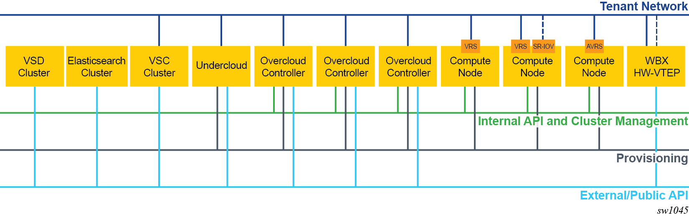
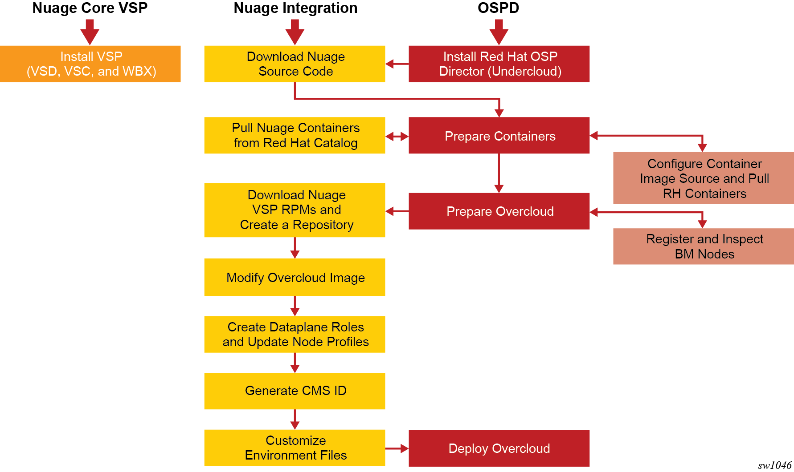

.. Don't use default python highlighting for code blocks http://www.sphinx-doc.org/en/stable/markup/code.html

========================================================================
Integrating Nuage VSP 5.4 with Red Hat OpenStack Platform Director 13
========================================================================

This document has the following topics:

.. contents::
   :local:
   :depth: 3

This document describes how the Nuage VSP integrates with Red Hat OpenStack Platform Director (OSPD).
The Nuage OpenStack plugins allow users to deploy flexible network configurations, including routers, subnets, and security groups along with other Nuage OpenStack extensions such as VSD-managed routers and subnets, which are shared between OpenStack and other cloud management systems.
For more information about the Nuage OpenStack ML2 driver, see the "Nuage Neutron ML2 Driver Guide."

This document has information about the requirements and recommended network topologies to deploy Red Hat OSP Director with Nuage VSP.
It describes the deployment workflow that includes downloading the required packages, setting up the Undercloud and Overcloud, and creating and configuring environment files and Heat templates for the deployment. It also provides sample environment files that you can modify for your deployment.

Red Hat OpenStack Platform Director
-----------------------------------

The Red Hat OpenStack Platform Director (OSPD) is a toolset for installing and managing an OpenStack environment. It is based primarily on the OpenStack TripleO project. It uses an OpenStack deployment, referred to as the Undercloud, to deploy an OpenStack cluster, referred to as an Overcloud.

The OpenStack Platform Director is an image-based installer. It uses a single image (for example, overcloud-full.qcow2) that is deployed on the Controller and Compute nodes belonging to the OpenStack cluster (Overcloud). This image contains all the packages needed during the deployment. The deployment creates only the configuration files and databases required by the different services and starts the services in the correct order. During a deployment, no new software is installed.

For integration of OpenStack Platform Director with the Nuage VSP, use the command-line based deployment option.

OpenStack Platform Director uses Heat to orchestrate the deployment of an OpenStack environment. The actual deployment is done through Heat templates and Puppet. Users provide any custom input in templates using the ``openstack overcloud deploy`` command. When this command is run, all the templates are parsed to create the Hiera database, and then a set of Puppet manifests, also referred to as TripleO Heat templates, are run to complete the deployment. The Puppet code in turn uses the Puppet modules developed to deploy different services of OpenStack (such as puppet-nova, puppet-neutron, and puppet-cinder).

The OpenStack Platform Director architecture allows partners to create custom templates. Partners create new templates to expose parameters specific to their modules.  These templates can then be passed through the ``openstack overcloud deploy`` command during the deployment. Changes to the Puppet manifests are required to handle the new values in the Hiera database and to act on them to deploy the partner software.

Requirements and Best Practices
---------------------------------

For Nuage Networks Virtualized Services Platform (VSP) (Virtualized Services Directory [VSD] and Virtualized Services Controller [VSC]) requirements and best practices, see the *VSP User Guide* for the deployment requirements. Before deploying OpenStack, the VSP components (VSD and VSC) should already be deployed.

For Red Hat OpenStack Platform Director 13 requirements and best practices, see the Red Hat upstream documentation:
https://access.redhat.com/documentation/en-us/red_hat_openstack_platform/13/html/director_installation_and_usage/

Recommended Topologies
-----------------------

The deployment topology and networking segmentation varies depending on the OpenStack end-to-end requirements and underlay topology. A typical OpenStack setup with Nuage integration has the following topology:

Workflow Overview of the Nuage VSP Integration with OpenStack Platform Director
--------------------------------------------------------------------------------

The workflow to integrate Nuage VSP with OpenStack Platform Director includes these phases:

* **Phase 0: Install the VSP Core Components**

  Before installing OSPD on the Undercloud, install and configure VSD and VSC. See `Recommended Topologies`_ for a typical OpenStack setup with Nuage integration.

  Depending on your deployment, you may also install and configure WBX as a leaf/spine switch for Data Center and Enterprise networks deployments. See the WBX documentation for more details.

* **Phase 1: Install Red Hat OpenStack Platform Director**

  In this phase, you install Director on the Undercloud system by following the process in the Red Hat documentation.

* **Phase 2: Download Nuage Source Code**

  In this phase,  you get the following files on Director for the Nuage Overcloud deployment:

  - Nuage Tripleo Heat templates
  - Image patching files
  - Additional scripts

* **Phase 3: Prepare the Containers**

  In this phase, you prepare the Red Hat OpenStack and Nuage OpenStack containers for the integration.

  - **Phase 3.1: Configure the Containers Image Source and Pull the Red Hat OpenStack Containers**

    Follow the Red Hat documentation to complete these tasks.

  - **Phase 3.2: Pull the Nuage Containers from the Red Hat Catalog**

    The Nuage OpenStack containers are available from the Red Hat Partner Container catalog. The container names change from release to release.

* **Phase 4: Prepare the Overcloud**

  In this phase, you follow procedures in this document and in the Red Hat documentation to do the basic configuration of the Overcloud.

  - **Phase 4.1: Register and Inspect the Bare Metal Nodes**

    Follow the procedures in the Red Hat documentation for registering and inspecting the hardware nodes in the "Configuring a Basic Overcloud using the CLI Tools" section and check the node status.

  - **Phase 4.2: Download the Nuage VSP RPMs and Create a Yum Repository**

    In this phase, you download the Nuage RPMs and create a repository for them.

  - **Phase 4.3: Modify the Overcloud Image**

    To install the required Nuage packages, you run the script to patch the the Overcloud image.

  - **Phase 4.4: Create the Dataplane Roles and Update the Node Profiles**

    In this phase, you add the Nuage Heat templates and dataplane roles for the Nuage integration.
    Roles define which actions users can perform. For more information about the supported roles, go to `Phase 4: Prepare the Overcloud`_

  - **Phase 4.5: Generate a CMS ID for the OpenStack Deployment**

    The Cloud Management System (CMS) ID is created to identify a specific Compute or Controller node.

  - **Phase 4.6: Customize the Environment Files**

    In this phase, you modify the environment files for your deployment and assign roles (profiles) to the Compute and Controller nodes.
    The files are populated with the required parameters.
    Nuage provides Heat templates and environment files to configure Neutron on the Controller node and RPMs (such as nuage-openvswitch and nuage-metadata-agent) on Compute nodes.

* **Phase 5: Deploy Overcloud**

  In this phase, you use the ``openstack overcloud deploy`` command with different options to deploy the various use cases.

Deployment Workflow
---------------------

Phase 0: Install the VSP Core Components
~~~~~~~~~~~~~~~~~~~~~~~~~~~~~~~~~~~~~~~~~~

To install VSD and VSC, see the *VSP Install Guide* and the  *VSP User Guide* for the deployment requirements and procedures.

To install WBX, see the WBX documentation.

Phase 1: Install Red Hat OpenStack Platform Director
~~~~~~~~~~~~~~~~~~~~~~~~~~~~~~~~~~~~~~~~~~~~~~~~~~~~~

To prepare for the Nuage VSP integration, install Director on the Undercloud system by following the steps in the Red Hat documentation:

https://access.redhat.com/documentation/en-us/red_hat_openstack_platform/13/html/director_installation_and_usage/installing-the-undercloud

Then make sure the required images for the RHEL 7.8 deployment are available:

1. After the Undercloud is installed, make sure that you have openstack-tripleo-heat-templates-8.4.1-58.el7ost package.

::

    yum swap openstack-tripleo-heat-templates openstack-tripleo-heat-templates-8.4.1-58.el7ost.noarch

2. Download following images for the RHEL 7.8 Overcloud qcow2 file:

::

    yum install rhosp-director-images-13.0-20200610.2.el7ost rhosp-director-images-ipa-13.0-20200610.2.el7ost

Phase 2: Download Nuage Source Code
~~~~~~~~~~~~~~~~~~~~~~~~~~~~~~~~~~~~~~~

In this phase, get the Nuage Tripleo Heat Templates, image patching files, and the other scripts by using the following commands on the Undercloud:

::

    cd /home/stack
    git clone https://github.com/nuagenetworks/nuage-ospdirector.git -b <release-tag>
    ln -s nuage-ospdirector/nuage-tripleo-heat-templates .

    Example:

    cd /home/stack
    git clone https://github.com/nuagenetworks/nuage-ospdirector.git -b 13.541U17.1
    ln -s nuage-ospdirector/nuage-tripleo-heat-templates .

Phase 3: Prepare the Containers
~~~~~~~~~~~~~~~~~~~~~~~~~~~~~~~~~~

In this phase, you prepare the Red Hat OpenStack and Nuage containers for the integration.

Phase 3.1: Configure the Container Image Source and Pull the Red Hat OpenStack Containers
+++++++++++++++++++++++++++++++++++++++++++++++++++++++++++++++++++++++++++++++++++++++++++++

This release is supported only on RHEL 7.8. The list of RHEL 7.8 based overcloud container images that were used for qualification can be found on the wiki: https://github.com/nuagenetworks/nuage-ospdirector/wiki/upstream-container-list-tested-with-Nuage-5.4.1.U17-(RHEL-7.8 OSPD13z12).

Phase 3.2: Pull the Nuage Containers from the Red Hat Catalog
+++++++++++++++++++++++++++++++++++++++++++++++++++++++++++++++++

Nuage provides the customized OpenStack containers with Nuage plugins and extensions. The container names change from release to release. This is a sample from Release 5.4.1 U17 with 13.0-1 as an example (this version may change):

* registry.connect.redhat.com/nuagenetworks/rhosp13-openstack-heat-api-cfn-5-4-1-u17:13.0-2
* registry.connect.redhat.com/nuagenetworks/rhosp13-openstack-heat-api-5-4-1-u17:13.0-2
* registry.connect.redhat.com/nuagenetworks/rhosp13-openstack-heat-engine-5-4-1-u17:13.0-2
* registry.connect.redhat.com/nuagenetworks/rhosp13-openstack-horizon-5-4-1-u17:13.0-2
* registry.connect.redhat.com/nuagenetworks/rhosp13-openstack-neutron-server-5-4-1-u17:13.0-2
* registry.connect.redhat.com/nuagenetworks/rhosp13-openstack-nova-compute-5-4-1-u17:13.0-2

For the list of containers against which the Nuage integration was tested, see the `Release Notes <https://github.com/nuagenetworks/nuage-ospdirector/releases>`_ for this release.

The Nuage containers are now available in the Red Hat Partner Container Catalog. To get the Nuage containers, follow these instructions to connect to a registry remotely:

1. On the Undercloud, use the following instructions to get Nuage images from a Red Hat container registry using registry service account tokens.

   Make sure to `create a registry service account <https://access.redhat.com/terms-based-registry>`_ before completing this step.

::

    $ docker login registry.connect.redhat.com
    Username: ${REGISTRY-SERVICE-ACCOUNT-USERNAME}
    Password: ${REGISTRY-SERVICE-ACCOUNT-PASSWORD}
    Login Succeeded!

2. Change the working directory to `/home/stack/nuage-tripleo-heat-templates/scripts/pull_nuage_containers/`.

::

    $ cd /home/stack/nuage-tripleo-heat-templates/scripts/pull_nuage_containers/

3. Configure `nuage_container_config.yaml` with appropriate values. See the following example.

::

    #OpenStack version number
    version: 13
    #Nuage Release and format is <Major-release, use '-' instead of '.'>-<Minor-release>-<Updated-release>
    # for example: Nuage release 5.4.1 U17 please enter following
    release: 5-4-1-u17
    #Tag for Nuage container images
    tag: latest
    #Undercloud Local Registry IP Address:PORT
    local_registry: 192.168.24.1:8787
    #List of Nuage containers
    nuage_images: ['heat-api-cfn', 'heat-api', 'heat-engine', 'horizon', 'neutron-server', 'nova-compute']

4. Run the `nuage_container_pull.py` script by passing `nuage_container_config.yaml` to the ``--nuage-config`` argument.

   This command does the following actions:

      a. Pull Nuage container images from Red Hat Registry.

      b. Retag the Nuage container images, by modifying the registry to point to the local registry.

      c. Push the retagged Nuage container images to the local registry.

      d. Remove the container images that got created in Step 1 and Step 2 in this phase from the Undercloud machine.

   After running `nuage_container_pull.py`, the `nuage_overcloud_images.yaml` file is created in the `/home/stack/nuage-tripleo-heat-templates/environments` directory.

      ::

          $ python nuage_container_pull.py --nuage-config nuage_container_config.yaml

   This example shows how nuage_overcloud_images.yaml should be used when deploying overcloud:

     ::

         openstack overcloud deploy --templates -e /home/stack/templates/overcloud_images.yaml -e /home/stack/nuage-tripleo-heat-templates/environments/nuage_overcloud_images.yaml - e <remaining environment files>

.. Note:: The `/home/stack/templates/overcloud_images.yaml` file should take precedence over this file.

Phase 4: Prepare the Overcloud
~~~~~~~~~~~~~~~~~~~~~~~~~~~~~~~~~~~~

In this phase, you perform the basic configuration of the Overcloud.

The process includes modifying the Overload image and environment file, creating the dataplane roles and updating node profiles, and assigning the roles to a Compute or Controller node.

**Role**: A role is a personality assigned to a node where a specific set of operations is allowed.
For more information about roles, see the Red Hat OpenStack documentation:

   * https://access.redhat.com/documentation/en-us/red_hat_openstack_platform/13/html/director_installation_and_usage/chap-Planning_your_Overcloud#sect-Planning_Node_Deployment_Roles

   * https://access.redhat.com/documentation/en-us/red_hat_openstack_platform/13/html-single/advanced_overcloud_customization/index#sect-Creating_a_Custom_Roles_File

As part of the Nuage integration, Nuage provides these roles:

   * Single Accelerated VRS (AVRS) role: ComputeAvrs
   * Multiple AVRS roles: ComputeAvrsSingle and ComputeAvrsDual
   * Single Root I/O Virtualization (SR-IOV): ComputeSriov

You only need to configure the roles for your deployment and assign the roles to the appropriate nodes. For example, the network topology diagram in `Workflow Overview of the Nuage VSP Integration with OpenStack Platform Director`_ shows that each Compute node has different roles:

   * Compute node with VRS only
   * Compute node with VRS and SR-IOV
   * Compute node with AVRS only

Phase 4.1: Register and Inspect the Bare Metal Nodes
+++++++++++++++++++++++++++++++++++++++++++++++++++++++

In the Red Hat OpenStack Platform Director documentation, follow the steps using the CLI *up to where* the ``openstack overcloud deploy`` command is run:

https://access.redhat.com/documentation/en-us/red_hat_openstack_platform/13/html/director_installation_and_usage/chap-configuring_basic_overcloud_requirements_with_the_cli_tools

To verify the Ironic node status, follow these steps:

1. Check the bare metal node status.

   The results should show the *Provisioning State* status as *available* and the *Maintenance* status as *False*.

::

    openstack baremetal node list

2. If profiles are being set for a specific placement in the deployment, check the Overcloud profile status.

   The results should show the *Provisioning State* status as *available* and the *Current Profile* status as *control* or *compute*.

::

    openstack overcloud profiles list

Phase 4.2: Download the Nuage VSP RPMs and Create a Yum Repository
++++++++++++++++++++++++++++++++++++++++++++++++++++++++++++++++++++

For Nuage VSP integrations, download all the required components and create a yum repository reachable from the Undercloud hypervisor or any other machine used to modify the Overcloud image (see `Phase 4.3: Modify the Overcloud Image`_).

The repository contents may change depending on the roles configured for your deployment.

::

   +----------------+----------------------------------------------+-------------------------------------------------------------------------------------------+
   | Group          | Packages                                     | Location (tar.gz or link)                                                                 |
   +================+==============================================+===========================================================================================+
   |                | nuage-bgp                                    | nuage-vrs-el7 or nuage-avrs-el7                                                           |
   |                +----------------------------------------------+-------------------------------------------------------------------------------------------+
   | Nuage          | nuage-openstack-neutronclient                | nuage-openstack                                                                           |
   | Common         +----------------------------------------------+-------------------------------------------------------------------------------------------+
   | Packages       | nuage-puppet-modules-5.4.0                   | https://github.com/nuagenetworks/nuage-ospdirector/tree/5.4/OSPD13/nuage-puppet-modules   |
   |                +----------------------------------------------+-------------------------------------------------------------------------------------------+
   |                | nuage-metadata-agent                         | nuage-vrs-el7 or nuage-avrs-el7                                                           |
   |                +----------------------------------------------+-------------------------------------------------------------------------------------------+
   |                | python-openswitch-nuage                      | nuage-vrs-el7 or nuage-avrs-el7                                                           |
   +----------------+----------------------------------------------+-------------------------------------------------------------------------------------------+
   | Nuage VRS      | nuage-openvswitch                            | nuage-vrs-el7                                                                             |
   | Packages       +----------------------------------------------+-------------------------------------------------------------------------------------------+
   |                | selinux-policy-nuage                         | nuage-selinux                                                                             |
   +----------------+----------------------------------------------+-------------------------------------------------------------------------------------------+
   |                | 6windgate-dpdk                               | nuage-avrs-el7                                                                            |
   |                +----------------------------------------------+-------------------------------------------------------------------------------------------+
   | Accelerated    | 6windgate-dpdk-pmd-mellanox-rdma-core        | nuage-avrs-el7                                                                            |
   | VRS (AVRS)     +----------------------------------------------+-------------------------------------------------------------------------------------------+
   | 6WIND          | 6windgate-dpdk-pmd-virtio-host               | nuage-avrs-el7                                                                            |
   | Packages       +----------------------------------------------+-------------------------------------------------------------------------------------------+
   |                | 6windgate-fp                                 | nuage-avrs-el7                                                                            |
   |                +----------------------------------------------+-------------------------------------------------------------------------------------------+
   |                | 6windgate-fpn-sdk-dpdk                       | nuage-avrs-el7                                                                            |
   |                +----------------------------------------------+-------------------------------------------------------------------------------------------+
   |                | 6windgate-linux-fp-sync                      | nuage-avrs-el7                                                                            |
   |                +----------------------------------------------+-------------------------------------------------------------------------------------------+
   |                | 6windgate-fpn-sdk-dpdk                       | nuage-avrs-el7                                                                            |
   |                +----------------------------------------------+-------------------------------------------------------------------------------------------+
   |                | 6windgate-linux-fp-sync-fptun                | nuage-avrs-el7                                                                            |
   |                +----------------------------------------------+-------------------------------------------------------------------------------------------+
   |                | 6windgate-linux-fp-sync-ovs                  | nuage-avrs-el7                                                                            |
   |                +----------------------------------------------+-------------------------------------------------------------------------------------------+
   |                | 6windgate-linux-fp-sync-vrf                  | nuage-avrs-el7                                                                            |
   |                +----------------------------------------------+-------------------------------------------------------------------------------------------+
   |                | 6windgate-product-base                       | nuage-avrs-el7                                                                            |
   |                +----------------------------------------------+-------------------------------------------------------------------------------------------+
   |                | 6windgate-tools-common-libs-daemonctl        | nuage-avrs-el7                                                                            |
   |                +----------------------------------------------+-------------------------------------------------------------------------------------------+
   |                | 6windgate-tools-common-libs-libconsole       | nuage-avrs-el7                                                                            |
   |                +----------------------------------------------+-------------------------------------------------------------------------------------------+
   |                | 6windgate-tools-common-libs-pyroute2         | nuage-avrs-el7                                                                            |
   |                +----------------------------------------------+-------------------------------------------------------------------------------------------+
   |                | dkms                                         | nuage-avrs-el7                                                                            |
   |                +----------------------------------------------+-------------------------------------------------------------------------------------------+
   |                | nuage-openvswitch-6wind                      | nuage-avrs-el7                                                                            |
   |                +----------------------------------------------+-------------------------------------------------------------------------------------------+
   |                | python-pyelftools                            | nuage-avrs-el7                                                                            |
   |                +----------------------------------------------+-------------------------------------------------------------------------------------------+
   |                | virtual-accelerator-base                     | nuage-avrs-el7                                                                            |
   |                +----------------------------------------------+-------------------------------------------------------------------------------------------+
   |                | selinux-policy-nuage-avrs                    | nuage-avrs-selinux                                                                        |
   +----------------+----------------------------------------------+-------------------------------------------------------------------------------------------+
   | Nuage SR-IOV   | nuage-topology-collector (for Nuage SR-IOV)  | https://github.com/nuagenetworks/topology-collector/releases/tag/release-5.4.1.U17        |
   | packages       |                                              |                                                                                           |
   |----------------+----------------------------------------------+-------------------------------------------------------------------------------------------+

Phase 4.3: Modify the Overcloud Image
++++++++++++++++++++++++++++++++++++++++

In this phase, you modify the overcloud-full.qcow2 image with the required Nuage packages.

Follow these steps to modify the the Overcloud qcow image (overcloud-full.qcow2):

1. Install the required packages: libguestfs-tools and python-yaml

::

    yum install libguestfs-tools python-yaml -y

2. Copy the *image-patching* folder from /home/stack/nuage-ospdirector/image-patching/ on the hypervisor machine that is accessible to the nuage-rpms repository.

::

    cd nuage_image_patching_scripts

3. Copy *overcloud-full.qcow2* from /home/stack/images/ on the Undercloud director to this location and make a backup of *overcloud-full.qcow2*.

::

    cp overcloud-full.qcow2 overcloud-full-bk.qcow2

4. This script takes in *nuage_patching_config.yaml* as input parameters. You need to configure the following parameters:

   * ImageName (required) is the name of the qcow2 image (for example, overcloud-full.qcow2).
   * NuageMajorVersion (required) is the Nuage Major Version. Valid options are either *5.0* or *6.0*. Enter *5.0*.
   * DeploymentType (required) is for type of deployment specifed by the user. Select *vrs* or *avrs*.

     - For any combination of VRS and SR-IOV deployments, specify the deployment type as ["vrs"].
     - For any combination of AVRS, VRS and SR-IOV deployments, specify the deployment type as [ "avrs"].

   * RhelUserName (optional) is the user name for the Red Hat Enterprise Linux (RHEL) subscription.
   * RhelPassword (optional) is the password for the Red Hat Enterprise Linux subscription.
   * RhelPool (optional) is the Red Hat Enterprise Linux pool to which the base packages are subscribed. Instructions to get them are `here <https://access.redhat.com/documentation/en-us/red_hat_openstack_platform/13/html/director_installation_and_usage/installing-the-undercloud#registering-and-updating-your-undercloud>`_ in the second point.
   * RpmPublicKey (optional) is where you pass all the file paths of the GPG key that you want to add to your Overcloud images before deploying the required packages for your deployment.

     .. Note::

        * Any Nuage package signing keys are delivered with other Nuage artifacts.  See ``nuage-package-signing-keys-*.tar.gz``.

        * Make sure to copy the GPGKey files to the same folder as the ``nuage_overcloud_full_patch.py`` patching script directory.

   * RepoFile (required) is the name of the repository hosting the RPMs required for patching.

     - Make sure to place the repository file in the same folder as the ``nuage_overcloud_full_patch.py`` patching script directory.
     - For a sample RepoFile, see ``nuage_5.0_ospd13.repo.sample``.
     - RepoFile can contain multiple Nuage repository with the required Nuage packages and can also have extra repositories with non-Nuage packages.

      [nuage] repo should have: (We recommend user to enable this repo "enabled=1" by default as below packages will be installed via this repo)
           nuage-puppet-modules
           python-openvswitch-nuage
           selinux-policy-nuage
           nuage-bgp
           nuage-openstack-neutronclient

      [nuage_vrs] repo should have:
           nuage-openvswitch
           nuage-metadata-agent

      [nuage_avrs] should have all the packages provided by Nuage for openvswitch and 6wind rpms.
           nuage-openvswitch
           nuage-metadata-agent
           6wind packages

      [extra] repo should have all the packages that we install as part of dependency packages:
          libvirt
          perl-JSON
          lldpad

   * logFileName is used to pass log filename.

   For examples of nuage_patching_config.yaml, go to `Nuage Patching Configuration`_.

5. Run the following command that provides the parameter values to start the image patching process:

::

    python nuage_overcloud_full_patch.py --nuage-config nuage_patching_config.yaml

.. Note:: If the image patching fails, remove the partially patched overcloud-full.qcow2 and create a copy of it from the backup image before retrying the image patching process.

    ::

        rm overcloud-full.qcow2
        cp overcloud-full-bk.qcow2 overcloud-full.qcow2

6. Verify that the *machine-id* is clear in the Overcloud image. The result should be empty output.

::

    guestfish -a overcloud-full.qcow2 run : mount /dev/sda / : cat /etc/machine-id

7. Copy the patched image back to /home/stack/images/ on the Undercloud and upload it to Glance.

   a. Check that the current images are uploaded:

        ::

            [stack@director ~]$ source ~/stackrc
            (undercloud) [stack@director ~]$ openstack image list

   b. If the ``openstack image list`` command returns null, run the following command to upload all images in /home/stack/images/ to Glance.

        ::

            [stack@director images]$ openstack overcloud image upload --image-path /home/stack/images/

   c. If the ``openstack image list`` command returns the output similar to this:

        ::

            +--------------------------------------+------------------------+
            | ID                                   | Name                   |
            +--------------------------------------+------------------------+
            | 765a46af-4417-4592-91e5-a300ead3faf6 | bm-deploy-ramdisk      |
            | 09b40e3d-0382-4925-a356-3a4b4f36b514 | bm-deploy-kernel       |
            | ef793cd0-e65c-456a-a675-63cd57610bd5 | overcloud-full         |
            | 9a51a6cb-4670-40de-b64b-b70f4dd44152 | overcloud-full-initrd  |
            | 4f7e33f4-d617-47c1-b36f-cbe90f132e5d | overcloud-full-vmlinuz |
            +--------------------------------------+------------------------+

      Run the following commands to update the images to Glance:

        ::

            (undercloud) [stack@director images]$ openstack overcloud image upload --update-existing --image-path /home/stack/images/
            (undercloud) [stack@director images]$ openstack overcloud node configure $(openstack baremetal node list -c UUID -f value)

Phase 4.4: Create the Dataplane Roles and Update the Node Profiles
+++++++++++++++++++++++++++++++++++++++++++++++++++++++++++++++++++

In this phase, you add the Nuage Heat templates and dataplane roles for the Nuage integration.

1. Copy the roles from `/usr/share/openstack-tripleo-heat-templates/roles` to `/home/stack/nuage-tripleo-heat-templates/roles`.

    ::

        cp /usr/share/openstack-tripleo-heat-templates/roles/* /home/stack/nuage-tripleo-heat-templates/roles/

2. Create the ComputeAvrs, ComputeAvrsSingle and ComputeAvrsDual Nuage Compute roles, by following command:

   ::

        cd /home/stack/nuage-tripleo-heat-templates/scripts/create_roles
        ./create_all_roles.sh

3. Create a *nuage_roles_data.yaml* file with all the required roles for the current Overcloud deployment.

   This example shows how to create *nuage_roles_data.yaml* with a Controller and Compute nodes for VRS, AVRS, and SR-IOV. The respective roles are specified in the same order. The following example has the respective role names mentioned in the same order.

::

    Syntax:
    openstack overcloud roles generate --roles-path /home/stack/nuage-tripleo-heat-templates/roles -o /home/stack/nuage-tripleo-heat-templates/templates/nuage_roles_data.yaml Controller Compute <role> <role> ...

    Example:
    openstack overcloud roles generate --roles-path /home/stack/nuage-tripleo-heat-templates/roles -o /home/stack/nuage-tripleo-heat-templates/templates/nuage_roles_data.yaml Controller Compute ComputeAvrs ComputeSriov

.. Note:: It is not mandatory to create nuage_roles_data.yaml with all the roles shown in the example. You can specify only the required ones for your deployment.

4. Create ``node-info.yaml`` in /home/stack/templates/ and specify the roles and number of nodes.

  This example shows how to create a *node-info.yaml* file for deployment with three Controller, two Compute, two ComputeAvrs, and two ComputeSriov roles:

::

    Syntax:

    parameter_defaults:
      Overcloud<Role Name>Flavor: <flavor name>
      <Role Name>Count: <number of nodes for this role>

    Example:

    parameter_defaults:
      OvercloudControllerFlavor: control
      ControllerCount: 3
      OvercloudComputeFlavor: compute
      ComputeCount: 2
      OvercloudComputeAvrsFlavor: computeavrs
      ComputeAvrsCount: 2
      OvercloudComputeSriovFlavor: computesriov
      ComputeSriovCount: 2

.. Note:: It is not mandatory to provide node info for all the roles shown in the example. You can specify the node information only for the required roles.

Phase 4.6: Generate a CMS ID for the OpenStack Deployment
++++++++++++++++++++++++++++++++++++++++++++++++++++++++++

The Cloud Management System (CMS) ID is used to identify a specific Compute or Controller node.

In this phase, you generate the CMS ID used to configure your OpenStack deployment with the VSD deployment.

1. Go to `Generate CMS ID <../../nuage-tripleo-heat-templates/scripts/generate-cms-id>`_ for the files and script to generate the CMS ID, and follow the instructions in the README.md file.

   The CMS ID is displayed in the output, and a copy of it is stored in a file called cms_id.txt in the same folder.

2. Add the CMS ID to the /home/stack/nuage-tripleo-heat-templates/environments/neutron-nuage-config.yaml template file for the ``NeutronNuageCMSId`` parameter.

Phase 4.7: Customize the Environment Files
+++++++++++++++++++++++++++++++++++++++++++

In this phase, you create and customize environment files and tag nodes for specific profiles. These profile tags match your nodes to flavors, which assign the flavors to deployment roles.

For more information about the parameters in the environment files, go to `Parameters in Environment Files`_.

For sample environment files, go to `Sample Environment Files`_.

1. Go to `/home/stack/nuage-tripleo-heat-templates/environments/` on the Undercloud machine.

2. Customize these environment files, and add required values, such as CMS ID, and other parameters.

    * neutron-nuage-config.yaml - Add the generated ``cms_id`` to the ``NeutronNuageCMSId`` parameter.
    * nova-nuage-config.yaml

   Go to `Parameters in Environment Files`_ for details about the required parameters.

3. Assign roles to the Compute and Controller nodes, as described in the following steps.

   This is the mapping of the Nuage OpenvSwitch packages to role names:

::

   +----------------+----------------------------------------------------+
   | Dataplane      | Role Name                                          |
   +================+====================================================+
   | VRS            | Compute                                            |
   |----------------+----------------------------------------------------+
   | AVRS           | ComputeAvrs, ComputeAvrsSingle, or ComputeAvrsDual |                                                                        |
   |----------------+----------------------------------------------------+
   | SR-IOV         | ComputeSriov                                       |                                                                        |
   +----------------+----------------------------------------------------+

Nuage Controller Role (Controller)
''''''''''''''''''''''''''''''''''''

      For a Controller node, assign the Controller role to each of the Controller nodes:

::

   openstack baremetal node set --property capabilities='profile:control,boot_option:local' <node-uuid>

VRS Compute Role (Compute)
'''''''''''''''''''''''''''

    For a VRS Compute node, assign the appropriate profile:

::

    openstack baremetal node set --property capabilities='profile:compute,boot_option:local' <node-uuid>

Single AVRS Role (ComputeAvrs)
''''''''''''''''''''''''''''''

    AVRS runs inside the hypervisor and removes performance bottlenecks by offloading virtual switching from the networking stack. For more information about AVRS, go to the *VSP User Guide*.

    For ComputeAvrs Integration, perform the following steps:

    1. Create a flavor and profile:

    ::

        openstack flavor create --id auto --ram 4096 --disk 40 --vcpus 1 computeavrs
        openstack flavor set --property "cpu_arch"="x86_64" --property "capabilities:boot_option"="local" --property "capabilities:profile"="computeavrs" computeavrs

    2. Set the profile on the AVRS nodes:

    ::

         openstack baremetal node set --property capabilities='profile:computeavrs,boot_option:local' <node-uuid>

    3. Modify the AVRS environment file in `/home/stack/nuage-tripleo-heat-templates/environments/compute-avrs-environment`.yaml.

       You can also create a new AVRS role similar to the upstream Compute role.

       The following examples show the settings in the Sample Environment Files. The parameter values can be customized for your deployment. Contact Nuage for the recommended values for these parameters.

       a. For AVRS deployment, Virtual Accelerator requires information including which logical cores run the fast path, list of ports enabled in the fast path, additional fast path options, and so on to be set in `/etc/fast-path.env`.

          Some parameters in ``fast-path.env`` need to be configured in the Heat templates. Use the ``compute-avrs-environment.yaml`` environment file to configure them. Go to `Sample Environment Files`_ for probable values in ``compute-avrs-environment.yaml``.

          Go to `Parameters Required for Nuage AVRS`_ for the mapping between parameters in the environment files to the parameters in `fast-path.env`.

       b. Virtual Accelerator requires that the monkey_patch parameters be set in `nova.conf`. This example shows how to configure them.

       ::

           ComputeAvrsExtraConfig:
               nova::config::nova_config:
                 DEFAULT/monkey_patch:
                   value: true
                 DEFAULT/monkey_patch_modules:
                   value: nova.virt.libvirt.vif:openstack_6wind_extensions.queens.nova.virt.libvirt.vif.decorator

       c. Virtual Accelerator requires hugepages to be configured. This example shows how to configure hugepages and enable VT-d.

       ::

            KernelArgs: "default_hugepagesz=1G hugepagesz=1G hugepages=64 iommu=pt intel_iommu=on isolcpus=1-7"

       .. Note::

            The kernel arguments are consumed by the another environment file that includes ``/usr/share/openstack-tripleo-heat-templates/environments/host-config-and-reboot.yaml`` in the deployment command.

            You can set GpgCheck to ``no`` in environment files if you want to disable GPG Check while installing packages on the AVRS node.

       d. For IsolatedCPU or CPUAffinity to be respected, CPUSET_ENABLE needs to be set to 0. This does not need to be explicitly set because CPUSET_ENABLE is set to 0 by default in the templates.

          Go to `Parameters Required for Nuage AVRS`_ for the mapping between parameters in the environment files to the parameters in `cpuset.env`.

Multiple AVRS Roles (ComputeAvrsSingle and ComputeAvrsDual)
'''''''''''''''''''''''''''''''''''''''''''''''''''''''''''''

    AVRS runs inside the hypervisor and removes performance bottlenecks by offloading virtual switching from the networking stack. For more information about AVRS, go to the *VSP User Guide*.

    When a single AVRS role is created, users are required to have same set of nodes in their environment because the AVRS Computes all get the same configuration.

    When multiple roles can be created, each role can pass a different configuration to specific AVRS Compute nodes. Users can have a pool of servers that require same configuration and assign them the same role.

    For example, 10 nodes are being deployed. Six nodes are identical, and the remaining 4 nodes are identical.
    You can assign the first six nodes to the ComputeAvrsSingle role and the remaining four nodes to the ComputeAvrsDual role. The configurations for ComputeAvrsSingle role do not overlap with ComputeAvrsDual.

    For ComputeAvrsSingle and ComputeAvrsDual integration, perform the following steps:

    1. Create a flavor and profile:

    ::

       openstack flavor create --id auto --ram 4096 --disk 40 --vcpus 1 computeavrssingle
       openstack flavor set --property "cpu_arch"="x86_64" --property "capabilities:boot_option"="local" --property "capabilities:profile"="computeavrssingle" computeavrssingle

       openstack flavor create --id auto --ram 4096 --disk 40 --vcpus 1 computeavrsdual
       openstack flavor set --property "cpu_arch"="x86_64" --property "capabilities:boot_option"="local" --property "capabilities:profile"="computeavrsdual" computeavrsdual

    2. Set the profile on the AVRS nodes:

    ::

        openstack baremetal node set --property capabilities='profile:computeavrssingle,boot_option:local' <node-uuid>
        openstack baremetal node set --property capabilities='profile:computeavrsdual,boot_option:local' <node-uuid>

    3. Modify the AVRS environment file in the `/home/stack/nuage-tripleo-heat-templates/environments/compute-avrs-mutlirole-environment.yaml`.

       For an example of an environment file with multiple AVRS roles, see a `sample file <../../nuage-tripleo-heat-templates/environments/compute-avrs-multirole-environment.yaml>`_.

       The following examples for the AVRS deployment show the Sample Environment Files. The parameter values can be customized for your deployment. Contact Nuage for the recommended values for these parameters.

       a. Virtual Accelerator requires information including which logical cores run the fast path, list of ports enabled in the fast path, additional fast path options, and so on to be set in `/etc/fast-path.env`.

          Go to `Parameters Required for Nuage AVRS`_ for the mapping between parameters in the environment files to the parameters in `fast-path.env`.

       b. Virtual Accelerator requires that the monkey_patch parameters be set in `nova.conf`. Use the following settings.

       ::

           ComputeAvrsExtraConfig:
               nova::config::nova_config:
                 DEFAULT/monkey_patch:
                   value: true
                 DEFAULT/monkey_patch_modules:
                   value: nova.virt.libvirt.vif:openstack_6wind_extensions.queens.nova.virt.libvirt.vif.decorator

       c. Virtual Accelerator requires hugepages to be configured. This shows how to configure hugepages and enable VT-d.

       ::

           KernelArgs: "default_hugepagesz=1G hugepagesz=1G hugepages=64 iommu=pt intel_iommu=on isolcpus=1-7"

       .. Note::

          The kernel arguments are consumed by the another environment file that includes `/usr/share/openstack-tripleo-heat-templates/environments/host-config-and-reboot.yaml` in the deployment command.

          You also can set GpgCheck to ``no`` in environment files if you want to disable GPG Check while installing packages on the AVRS node.

       d. For IsolatedCPU or CPUAffinity to be respected, CPUSET_ENABLE needs to be set to 0. This does not need to be set explicitly because CPUSET_ENABLE is set to 0 by default in the templates.

          Go to `Parameters Required for Nuage AVRS`_ for the mapping between parameters in the environment files to the parameters in `cpuset.env`.

SR-IOV Role (ComputeSriov)
'''''''''''''''''''''''''''

Nuage supports the Virtual Routing and Switching (VRS) role (Compute) and the Single Root I/O Virtualization (SR-IOV) role (ComputeSriov).
The Nuage plugin supports Single Root I/O Virtualization (SR-IOV)-attached VMs (https://wiki.openstack.org/wiki/SR-IOV-Passthrough-For-Networking) with VSP-managed VMs on the same KVM hypervisor cluster.
For more information, go to the "VSP OpenStack ML2 Driver Guide*.

    To enable SR-IOV, perform the following steps:

    1. Create a flavor and profile for ComputeSriov:

       Refer to https://access.redhat.com/documentation/en-us/red_hat_openstack_platform/13/html/director_installation_and_usage/chap-configuring_basic_overcloud_requirements_with_the_cli_tools#sect-Tagging_Nodes_into_Profiles for the detailed steps.

    ::

        openstack flavor create --id auto --ram 4096 --disk 40 --vcpus 1 computesriov
        openstack flavor set --property "cpu_arch"="x86_64" --property "capabilities:boot_option"="local" --property "capabilities:profile"="computesriov" computesriov

    2. Assign SR-IOV nodes with the appropriate ComputeSriov profile:

    ::

        openstack baremetal node set --property capabilities='profile:computesriov,boot_option:local' <node-uuid>

    3. To deploy the Overcloud, additional parameters and template files are required.

       * Include the following parameter values in the Heat template *neutron-nuage-config.yaml*:

         ::

             NeutronServicePlugins: 'NuagePortAttributes,NuageAPI,NuageL3,trunk,NuageNetTopology'
             NeutronTypeDrivers: "vlan,vxlan,flat"
             NeutronMechanismDrivers: ['nuage','nuage_sriov','sriovnicswitch']
             NeutronFlatNetworks: '*'
             NeutronTunnelIdRanges: "1:1000"
             NeutronNetworkVLANRanges: "physnet1:2:100,physnet2:2:100"
             NeutronVniRanges: "1001:2000"

       * Include  the *neutron-sriov.yaml* file in the Overcloud deployment command. For an example, go to `Sample Environment Files`_.

         For more information, refer to the `SRIOV-NFV-CONFIGURATION <https://access.redhat.com/documentation/en-us/red_hat_openstack_platform/13/html-single/network_functions_virtualization_planning_and_configuration_guide/index#part-sriov-nfv-configuration>`_ section from Red Hat.

       .. Note:: Make sure that the physical network mappings parameters in neutron-nuage-config.yaml and neutron-sriov.yaml match with your hardware profile. To check interface information for your inspected nodes, run ``openstack baremetal introspection interface list [node uuid]``.

Network Isolation
''''''''''''''''''

   The Nuage plugin supports Network Isolation on the Overcloud nodes. It provides fully distributed L2 and L3 networking, including L2 and L3 network isolation, without requiring centralized routing instances such as the Neutron L3 agent.

   **Linux Bonding with VLANs**

    The plugin uses the default Linux bridge and Linux bonding. Go to https://access.redhat.com/documentation/en-us/red_hat_openstack_platform/13/html/advanced_overcloud_customization/overcloud-network-interface-bonding for more information about Linux bonding on OpenStack.

    To deploy the Overcloud Controller and ComputeSriov, Nuage provides `bond-with-vlans network templates <../../nuage-tripleo-heat-templates/network/config/bond-with-vlans/>`_ that configure the Linux bonding with VLANs.

    By default, these network templates support the following topology. You can modify the templates to match your topology.

    * controller.yaml expects the Controller nodes to have three interfaces, where the first interface is for provisioning and the rest are for Linux bonding with VLANs for all networks.
    * compute.yaml expects Compute nodes to have three interfaces, where the first interface is for provisioning and the rest are for Linux bonding with VLANs for all networks
    * computeavrs.yaml expects the ComputeAvrs nodes to have three interfaces, where the first interface is for provisioning and the rest are for Linux bonding with VLANs for all networks..
    * computeavrssingle.yaml expects the ComputeAvrssingle nodes to have three interfaces, where the first interface is for provisioning and the rest are for Linux bonding with VLANs for all networks.
    * computeavrsdual.yaml expects the ComputeAvrsdual nodes to have three interfaces, where the first interface is for provisioning and the rest ones are for Linux bonding with VLANs for all networks.

    The following example shows the changes to the sample network template for the Linux bonding with VLANs for all interface types.

    To customize the template, modify ``/home/stack/nuage-tripleo-heat-templates/environments/network-environment.yaml`` with the appropriate values.

     ::

                ...
                  - type: linux_bond
                    name: bond1

                    dns_servers:
                      get_param: DnsServers
                    bonding_options: 'mode=active-backup'
                    members:
                    - type: interface
                      name: nic2
                      primary: true
                    - type: interface
                      name: nic3
                  - type: vlan
                    device: bond1
                    vlan_id:
                      get_param: StorageNetworkVlanID
                    addresses:
                    - ip_netmask:
                        get_param: StorageIpSubnet
                  - type: vlan
                    device: bond1
                    vlan_id:
                      get_param: StorageMgmtNetworkVlanID
                    addresses:
                    - ip_netmask:
                        get_param: StorageMgmtIpSubnet
                  - type: vlan
                    device: bond1
                    vlan_id:
                      get_param: InternalApiNetworkVlanID
                    addresses:
                    - ip_netmask:
                        get_param: InternalApiIpSubnet
                  - type: vlan
                    device: bond1
                    vlan_id:
                      get_param: TenantNetworkVlanID
                    addresses:
                    - ip_netmask:
                        get_param: TenantIpSubnet
                  - type: vlan
                    device: bond1
                    vlan_id:
                      get_param: ExternalNetworkVlanID
                    addresses:
                    - ip_netmask:
                        get_param: ExternalIpSubnet
                    routes:
                    - default: true
                      next_hop:
                        get_param: ExternalInterfaceDefaultRoute
                ...

Phase 5: Deploy the Overcloud
~~~~~~~~~~~~~~~~~~~~~~~~~~~~~~~~~~~~

Use the ``openstack overcloud deploy`` command options to pass the environment files and to create or update an Overcloud deployment where:

    * neutron-nuage-config.yaml has the Nuage-specific Controller parameter values.
    * node-info.yaml has information specifying the count and flavor for the Controller and Compute nodes.
    * nova-nuage-config.yaml has the Nuage-specific Compute parameter values.

For AVRS, also include the following role and environment files.

    For single AVRS role deployment:

        * nuage_roles_data.yaml
        * compute-avrs-environment.yaml

    For multiple AVRS roles deployment:

        * nuage_roles_data.yaml
        * compute-avrs-multirole-environment.yaml

For SR-IOV, also include the following role and environment files.

        * nuage_roles_data.yaml
        * neutron-sriov.yaml

1. For a non-HA Overcloud deployment, use one of the following commands:

::

    For VRS Computes as bare metal, use:
    openstack overcloud deploy --templates -e /home/stack/templates/overcloud_images.yaml -e /home/stack/templates/node-info.yaml -e /home/stack/nuage-tripleo-heat-templates/environments/nuage_overcloud_images.yaml -e /home/stack/nuage-tripleo-heat-templates/environments/neutron-nuage-config.yaml -e /home/stack/nuage-tripleo-heat-templates/environments/nova-nuage-config.yaml --ntp-server ntp-server --timeout timeout

    For VRS Computes as virtual machines, add the --libvirt-type parameter:
    openstack overcloud deploy --templates --libvirt-type qemu -e /home/stack/templates/overcloud_images.yaml -e /home/stack/templates/node-info.yaml -e /home/stack/nuage-tripleo-heat-templates/environments/nuage_overcloud_images.yaml -e /home/stack/nuage-tripleo-heat-templates/environments/neutron-nuage-config.yaml -e /home/stack/nuage-tripleo-heat-templates/environments/nova-nuage-config.yaml --ntp-server ntp-server --timeout timeout

    For single AVRS role deployment, use:
    openstack overcloud deploy --templates -r /home/stack/nuage-tripleo-heat-templates/templates/nuage_roles_data.yaml -e /home/stack/templates/overcloud_images.yaml -e /home/stack/templates/node-info.yaml -e /home/stack/nuage-tripleo-heat-templates/environments/nuage_overcloud_images.yaml  -e /home/stack/nuage-tripleo-heat-templates/environments/nova-nuage-config.yaml -e /home/stack/nuage-tripleo-heat-templates/environments/neutron-nuage-config.yaml -e /home/stack/nuage-tripleo-heat-templates/environments/compute-avrs-environment.yaml -e /usr/share/openstack-tripleo-heat-templates/environments/host-config-and-reboot.yaml --ntp-server ntp-server --timeout timeout

    For multiple AVRS roles deployment, use:
    openstack overcloud deploy --templates -r /home/stack/nuage-tripleo-heat-templates/templates/nuage_roles_data.yaml -e /home/stack/templates/overcloud_images.yaml -e /home/stack/templates/node-info.yaml -e /home/stack/nuage-tripleo-heat-templates/environments/nuage_overcloud_images.yaml  -e /home/stack/nuage-tripleo-heat-templates/environments/nova-nuage-config.yaml -e /home/stack/nuage-tripleo-heat-templates/environments/neutron-nuage-config.yaml -e /home/stack/nuage-tripleo-heat-templates/environments/compute-avrs-multirole-environment.yaml -e /usr/share/openstack-tripleo-heat-templates/environments/host-config-and-reboot.yaml --ntp-server ntp-server --timeout timeout

2. For an HA deployment, use one of the following commands:

::

    For VRS Computes as bare metal, use:
    openstack overcloud deploy --templates -e /home/stack/templates/overcloud_images.yaml -e /home/stack/templates/node-info.yaml -e /home/stack/nuage-tripleo-heat-templates/environments/nuage_overcloud_images.yaml -e /home/stack/nuage-tripleo-heat-templates/environments/neutron-nuage-config.yaml -e /home/stack/nuage-tripleo-heat-templates/environments/nova-nuage-config.yaml --ntp-server ntp-server --timeout timeout

    For VRS Computes as virtual machines, add the --libvirt-type parameter:
    openstack overcloud deploy --templates --libvirt-type qemu -e /home/stack/templates/overcloud_images.yaml -e /home/stack/templates/node-info.yaml -e /home/stack/nuage-tripleo-heat-templates/environments/nuage_overcloud_images.yaml -e /home/stack/nuage-tripleo-heat-templates/environments/neutron-nuage-config.yaml -e /home/stack/nuage-tripleo-heat-templates/environments/nova-nuage-config.yaml --ntp-server ntp-server --timeout timeout

    For single AVRS role deployment, use:
    openstack overcloud deploy --templates -r /home/stack/nuage-tripleo-heat-templates/templates/nuage_roles_data.yaml -e /home/stack/templates/overcloud_images.yaml -e /home/stack/templates/node-info.yaml -e /home/stack/nuage-tripleo-heat-templates/environments/nuage_overcloud_images.yaml  -e /home/stack/nuage-tripleo-heat-templates/environments/nova-nuage-config.yaml -e /home/stack/nuage-tripleo-heat-templates/environments/neutron-nuage-config.yaml -e /home/stack/nuage-tripleo-heat-templates/environments/compute-avrs-environment.yaml -e /usr/share/openstack-tripleo-heat-templates/environments/host-config-and-reboot.yaml --ntp-server ntp-server --timeout timeout

    For multiple AVRS roles deployment, use:
    openstack overcloud deploy --templates -r /home/stack/nuage-tripleo-heat-templates/templates/nuage_roles_data.yaml -e /home/stack/templates/overcloud_images.yaml -e /home/stack/templates/node-info.yaml -e /home/stack/nuage-tripleo-heat-templates/environments/nuage_overcloud_images.yaml  -e /home/stack/nuage-tripleo-heat-templates/environments/nova-nuage-config.yaml -e /home/stack/nuage-tripleo-heat-templates/environments/neutron-nuage-config.yaml -e /home/stack/nuage-tripleo-heat-templates/environments/compute-avrs-multirole-environment.yaml -e /usr/share/openstack-tripleo-heat-templates/environments/host-config-and-reboot.yaml --ntp-server ntp-server --timeout timeout

3. For SR-IOV, use following command:

::

   openstack overcloud deploy --templates -r /home/stack/nuage-tripleo-heat-templates/templates/nuage_roles_data.yaml -e /home/stack/templates/overcloud_images.yaml -e /home/stack/nuage-tripleo-heat-templates/environments/nuage_overcloud_images.yaml -e /home/stack/templates/node-info.yaml -e /home/stack/templates/neutron-sriov.yaml -e /home/stack/nuage-tripleo-heat-templates/environments/neutron-nuage-config.yaml -e /home/stack/nuage-tripleo-heat-templates/environments/nova-nuage-config.yaml -e /usr/share/openstack-tripleo-heat-templates/environments/host-config-and-reboot.yaml --ntp-server ntp-server --timeout timeout

5. For a Linux-bonding HA deployment with Nuage, use the following:

::

    openstack overcloud deploy --templates -e /home/stack/templates/overcloud_images.yaml -e /home/stack/nuage-tripleo-heat-templates/environments/nuage_overcloud_images.yaml -e /home/stack/templates/node-info.yaml -e /usr/share/openstack-tripleo-heat-templates/environments/network-isolation.yaml -e /home/stack/nuage-tripleo-heat-templates/environments/network-environment.yaml -e /home/stack/nuage-tripleo-heat-templates/environments/net-bond-with-vlans.yaml -e /home/stack/nuage-tripleo-heat-templates/environments/neutron-nuage-config.yaml -e /home/stack/nuage-tripleo-heat-templates/environments/nova-nuage-config.yaml --ntp-server ntp-server --timeout timeout

    For single AVRS role deployment, use:
    openstack overcloud deploy --templates -r /home/stack/nuage-tripleo-heat-templates/templates/nuage_roles_data.yaml -e /home/stack/templates/overcloud_images.yaml -e /home/stack/nuage-tripleo-heat-templates/environments/nuage_overcloud_images.yaml -e /home/stack/templates/node-info.yaml -e /usr/share/openstack-tripleo-heat-templates/environments/network-isolation.yaml -e /home/stack/nuage-tripleo-heat-templates/environments/network-environment.yaml -e /home/stack/nuage-tripleo-heat-templates/environments/net-bond-with-vlans.yaml -e /home/stack/nuage-tripleo-heat-templates/environments/neutron-nuage-config.yaml -e /home/stack/nuage-tripleo-heat-templates/environments/nova-nuage-config.yaml -e /home/stack/nuage-tripleo-heat-templates/environments/compute-avrs-environment.yaml -e /usr/share/openstack-tripleo-heat-templates/environments/host-config-and-reboot.yaml --ntp-server ntp-server --timeout timeout

    For multiple AVRS role deployment, use:
    openstack overcloud deploy --templates -r /home/stack/nuage-tripleo-heat-templates/templates/nuage_roles_data.yaml -e /home/stack/templates/overcloud_images.yaml -e /home/stack/nuage-tripleo-heat-templates/environments/nuage_overcloud_images.yaml -e /home/stack/templates/node-info.yaml -e /usr/share/openstack-tripleo-heat-templates/environments/network-isolation.yaml -e /home/stack/nuage-tripleo-heat-templates/environments/network-environment.yaml -e /home/stack/nuage-tripleo-heat-templates/environments/net-bond-with-vlans.yaml -e /home/stack/nuage-tripleo-heat-templates/environments/neutron-nuage-config.yaml -e /home/stack/nuage-tripleo-heat-templates/environments/nova-nuage-config.yaml -e /home/stack/nuage-tripleo-heat-templates/environments/compute-avrs-multirole-environment.yaml -e /usr/share/openstack-tripleo-heat-templates/environments/host-config-and-reboot.yaml --ntp-server ntp-server --timeout timeout

6. For VRS, SR-IOV, and AVRS deployment with Nuage using Linux-bonding, use the following:

::

    openstack overcloud deploy --templates -r /home/stack/nuage-tripleo-heat-templates/templates/nuage_roles_data.yaml -e /home/stack/templates/overcloud_images.yaml -e /home/stack/nuage-tripleo-heat-templates/environments/nuage_overcloud_images.yaml -e /home/stack/templates/node-info.yaml -e /usr/share/openstack-tripleo-heat-templates/environments/network-isolation.yaml -e /home/stack/nuage-tripleo-heat-templates/environments/network-environment.yaml -e /home/stack/nuage-tripleo-heat-templates/environments/net-bond-with-vlans.yaml -e /home/stack/nuage-tripleo-heat-templates/environments/neutron-nuage-config.yaml -e /home/stack/nuage-tripleo-heat-templates/environments/nova-nuage-config.yaml -e /home/stack/nuage-tripleo-heat-templates/environments/compute-avrs-environment.yaml -e /home/stack/templates/neutron-sriov.yaml -e /usr/share/openstack-tripleo-heat-templates/environments/host-config-and-reboot.yaml --ntp-server ntp-server --timeout timeout

where:

   * ``neutron-nuage-config.yaml`` has Controller-specific parameter values.
   * ``nova-nuage-config.yaml`` has Compute-specific parameter values.
   * ``nuage_roles_data.yaml`` has the roles required for overcloud deployment.
   * ``node-info.yaml`` has information about the count and flavor for Controller and Compute nodes.
   * ``network-environment.yaml`` configures additional network environment variables.
   * ``network-isolation.yaml`` enables the creation of networks for isolated Overcloud traffic.
   * ``net-bond-with-vlans.yaml`` configures an IP address and a pair of bonded NICs on each network.
   * ``neutron-sriov.yaml`` has the Neutron SR-IOV-specific parameter values.
   * ``compute-avrs-environment.yaml``  configures the parameters for ComputeAvrs.
   * ``host-config-and-reboot.yaml`` configures KernelArgs and reboots the Compute Nodes.
   * ``ntp-server`` has the NTP settings for the Overcloud nodes.

Phase 6: Verify that OpenStack Platform Director Has Been Deployed Successfully
~~~~~~~~~~~~~~~~~~~~~~~~~~~~~~~~~~~~~~~~~~~~~~~~~~~~~~~~~~~~~~~~~~~~~~~~~~~~~~~~~~

1. Run ``openstack stack list`` to verify that the stack was created.

::

    [stack@director ~]$ openstack stack list

    +--------------------------------------+------------+----------------------------------+-----------------+----------------------+-----------------+
    | ID                                   | Stack Name | Project                          | Stack Status    | Creation Time        | Updated Time    |
    +--------------------------------------+------------+----------------------------------+-----------------+----------------------+-----------------+
    | 75810b99-c372-463c-8684-f0d7b4e5743e | overcloud  | 1c60ab81cc924fe78355a76ee362386b | CREATE_COMPLETE | 2018-03-27T07:26:28Z | None            |
    +--------------------------------------+------------+----------------------------------+-----------------+----------------------+-----------------+

2. Run ``nova list`` to view the Overcloud Compute and Controller nodes.

::

    [stack@director ~]$ nova list
    +--------------------------------------+------------------------+--------+------------+-------------+---------------------+
    | ID                                   | Name                   | Status | Task State | Power State | Networks            |
    +--------------------------------------+------------------------+--------+------------+-------------+---------------------+
    | 437ff73b-3615-48cc-a9cf-ed0790953577 | overcloud-compute-0    | ACTIVE | -          | Running     | ctlplane=192.0.2.60 |
    | 797e7a74-eb96-49fb-87e7-9e6955e70c70 | overcloud-compute-1    | ACTIVE | -          | Running     | ctlplane=192.0.2.58 |
    | a7ef35db-4230-4fcd-9411-a6329f4747c9 | overcloud-compute-2    | ACTIVE | -          | Running     | ctlplane=192.0.2.59 |
    | a0548879-0931-4b2c-bbe9-2733e4566d64 | overcloud-controller-0 | ACTIVE | -          | Running     | ctlplane=192.0.2.57 |
    +--------------------------------------+------------------------+--------+------------+-------------+---------------------+

3. Verify that the services are running.

4. Check the VRS and VSC connection on an Overcloud Compute node.

::

    [heat-admin@overcloud-compute-1 ~]$ sudo ovs-vsctl show
    cc87b725-7107-4917-b239-8dea497f5624
        Bridge "alubr0"
            Controller "ctrl1"
                target: "tcp:101.0.0.21:6633"
                role: master
                is_connected: true
            Controller "ctrl2"
                target: "tcp:101.0.0.22:6633"
                role: slave
                is_connected: true
            Port "alubr0"
                Interface "alubr0"
                    type: internal
            Port svc-spat-tap
                Interface svc-spat-tap
                    type: internal
            Port svc-pat-tap
                Interface svc-pat-tap
                    type: internal
            Port "svc-rl-tap1"
                Interface "svc-rl-tap1"
            Port "svc-rl-tap2"
                Interface "svc-rl-tap2"
        ovs_version: "5.4.1-548-nuage"

Phase 7: Install the nuage-openstack-neutronclient RPM in the Undercloud (Optional)
~~~~~~~~~~~~~~~~~~~~~~~~~~~~~~~~~~~~~~~~~~~~~~~~~~~~~~~~~~~~~~~~~~~~~~~~~~~~~~~~~~~~~

The nuage-openstack-neutronclient RPM was downloaded and add to the repository with the other Nuage base packages in `Phase 4.2: Download the Nuage VSP RPMs and Create a Yum Repository`_

To complete the installation:

1. Enable the Nuage repository hosting the nuage-openstack-neutronclient on the Undercloud.

2. Run ``yum install -y nuage-openstack-neutronclient``

Phase 8: Manually Install and Run the Topology Collector for SR-IOV (Optional)
~~~~~~~~~~~~~~~~~~~~~~~~~~~~~~~~~~~~~~~~~~~~~~~~~~~~~~~~~~~~~~~~~~~~~~~~~~~~~~~

See the "Installation and Configuration: Topology Collection Agent and LLDP" section in the *Nuage VSP OpenStack Neutron ML2 Driver Guide*.

For more information, see the OpenStack SR-IOV documentation: https://access.redhat.com/documentation/en-us/red_hat_enterprise_linux_openstack_platform/7/html/networking_guide/sr-iov-support-for-virtual-networking

Nuage Patching Configuration
------------------------------

For a local repository for Nuage OpenStack packages and Red Hat OpenStack-dependent packages:

   This is an example of nuage_5.0_ospd13.repo.sample:

    ::

         [nuage]
         name=nuage_osp13_5.4.1.u17_nuage
         baseurl=http://1.2.3.4/nuage_osp13_5.4.1/nuage_extra
         enabled=1
         gpgcheck=1

         [nuage_vrs]
         name=nuage_osp13_5.4.1.u17_nuage_vrs
         baseurl=http://1.2.3.4/nuage_osp13_5.4.1/nuage_vrs
         enabled=0
         gpgcheck=1

         [nuage_avrs]
         name=nuage_osp13_5.4.1.u17_nuage_avrs
         baseurl=http://1.2.3.4/nuage_osp13_5.4.1/avrs
         enabled=0
         gpgcheck=1

         [extra]
         name=extra
         baseurl=http://1.2.3.4/extra_repo
         enabled=1
         gpgcheck=1

   You can configure nuage_patching_config.yaml like this:

   ::

         ImageName: "overcloud-full.qcow2"
         NuageMajorVersion: "5.0"
         DeploymentType: ["avrs"]
         RpmPublicKey: ['RPM-GPG-Nuage-key', 'RPM-GPG-SOMEOTHER-key']
         RepoFile: './nuage_ospd13.repo'
         VRSRepoNames: ['nuage_vrs']
         AVRSRepoNames: ['nuage_avrs']
         logFileName: "nuage_image_patching.log"

For a local repository for Nuage packages and a Red Hat Subscription for dependent packages:

   This is an example of nuage_ospd13.repo with four different repositories:

   ::

         [nuage]
         name=nuage_osp13_5.4.1.u17_nuage
         baseurl=http://1.2.3.4/nuage_osp13_5.4.1/nuage_extra
         enabled=1
         gpgcheck=1

         [nuage_vrs]
         name=nuage_osp13_5.4.1.u17_nuage_vrs
         baseurl=http://1.2.3.4/nuage_osp13_5.4.1/nuage_vrs
         enabled=0
         gpgcheck=1

         [nuage_avrs]
         name=nuage_osp13_5.4.1.u17_nuage_avrs
         baseurl=http://1.2.3.4/nuage_osp13_5.4.1/avrs
         enabled=0
         gpgcheck=1

   You can configure nuage_patching_config.yaml like this:

   ::

         ImageName: "overcloud-full.qcow2"
         NuageMajorVersion: "5.0"
         DeploymentType: ["avrs"]
         RhelUserName: 'abc'
         RhelPassword: '***'
         RhelPool: '1234567890123445'
         RpmPublicKey: ['RPM-GPG-Nuage-key', 'RPM-GPG-SOMEOTHER-key']
         RepoFile: './nuage_ospd13.repo'
         VRSRepoNames: ['nuage_vrs']
         AVRSRepoNames: ['nuage_avrs']
         logFileName: "nuage_image_patching.log"

Parameters in Environment Files
---------------------------------

This section has the details about the parameters specified in the Heat template files. It also describes the configuration files where the parameters are set and used.

Go to http://docs.openstack.org/developer/heat/template_guide/hot_guide.html and https://docs.openstack.org/queens/configuration/ for more information.

For the Heat templates used by OpenStack Platform Director, go to http://git.openstack.org/cgit/openstack/tripleo-heat-templates

Parameters on the Neutron Controller
~~~~~~~~~~~~~~~~~~~~~~~~~~~~~~~~~~~~~~

The following parameters are mapped to values in the /etc/neutron/plugins/nuage/plugin.ini file on the Neutron Controller:

::

    NeutronNuageNetPartitionName
    Maps to default_net_partition_name parameter

    NeutronNuageVSDIp
    Maps to server parameter

    NeutronNuageVSDUsername
    NeutronNuageVSDPassword
    Maps to serverauth as username:password

    NeutronNuageVSDOrganization
    Maps to organization parameter

    NeutronNuageBaseURIVersion
    Maps to the version in base_uri as /nuage/api/<version>

    NeutronNuageCMSId
    Maps to the cms_id parameter

The following parameters are mapped to values in the /etc/neutron/neutron.conf file on the Neutron Controller:

.. Note:: The values for these parameters depend on the Nuage VSP configuration.

::

    NeutronServicePlugins
    Maps to service_plugins parameter in [DEFAULT] section

The following parameters are mapped to values in the /etc/nova/nova.conf file on the Neutron Controller:

.. Note:: These values for the parameters depend on the Nuage VSP configuration.

::

    UseForwardedFor
    Maps to use_forwarded_for parameter in [DEFAULT] section

    NeutronMetadataProxySharedSecret
    Maps to metadata_proxy_shared_secret parameter in [neutron] section

The following parameters are mapped to values in the /etc/neutron/plugins/ml2/ml2_conf.ini file on the Neutron Controller:

::

    NeutronNetworkType
    Maps to tenant_network_types in [ml2] section

    NeutronPluginExtensions
    Maps to extension_drivers in [ml2] section

    NeutronTypeDrivers
    Maps to type_drivers in [ml2] section

    NeutronMechanismDrivers
    Maps to mechanism_drivers in [ml2] section

    NeutronFlatNetworks
    Maps to flat_networks parameter in [ml2_type_flat] section

    NeutronTunnelIdRanges
    Maps to tunnel_id_ranges in [ml2_type_gre] section

    NeutronNetworkVLANRanges
    Maps to network_vlan_ranges in [ml2_type_vlan] section

    NeutronVniRanges
    Maps to vni_ranges in [ml2_type_vxlan] section

The following parameter is mapped to value in the /etc/heat/heat.conf file on the Controller:

::

    HeatEnginePluginDirs
    Maps to plugin_dirs in [DEFAULT] section

The following parameter is mapped to value in the /usr/share/openstack-dashboard/openstack_dashboard/local/local_settings.py on the Controller:

::

    HorizonCustomizationModule
    Maps to customization_module in HORIZON_CONFIG dict

The following parameter is mapped to value in the /etc/httpd/conf.d/10-horizon_vhost.conf on the Controller:

::

    HorizonVhostExtraParams
    Maps to CustomLog, Alias in this file

The following parameters are used to set and/or disable services in the Undercloud Puppet code:

::

    OS::TripleO::Services::NeutronDHCPAgent
    OS::TripleO::Services::NeutronL3Agent
    OS::TripleO::Services::NeutronMetadataAgent
    OS::TripleO::Services::NeutronOVSAgent
    These parameters are used to disable the OpenStack default services as these are not used with Nuage integrated OpenStack cluster

The following parameter is to set values on the Controller using Puppet code:

::

    NeutronNuageDBSyncExtraParams
    String of extra command line parameters to append to the neutron-db-manage upgrade head command

Parameters on the Nova Compute
~~~~~~~~~~~~~~~~~~~~~~~~~~~~~~~

The following parameters are mapped to values in the /etc/default/openvswitch file on the Nova Compute:

::

    NuageActiveController
    Maps to ACTIVE_CONTROLLER parameter

    NuageStandbyController
    Maps to STANDBY_CONTROLLER parameter

    NuageBridgeMTU
    Maps to BRIDGE_MTU parameter

    VrsExtraConfigs
    Used to configure extra parameters and values for nuage-openvswitch

The following parameters are mapped to values in the /etc/nova/nova.conf file on the Nova Compute:

::

    NovaOVSBridge
    Maps to ovs_bridge parameter in [neutron] section

    NovaComputeLibvirtType
    Maps to virt_type parameter in [libvirt] section

    NovaIPv6
    Maps to use_ipv6 in [DEFAULT] section

The following parameters are mapped to values in the /etc/default/nuage-metadata-agent file on the Nova Compute:

::

    NuageMetadataProxySharedSecret
    Maps to METADATA_PROXY_SHARED_SECRET parameter. This need to match the setting in neutron controller above

    NuageNovaApiEndpoint
    Maps to NOVA_API_ENDPOINT_TYPE parameter. This needs to correspond to  the setting for the Nova API endpoint as configured by OSP Director

Parameters Required for Nuage AVRS
~~~~~~~~~~~~~~~~~~~~~~~~~~~~~~~~~~~

The following parameters are mapped to values in the /etc/fast-path.env on the Nova Compute AVRS:

::

    FastPathMask           =====>    FP_MASK
    Maps to FP_MASK.  FP_MASK defines which logical cores run the fast path.

    FastPathNics           =====>    FP_PORTS
    Maps to FP_PORTS. FP_PORTS defines the list of ports enabled in the fast path.

    CorePortMapping        =====>    CORE_PORT_MAPPING
    Maps to CORE_PORT_MAPPING. CORE_PORT_MAPPING maps fast path cores with network ports, specifying which logical cores poll which ports.

    FastPathMemory         =====>    FP_MEMORY
    Maps to FP_MEMORY. FP_MEMORY defines how much memory from the hugepages is reserved for the fast path in MegaBytes.

    VmMemory               =====>    VM_MEMORY
    Maps to VM_MEMORY. VM_MEMORY defines how much memory from the hugepages to allocate for virtual machines.

    NbMbuf                 =====>    NB_MBUF
    Maps to NB_MBUF. NB_MBUF defines the total number of mbufs to add in the mbufs pools

    FastPathOffload        =====>    FP_OFFLOAD
    Maps to FP_OFFLOAD.  FP_OFFLOAD enables or disables the offload support in the fast path.

    FastPathNicDescriptors =====>    FPNSDK_OPTIONS
    Maps to FPNSDK_OPTIONS. FPNSDK_OPTIONS specifies additional FPNSDK options.

    FastPathDPVI           =====>    DPVI_MASK
    Maps to DPVI_MASK. DPVI_MASK defines the cores allocated to exception packets processing.

    FastPathOptions        =====>    FP_OPTIONS
    Maps to FP_OPTIONS. FP_OPTIONS specifies additional fast path options.

The following parameters are mapped to values in the /etc/cpuset.env on the Nova Compute AVRS:

::

    CpuSetEnable        =====>    CPUSET_ENABLE
    Maps to CPUSET_ENABLE. CPUSET_ENABLE enabled (1) or disabled (0) the cpuset

Parameters Required for Docker
~~~~~~~~~~~~~~~~~~~~~~~~~~~~~~~

This parameter is required:

::

    DockerInsecureRegistryAddress
    The IP Address and Port of an insecure docker namespace that will be configured in /etc/sysconfig/docker.
    The value can be multiple addresses separated by commas.

Sample Environment Files
-------------------------

For the latest templates, go to the `Links to Nuage and OpenStack Resources`_ section.

network-environment.yaml
~~~~~~~~~~~~~~~~~~~~~~~~

::

    parameter_defaults:
      # This section is where deployment-specific configuration is done
      # CIDR subnet mask length for provisioning network
      ControlPlaneSubnetCidr: '24'
      # Gateway router for the provisioning network (or Undercloud IP)
      ControlPlaneDefaultRoute: 192.168.24.1
      EC2MetadataIp: 192.168.24.1  # Generally the IP of the Undercloud
      # Customize the IP subnets to match the local environment
      StorageNetCidr: '172.16.1.0/24'
      StorageMgmtNetCidr: '172.16.3.0/24'
      InternalApiNetCidr: '172.16.2.0/24'
      TenantNetCidr: '172.16.0.0/24'
      ExternalNetCidr: '10.0.0.0/24'
      ManagementNetCidr: '10.0.1.0/24'
      # Customize the VLAN IDs to match the local environment
      StorageNetworkVlanID: 30
      StorageMgmtNetworkVlanID: 40
      InternalApiNetworkVlanID: 20
      TenantNetworkVlanID: 50
      ExternalNetworkVlanID: 10
      ManagementNetworkVlanID: 60
      StorageAllocationPools: [{'start': '172.16.1.4', 'end': '172.16.1.250'}]
      StorageMgmtAllocationPools: [{'start': '172.16.3.4', 'end': '172.16.3.250'}]
      InternalApiAllocationPools: [{'start': '172.16.2.4', 'end': '172.16.2.250'}]
      TenantAllocationPools: [{'start': '172.16.0.4', 'end': '172.16.0.250'}]
      # Leave room if the external network is also used for floating IPs
      ExternalAllocationPools: [{'start': '10.0.0.4', 'end': '10.0.0.250'}]
      ManagementAllocationPools: [{'start': '10.0.1.4', 'end': '10.0.1.250'}]
      # Gateway routers for routable networks
      ExternalInterfaceDefaultRoute: '10.0.0.1'
      # Define the DNS servers (maximum 2) for the overcloud nodes
      DnsServers: ["135.1.1.111","135.227.146.166"]
      # The tunnel type for the tenant network (vxlan or gre). Set to '' to disable tunneling.
      NeutronTunnelTypes: 'vxlan'
      # Customize bonding options, e.g. "mode=4 lacp_rate=1 updelay=1000 miimon=100"
      # for Linux bonds w/LACP, or "bond_mode=active-backup" for OVS active/backup.
      BondInterfaceOvsOptions: "bond_mode=active-backup"

neutron-nuage-config.yaml
~~~~~~~~~~~~~~~~~~~~~~~~~~

::

    # A Heat environment file which can be used to enable a
    # a Neutron Nuage backend on the controller, configured via puppet
    resource_registry:
      OS::TripleO::Services::NeutronDhcpAgent: OS::Heat::None
      OS::TripleO::Services::NeutronL3Agent: OS::Heat::None
      OS::TripleO::Services::NeutronMetadataAgent: OS::Heat::None
      OS::TripleO::Services::NeutronOvsAgent: OS::Heat::None
      OS::TripleO::Services::ComputeNeutronOvsAgent: OS::Heat::None
      # Override the NeutronMl2PluginBase to use Nuage inside Docker container
      OS::TripleO::Docker::NeutronMl2PluginBase: ../puppet/services/neutron-plugin-ml2-nuage.yaml

    parameter_defaults:
      NeutronNuageNetPartitionName: 'Nuage_Partition_13'
      NeutronNuageVSDIp: '192.168.24.118:8443'
      NeutronNuageVSDUsername: 'csproot'
      NeutronNuageVSDPassword: 'csproot'
      NeutronNuageVSDOrganization: 'csp'
      NeutronNuageBaseURIVersion:  'v5_0'
      NeutronNuageCMSId: 'a91a28b8-28de-436b-a665-6d08a9346464'
      UseForwardedFor: true
      NeutronPluginMl2PuppetTags: 'neutron_plugin_ml2,neutron_plugin_nuage'
      NeutronServicePlugins: 'NuagePortAttributes,NuageAPI,NuageL3'
      NeutronDBSyncExtraParams: '--config-file /etc/neutron/neutron.conf --config-file /etc/neutron/plugins/ml2/ml2_conf.ini --config-file /etc/neutron/plugins/nuage/plugin.ini'
      NeutronTypeDrivers: 'vxlan'
      NeutronNetworkType: 'vxlan'
      NeutronMechanismDrivers: 'nuage'
      NeutronPluginExtensions: 'nuage_subnet,nuage_port,port_security'
      NeutronFlatNetworks: '*'
      NeutronTunnelIdRanges: ''
      NeutronNetworkVLANRanges: ''
      NeutronVniRanges: '1001:2000'
      NovaOVSBridge: 'alubr0'
      NeutronMetadataProxySharedSecret: 'NuageNetworksSharedSecret'
      HeatEnginePluginDirs: ['/usr/lib/python2.7/site-packages/nuage-heat/']
      HorizonCustomizationModule: 'nuage_horizon.customization'
      HorizonVhostExtraParams:
        add_listen: true
        priority: 10
        access_log_format: '%a %l %u %t \"%r\" %>s %b \"%%{}{Referer}i\" \"%%{}{User-Agent}i\"'
        aliases: [{'alias': '%{root_url}/static/nuage', 'path': '/usr/lib/python2.7/site-packages/nuage_horizon/static'}, {'alias': '%{root_url}/static', 'path': '/usr/share/openstack-dashboard/static'}]
        directories: [{'path': '/usr/lib/python2.7/site-packages/nuage_horizon', 'options': ['FollowSymLinks'], 'allow_override': ['None'], 'require': 'all granted'}]
      ControllerExtraConfig:
        neutron::config::server_config:
          DEFAULT/ipam_driver:
            value: nuage_internal
          DEFAULT/enable_snat_by_default:
            value: false
        neutron::config::plugin_nuage_config:
          RESTPROXY/nuage_pat:
            value: legacy_disabled

neutron-sriov.yaml
~~~~~~~~~~~~~~~~~~~

Include this file in the ``openstack overcloud deploy`` command when you deploy the Overcloud:

::

    ## A Heat environment that can be used to deploy SR-IOV
    resource_registry:
      OS::TripleO::Services::NeutronSriovAgent: /usr/share/openstack-tripleo-heat-templates/docker/services/neutron-sriov-agent.yaml
      OS::TripleO::Services::NeutronSriovHostConfig: /usr/share/openstack-tripleo-heat-templates/puppet/services/neutron-sriov-host-config.yaml

    parameter_defaults:
      # Add PciPassthroughFilter to the scheduler default filters
      NovaSchedulerDefaultFilters: ['RetryFilter','AvailabilityZoneFilter','RamFilter','ComputeFilter','ComputeCapabilitiesFilter','ImagePropertiesFilter','ServerGroupAntiAffinityFilter','ServerGroupAffinityFilter','PciPassthroughFilter']
      NovaSchedulerAvailableFilters: ['nova.scheduler.filters.all_filters']

      NeutronPhysicalDevMappings: "physnet1:eno2,physnet2:eno3"

      # Number of VFs that needs to be configured for a physical interface
      NeutronSriovNumVFs: "eno2:5,eno3:7"
      ComputeSriovParameters:
        KernelArgs: "iommu=pt intel_iommu=on"
        TunedProfileName: ""
        NovaPCIPassthrough:
          - devname: "eno2"
            physical_network: "physnet1"
          - devname: "eno3"
            physical_network: "physnet2"

nova-nuage-config.yaml For a Virtual Setup
~~~~~~~~~~~~~~~~~~~~~~~~~~~~~~~~~~~~~~~~~~~

::

    # A Heat environment file which can be used to enable
    # Nuage backend on the compute, configured via puppet
    resource_registry:
      OS::TripleO::Services::ComputeNeutronCorePlugin: ../puppet/services/neutron-compute-plugin-nuage.yaml

    parameter_defaults:
      NuageActiveController: '192.168.24.119'
      NuageStandbyController: '0.0.0.0'
      NovaPCIPassthrough: ""
      NovaOVSBridge: 'alubr0'
      NovaComputeLibvirtType: 'qemu'
      NovaIPv6: True
      NuageMetadataProxySharedSecret: 'NuageNetworksSharedSecret'
      NuageNovaApiEndpoint: 'internalURL'
      NovaComputeLibvirtVifDriver: 'nova.virt.libvirt.vif.LibvirtGenericVIFDriver'
      # VrsExtraConfigs can be used to configure extra parameters in /etc/default/openvswitch
      # For example to set "NETWORK_UPLINK_INTF" see below sample:
      # VrsExtraConfigs: {"NETWORK_UPLINK_INTF": "eno1"}
      VrsExtraConfigs: {}

nova-nuage-config.yaml For a KVM Setup
~~~~~~~~~~~~~~~~~~~~~~~~~~~~~~~~~~~~~~~

::

    # A Heat environment file which can be used to enable
    # Nuage backend on the compute, configured via puppet
    resource_registry:
      OS::TripleO::Services::ComputeNeutronCorePlugin: ../puppet/services/neutron-compute-plugin-nuage.yaml

    parameter_defaults:
      NuageActiveController: '192.168.24.119'
      NuageStandbyController: '0.0.0.0'
      NovaPCIPassthrough: ""
      NovaOVSBridge: 'alubr0'
      NovaComputeLibvirtType: 'kvm'
      NovaIPv6: True
      NuageMetadataProxySharedSecret: 'NuageNetworksSharedSecret'
      NuageNovaApiEndpoint: 'internalURL'
      NovaComputeLibvirtVifDriver: 'nova.virt.libvirt.vif.LibvirtGenericVIFDriver'
      # VrsExtraConfigs can be used to configure extra parameters in /etc/default/openvswitch
      # For example to set "NETWORK_UPLINK_INTF" see below sample:
      # VrsExtraConfigs: {"NETWORK_UPLINK_INTF": "eno1"}
      VrsExtraConfigs: {}

compute-avrs-environment.yaml for AVRS Integration
~~~~~~~~~~~~~~~~~~~~~~~~~~~~~~~~~~~~~~~~~~~~~~~~~~~

::

    resource_registry:
      OS::TripleO::Services::NovaComputeAvrs: ../docker/services/nova-compute-avrs.yaml

    parameter_defaults:
      ComputeAvrsExtraConfig:
        nova::config::nova_config:
          DEFAULT/monkey_patch:
            value: true
          DEFAULT/monkey_patch_modules:
            value: nova.virt.libvirt.vif:openstack_6wind_extensions.queens.nova.virt.libvirt.vif.decorator
      # An array of filters used by Nova to filter a node.These filters will be applied in the order they are listed,
      # so place your most restrictive filters first to make the filtering process more efficient.
      NovaSchedulerDefaultFilters: "RetryFilter,AvailabilityZoneFilter,RamFilter,ComputeFilter,ComputeCapabilitiesFilter,ImagePropertiesFilter,ServerGroupAntiAffinityFilter,ServerGroupAffinityFilter,PciPassthroughFilter,NUMATopologyFilter,AggregateInstanceExtraSpecsFilter"
      ComputeAvrsParameters:
        KernelArgs: "default_hugepagesz=1G hugepagesz=1G hugepages=64 iommu=pt intel_iommu=on isolcpus=1-7,9-15"
        NovaVcpuPinSet: "2-7,10-15"
        FastPathNics: "0000:06:00.1 0000:06:00.2"
        FastPathMask: "1,9"
        FastPathNicDescriptors: "--nb-rxd=4096 --nb-txd=4096"
        FastPathOptions: "--mod-opt=fp-vswitch:--flows=250000 --max-nfct=500000 --mod-opt=fp-vswitch:--search-comp=0"
        # Please note "--mod-opt=fp-vswitch:--search-comp=0" is not need for VA >= 1.9.3
        FastPathDPVI: "0"
        FastPathOffload: "off"
        CpuSetEnable: 0
        GpgCheck: "yes"

compute-avrs-multirole-environment.yaml for AVRS Integration
~~~~~~~~~~~~~~~~~~~~~~~~~~~~~~~~~~~~~~~~~~~~~~~~~~~~~~~~~~~~

::

    resource_registry:
      OS::TripleO::Services::NovaComputeAvrs: ../docker/services/nova-compute-avrs.yaml

    parameter_defaults:
      NovaSchedulerDefaultFilters: "RetryFilter,AvailabilityZoneFilter,RamFilter,ComputeFilter,ComputeCapabilitiesFilter,ImagePropertiesFilter,ServerGroupAntiAffinityFilter,ServerGroupAffinityFilter,PciPassthroughFilter,NUMATopologyFilter,AggregateInstanceExtraSpecsFilter"
      ComputeAvrsSingleExtraConfig:
        nova::config::nova_config:
          DEFAULT/monkey_patch:
             value: true
          DEFAULT/monkey_patch_modules:
             value: nova.virt.libvirt.vif:openstack_6wind_extensions.queens.nova.virt.libvirt.vif.decorator
      ComputeAvrsDualExtraConfig:
        nova::config::nova_config:
          DEFAULT/monkey_patch:
             value: true
          DEFAULT/monkey_patch_modules:
             value: nova.virt.libvirt.vif:openstack_6wind_extensions.queens.nova.virt.libvirt.vif.decorator
      ComputeAvrsSingleParameters:
        KernelArgs: "default_hugepagesz=1G hugepagesz=1G hugepages=64 iommu=pt intel_iommu=on isolcpus=1-7"
        NovaVcpuPinSet: "2-7"
        FastPathNics: "0000:06:00.1 0000:06:00.2"
        FastPathMask: "1"
        FastPathNicDescriptors: "--nb-rxd=4096 --nb-txd=4096"
        FastPathOptions: "--mod-opt=fp-vswitch:--flows=250000 --max-nfct=500000 --mod-opt=fp-vswitch:--search-comp=0"
        # Please note "--mod-opt=fp-vswitch:--search-comp=0" is not need for VA >= 1.9.3
        FastPathDPVI: "0"
        FastPathOffload: "off"
        CpuSetEnable: 0
        GpgCheck: "yes"

      ComputeAvrsDualParameters:
        KernelArgs: "default_hugepagesz=1G hugepagesz=1G hugepages=64 iommu=pt intel_iommu=on isolcpus=1-7,9-15"
        NovaVcpuPinSet: "2-7,10-15"
        FastPathNics: "0000:06:00.1 0000:06:00.2"
        FastPathMask: "1,9"
        FastPathNicDescriptors: "--nb-rxd=4096 --nb-txd=4096"
        FastPathOptions: "--mod-opt=fp-vswitch:--flows=250000 --max-nfct=500000 --mod-opt=fp-vswitch:--search-comp=0"
        # Please note "--mod-opt=fp-vswitch:--search-comp=0" is not need for VA >= 1.9.3
        FastPathDPVI: "0"
        FastPathOffload: "off"
        CpuSetEnable: 0
        GpgCheck: "yes"

node-info.yaml for Non-HA Deployments
~~~~~~~~~~~~~~~~~~~~~~~~~~~~~~~~~~~~~~~

::

    # Compute and Controller count can be set here

    parameter_defaults:
      ControllerCount: 1
      ComputeCount: 1

node-info.yaml for HA and Linux-Bond HA Deployments
~~~~~~~~~~~~~~~~~~~~~~~~~~~~~~~~~~~~~~~~~~~~~~~~~~~~~

::

    # Compute and Controller count can be set here

    parameter_defaults:
      ControllerCount: 3
      ComputeCount: 1

node-info.yaml for SR-IOV Deployments
~~~~~~~~~~~~~~~~~~~~~~~~~~~~~~~~~~~~~~

::

    parameter_defaults:
      OvercloudControllerFlavor: control
      OvercloudComputeFlavor: compute
      # OvercloudComputeSriovFlavor is the flavor to use for Compute Sriov nodes
      OvercloudComputeSriovFlavor: computesriov
      ControllerCount: 1
      ComputeCount: 1
      # ComputeSriovCount is number of Compute Sriov nodes
      ComputeSriovCount: 1

Troubleshooting
----------------

This section describes issues that may happen and how to resolve them.

One or More of the Deployed Overcloud Nodes Stop
~~~~~~~~~~~~~~~~~~~~~~~~~~~~~~~~~~~~~~~~~~~~~~~~~

On the node that was shut down, enter ``nova start <node_name>``. An example of the <node_name> is overcloud-controller-0.

After the node comes up, enter these commands:

::

    pcs cluster start --all
    pcs status

If the services do not come up, enter ``pcs resource cleanup``.

While Running the Script to Patch and Modify the Overcloud qcow Image
~~~~~~~~~~~~~~~~~~~~~~~~~~~~~~~~~~~~~~~~~~~~~~~~~~~~~~~~~~~~~~~~~~~~~~

For the scripts to patch the Overcloud qcow image, go to `stopgap-script <../../image-patching/stopgap-script>`_

If the following issue occurs:

::

    virt-customize: error: libguestfs error: could not create appliance through libvirt.

    Try running qemu directly without libvirt using this environment variable:
    export LIBGUESTFS_BACKEND=direct

Run the ``export LIBGUESTFS_BACKEND=direct`` command before executing the script.

While Registering Nodes
~~~~~~~~~~~~~~~~~~~~~~~~

The ``No valid host found`` error occurs:

::

    openstack baremetal import --json instackenv.json
    No valid host was found. Reason: No conductor service registered which supports driver pxe_ipmitool. (HTTP 404)

The workaround is to install the python-dracclient python package, and restart the Ironic-Conductor service. Then enter the command to restart the service.

::

    sudo yum install -y python-dracclient
    exit (go to root user)
    systemctl restart openstack-ironic-conductor
    su - stack (switch to stack user)
    source stackrc (source stackrc)

The *openstack baremetal node list* Output Shows the Instance UUID after Deleting the Stack
~~~~~~~~~~~~~~~~~~~~~~~~~~~~~~~~~~~~~~~~~~~~~~~~~~~~~~~~~~~~~~~~~~~~~~~~~~~~~~~~~~~~~~~~~~~~~

The command output is similar to the following:

::

    [stack@instack ~]$ openstack stack list

    +----+------------+--------------+---------------+--------------+
    | id | stack_name | stack_status | creation_time | updated_time |
    +----+------------+--------------+---------------+--------------+
    +----+------------+--------------+---------------+--------------+
    [stack@instack ~]$ nova list
    +----+------+--------+------------+-------------+----------+
    | ID | Name | Status | Task State | Power State | Networks |
    +----+------+--------+------------+-------------+----------+
    +----+------+--------+------------+-------------+----------+
    [stack@instack ~]$ openstack baremetal node list
    +--------------------------------------+------+--------------------------------------+-------------+--------------------+-------------+
    | UUID                                 | Name | Instance UUID                        | Power State | Provisioning State | Maintenance |
    +--------------------------------------+------+--------------------------------------+-------------+--------------------+-------------+
    | 9e57d620-3ec5-4b5e-96b1-bf56cce43411 | None | 1b7a6e50-3c15-4228-85d4-1f666a200ad5 | power off   | available          | False       |
    | 88b73085-1c8e-4b6d-bd0b-b876060e2e81 | None | 31196811-ee42-4df7-b8e2-6c83a716f5d9 | power off   | available          | False       |
    | d3ac9b50-bfe4-435b-a6f8-05545cd4a629 | None | 2b962287-6e1f-4f75-8991-46b3fa01e942 | power off   | available          | False       |
    +--------------------------------------+------+--------------------------------------+-------------+--------------------+-------------+

The workaround is to manually remove the instance_uuid reference:

::

    ironic node-update <node_uuid> remove instance_uuid

    Example:
    ironic node-update 9e57d620-3ec5-4b5e-96b1-bf56cce43411 remove instance_uuid

While Deploying the Overcloud with the Ironic Service Enabled
~~~~~~~~~~~~~~~~~~~~~~~~~~~~~~~~~~~~~~~~~~~~~~~~~~~~~~~~~~~~~~~

If the following issue occurs:

::

    resources.ControllerServiceChain: Error in 102 output role_data: The Parameter (UpgradeRemoveUnusedPackages) was not provided

The workaround is to apply this upstream `change <https://review.openstack.org/#/c/617215/3/docker/services/nova-ironic.yaml>`_ 

Here is the upstream `bug id <https://bugzilla.redhat.com/show_bug.cgi?id=1648998>`_

Known Issues
~~~~~~~~~~~~

1. When deploying the Overcloud ComputeAvrs without Network Isolation, creating any fast path VMs causes the creation of unnecessary ifcfg scripts, which prevents the network from restarting.

   Problem: When a fast path VM is created on AVRS through Openstack, `ifcfg` network configuration files are created and `BOOTPROTO` is set to DHCP. When the `systemctl restart network.service` command is run on the ComputeAvrs, the service returns a status of failed as the tap interface unnecessarily tries to acquire an IP address through DHCP.

   Workaround: Delete all the ifcfg-tap* configuration files from /etc/sysconfig/network-scripts/ before running `systemctl restart network.service`. This needs to be done every time before running `systemctl restart network.service` or `systemctl stop network.service`, followed by `systemctl start network.service`.

   Recommended Solution: Deploy the Overcloud nodes using Network Isolation.

Known Limitations
~~~~~~~~~~~~~~~~~

1. Using VrsExtraConfigs, you can configure extra parameters in /etc/default/openvswitch with these limitations:

   * Using the current approach, parameters that are not present in /etc/default/openvswitch by default may be configured.

   * VrsExtraConfigs can configure ACTIVE_CONTROLLER, STANDBY_CONTROLLER and BRIDGE_MTU by overwriting the values already assigned to them.

Links to Nuage and OpenStack Resources
---------------------------------------

* For the Heat templates used by OpenStack Platform Director, go to http://git.openstack.org/cgit/openstack/tripleo-heat-templates
* For the Puppet manifests, go to http://git.openstack.org/cgit/openstack/tripleo-heat-templates/tree/puppet
* For the nuage-puppet-modules RPM (nuage-puppet-modules-5.4.0), go to `nuage-puppet-modules <../../nuage-puppet-modules>`_
* For the scripts to patch the Overcloud qcow image, go to `nuage_image_patching_scripts <../../image-patching/nuage_image_patching_scripts>`_
* For the files and script to generate the CMS ID, go to `Generate CMS ID <../../nuage-tripleo-heat-templates/scripts/generate-cms-id>`_
