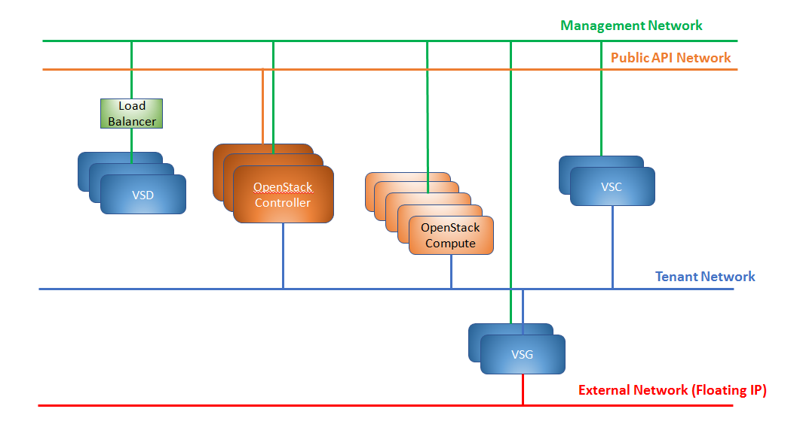

.. _queens-80-ospd:

.. Don't use default python highlighting for code blocks http://www.sphinx-doc.org/en/stable/markup/code.html

.. NOTES do not render correctly in the GitHub Preview, BUT they do in the HTML output, so do not worry!

.. .. Date, Version and Author
.. .. ==========================
.. ..
.. ..  =========  =======    =========
.. ..  Date       Version    Author
.. ..  =========  =======    =========
.. ..  11/03/19    5.4.1u7   Sai Ram/Sunny Verma

======================================================
Deploying Queens Using OpenStack Platform Director 13
======================================================

This section contains the following topics:

.. contents::
   :local:
   :depth: 3

OpenStack Platform Director
------------------------------

The Red Hat OpenStack Platform director is a toolset for installing and managing an OpenStack environment. It is based primarily on the OpenStack TripleO project. It uses an OpenStack deployment, referred to as the Undercloud, to deploy an OpenStack cluster, referred to as an Overcloud.

The OpenStack Platform director (also referred to as OpenStack director) is an image-based installer. It uses a single image (for example, overcloud-full.qcow2) that is deployed on the Controller and Compute nodes belonging to the OpenStack cluster (Overcloud). This image contains all the packages needed during the deployment. The deployment creates only the configuration files and databases required by the different services and starts the services in the correct order. During a deployment, no new software is installed.

For integration of OpenStack Platform director with the Nuage plugin, use the command-line based template option.

OpenStack director uses Heat to orchestrate the deployment of an OpenStack environment. The actual deployment is done through Heat templates and Puppet. Users provide any custom input in templates using the ``openstack overcloud deploy`` command. When this command is run, all the templates are parsed to create the Hiera database, and then a set of puppet manifests, also referred to as TripleO Heat templates, are run to complete the deployment. The Puppet code in turn uses the Puppet modules developed to deploy different services of OpenStack (such as puppet-nova, puppet-neutron, and puppet-cinder).

The OpenStack Platform director architecture allows partners to create custom templates. Partners create new templates to expose parameters specific to their modules.  These templates can then be passed through the ``openstack overcloud deploy`` command during the deployment. Changes to the Puppet manifests are required to handle the new values in the Hiera database and to act on them to deploy the partner software.

Requirements
-------------

For Overcloud, networking, Undercloud, and repository requirements, see the Red Hat upstream documentation:
https://access.redhat.com/documentation/en-us/red_hat_openstack_platform/13/html/director_installation_and_usage/ .

VSP requirements:

   * VSD and VSC are set up before running OpenStack Platform director.
   * Your network includes redundant VSDs.
   * Manual Horizon and Heat integration for Nuage Extensions are required because these modules are not part of the packaged integration.

RHEL 7.5/7.6 is supported with OSP 13.

Recommended Topologies
-----------------------

We recommend deploying this topology:

   * Cluster deployment with redundant controllers

The cluster in your Layer 3 (L3) network should have the following components:

.. _infrastructure_required:

These networks are used:

   * The External network provides Internet access to the VMs using the br-ext mechanisms and floating IP (FIP) addresses and/or Port Address Translation (PAT). It is secured using ACLs on the VSG.
   * The Management network is used for FIP traffic and Internet access for all VMs.
   * The Public API network is used for the public API, API management by administrators, and OpenStack Platform cluster management traffic.
   * The Tenant subnet is used for VXLAN tunnels between the OpenStack Platform Compute nodes, OpenStack controller, VSC, and VSG.

The cluster requires the following:

   * A VSD node can be installed as a VM or a bare metal server.
   * For high availability of the VSD nodes, use a load balancer across the VSD nodes for the REST API.
   * The VSC is always installed as a VM.

Best Practices
---------------

Nuage VSD and VSC

    * Add an endpoint on the provisioned network for verification and testing (when connecting to isolated networks).
    * The Layer 3 network has redundant VSDs.

Red Hat

    * During the certification process, the network should have an odd number of controllers so that the majority of the nodes are up if a node goes down.
    * Go to https://access.redhat.com/documentation/en-us/red_hat_openstack_platform/13/html/director_installation_and_usage/ for more Red Hat best practices.

Integrating Nuage VSP with OpenStack Platform Director
-------------------------------------------------------

*  Download the Nuage Source Code

    Nuage Tripleo Heat Templates, Images Patching and all additional scripts are present at: https://github.com/nuagenetworks/nuage-ospdirector/releases .
    Please download the respective release **Source code (tar.gz or zip)** and extract this on your undercloud under `/home/stack`

The integration includes the following steps:

* Modifying the Overcloud qcow image (for example, overcloud-full.qcow2)

    - The Nuage VRS and metadata agent configuration files need to be created and populated with the required parameters. To do this, add the puppet module (nuage-puppet-modules) to the Overcloud image with the other required Nuage RPMs.

    - The typical OpenStack director deployment scenario assumes that all the packages are installed on the overcloud-full image. The Overcloud qcow image (for example, overcloud-full.qcow2) needs to be patched with the following RPMs:

        - nuage-bgp
        - nuage-metadata-agent
        - nuage-openstack-heat
        - nuage-openstack-horizon
        - nuage-openstack-neutron
        - nuage-openstack-neutronclient
        - nuage-openvswitch (Nuage VRS)
        - nuage-puppet-modules-5.3.0
        - selinux-policy-nuage
        - nuage-topology-collector
        - python-openvswitch-nuage

    - Install python-openvswitch-nuage.
    - Uninstall Open vSwitch (OVS).
    - Install VRS (nuage-openvswitch).

    - Use nuage-puppet-modules-5.3.0.x86_64.rpm for setting Nuage Openvswitch and Nuage Metadata Agent config files.
    - The scripts to patch the overcloud-full.qcow2 image can be found at `image-patching/stopgap-script` which uninstall Open vSwitch (OVS), and install VRS.

    - For AVRS integration, the overcloud-full image is also patched with following 6WIND and Nuage AVRS RPMs:

        - 6windgate-dpdk
        - 6windgate-dpdk-pmd-mellanox-rdma-core
        - 6windgate-dpdk-pmd-virtio-host
        - 6windgate-fp
        - 6windgate-fpn-sdk-dpdk
        - 6windgate-fp-ovs
        - 6windgate-linux-fp-sync
        - 6windgate-linux-fp-sync-fptun
        - 6windgate-linux-fp-sync-ovs
        - 6windgate-linux-fp-sync-vrf
        - 6windgate-product-base
        - 6windgate-tools-common-libs-daemonctl
        - 6windgate-tools-common-libs-libconsole
        - 6windgate-tools-common-libs-pyroute2
        - 6wind-openstack-extensions
        - dkms
        - nuage-metadata-agent (6wind version)
        - nuage-openvswitch (6wind version)
        - python-pyelftools
        - selinux-policy-nuage-avrs
        - virtual-accelerator-base

* Adding Nuage Heat Templates ( `nuage-tripleo-heat-templates <../../nuage-tripleo-heat-templates>`_  )

    - Nuage provides heat templates & environment files to configure neutron on controller and nuage-openvswitch & nuage-metadata-agent on compute nodes and we configure VA on computeavrs nodes.

* Updating the TripleO Heat templates (also referred to as the puppet manifests)

    - Some of the parameters in ``neutron.conf`` and ``nova.conf`` need to be configured in the Heat templates. The Nuage VRS and metadata agent also need to be configured. The values for these parameters depend on the Nuage VSP configuration.
      We use ``neutron-nuage-config.yaml`` and ``nova-nuage-config.yaml`` environment files to configure these values.
    - See the `Sample Templates`_ section for some probable values of the parameters in the ``neutron-nuage-config.yaml`` and ``nova-nuage-config.yaml`` files.
    - For AVRS integration, some of the parameters in ``fast-path.env`` needs to be configured in the Heat templates. We use ``compute-avrs-environment.yaml`` environment file to configure these values.
    - For AVRS integration, see the `Sample Templates`_ section for some probable values of the parameters in the ``compute-avrs-environment.yaml`` file and we also need to create a new AVRS role similar to the upstream Compute role.
    - For AVRS intergration, we can also create Multiple roles which we can pass different sets of configuration on those AVRS Compute Node. Sample enviroment file can be found `here <../../nuage-tripleo-heat-templates/environments/compute-avrs-multirole-environment.yaml>`_

Links to Nuage and OpenStack Resources
---------------------------------------

* For the Heat templates used by OpenStack director, go to http://git.openstack.org/cgit/openstack/tripleo-heat-templates .
* For the Puppet manifests, go to http://git.openstack.org/cgit/openstack/tripleo-heat-templates/tree/puppet .
* For the nuage-puppet-modules RPM (nuage-puppet-modules-5.3.0), go to `image-patching <../../image-patching>`_ .
* For the scripts to patch the Overcloud qcow image, go to `stopgap-script <../../image-patching/stopgap-script>`_ .
* For the Nuage and Puppet modules, go to http://git.openstack.org/cgit/openstack/tripleo-heat-templates/tree/puppet .
* For the files and script to generate the CMS ID, go to `generate-cms-id <../../generate-cms-id>`_ .

.. Note::  **Please contact Nuage for Nuage Ironic Integration**

Before the Deployment Process
------------------------------

.. Note:: Before performing the procedures in this document, read the *Director Installation and Usage* guide for OSPD 13: https://access.redhat.com/documentation/en-us/red_hat_openstack_platform/13/html/director_installation_and_usage .

Create seperate repositories for the following packages:

    * OSC and VRS: `OSC and VRS Packages`_
    * 6WIND and AVRS ( Only for AVRS Deployment) : `6WIND and AVRS Packages`_

OSC and VRS Packages
~~~~~~~~~~~~~~~~~~~~~~

    * nuage-bgp
    * nuage-metadata-agent
    * nuage-openstack-heat
    * nuage-openstack-horizon
    * nuage-openstack-neutron
    * nuage-openstack-neutronclient
    * nuage-openvswitch (VRS)
    * nuage-puppet-modules (Latest version 5.3.0)
    * nuage-topology-collector
    * selinux-policy-nuage
    * python-openvswitch-nuage

6WIND and AVRS Packages
~~~~~~~~~~~~~~~~~~~~~~~~~

    * 6windgate-dpdk
    * 6windgate-dpdk-pmd-mellanox-rdma-core
    * 6windgate-dpdk-pmd-virtio-host
    * 6windgate-fp
    * 6windgate-fpn-sdk-dpdk
    * 6windgate-fp-ovs
    * 6windgate-linux-fp-sync
    * 6windgate-linux-fp-sync-fptun
    * 6windgate-linux-fp-sync-ovs
    * 6windgate-linux-fp-sync-vrf
    * 6windgate-product-base
    * 6windgate-tools-common-libs-daemonctl
    * 6windgate-tools-common-libs-libconsole
    * 6windgate-tools-common-libs-pyroute2
    * 6wind-openstack-extensions
    * dkms
    * nuage-metadata-agent (from el7-6wind)
    * nuage-openvswitch (from el7-6wind)
    * python-pyelftools
    * selinux-policy-nuage-avrs
    * virtual-accelerator-base
    * virtual-accelerator (Only requried for VA version <= 1.8.3)

Deployment Process
-------------------

Phase 1: Install OpenStack director on the Undercloud system.
~~~~~~~~~~~~~~~~~~~~~~~~~~~~~~~~~~~~~~~~~~~~~~~~~~~~~~~~~~~~~~~

Follow the steps in https://access.redhat.com/documentation/en-us/red_hat_openstack_platform/13/html/director_installation_and_usage/installing-the-undercloud .

When obtaining images for the Overcloud nodes, replace the upstream Overcloud image with one modified to include Nuage components from Step 2 in this workflow.

If you want to use a remote registry for the Overcloud container images, you need to add the iptables rule on Director (Undercloud Machine) with the Undercloud IP address or interface with external connectivity for NAT. In the below example, the Undercloud IP address is 192.168.24.1 and the external interface name is eth0:

::

    sudo iptables -A POSTROUTING -t nat -s 192.168.24.1/24 -j MASQUERADE
    (or)
    sudo iptables -t nat -A POSTROUTING -o eth0 -j MASQUERADE

Phase 2: Configure the basic Overcloud.
~~~~~~~~~~~~~~~~~~~~~~~~~~~~~~~~~~~~~~~~
Follow the upstream OpenStack documentation *up to the step where* the ``openstack overcloud deploy`` command is run using the CLI or starting the Overcloud deployment (starting the Overcloud creation) in the UI.

These are the OpenStack instructions:

    * Configuring the container registry details: https://access.redhat.com/documentation/en-us/red_hat_openstack_platform/13/html/director_installation_and_usage/configuring-a-container-image-source
    * Using the CLI: https://access.redhat.com/documentation/en-us/red_hat_openstack_platform/13/html/director_installation_and_usage/chap-configuring_basic_overcloud_requirements_with_the_cli_tools
    * Using the UI: https://access.redhat.com/documentation/en-us/red_hat_openstack_platform/13/html/director_installation_and_usage/chap-configuring_basic_overcloud_requirements_with_the_ui_tools

Phase 3: Modify the Overcloud qcow image (for example, overcloud-full.qcow2) to include Nuage components.
~~~~~~~~~~~~~~~~~~~~~~~~~~~~~~~~~~~~~~~~~~~~~~~~~~~~~~~~~~~~~~~~~~~~~~~~~~~~~~~~~~~~~~~~~~~~~~~~~~~~~~~~~~

The steps for modifying overcloud-full.qcow2 are provided in the `README.md <../../image-patching/stopgap-script/README.md>`_  file.

Phase 4: Adding Nuage Heat Templates
~~~~~~~~~~~~~~~~~~~~~~~~~~~~~~~~~~~~~

Copy the nuage-tripleo-heat-templates folder from /home/stack/nuage-ospdirector-osp-13.<release>/nuage-tripleo-heat-templates to `/home/stack/` directory on undercloud.

    ::

        cd /home/stack
        ln -s nuage-ospdirector/nuage-tripleo-heat-templates .

Copy the roles from `/usr/share/openstack-tripleo-heat-templates/roles` to `/home/stack/nuage-tripleo-heat-templates/roles`

    ::

        cp /usr/share/openstack-tripleo-heat-templates/roles/* /home/stack/nuage-tripleo-heat-templates/roles/

**For an AVRS integration please follow below steps as well**:

User can have Single or Mutli-Roles for AVRS nodes.

    **For single-role AVRS deployment**, use the `create_compute_avrs_role.sh <../../nuage-tripleo-heat-templates/scripts/create_roles/create_compute_avrs_role.sh>`_ to create a role file called ``compute-avrs-role.yaml``.

    Run using

    ::

         cd /home/stack/nuage-tripleo-heat-templates/scripts/create_roles

        ./create_compute_avrs_role.sh

    Above command will create a new ``ComputeAvrs``  role for your deployment, and compare it with sample `compute-avrs-role-sample.yaml <../../nuage-tripleo-heat-templates/templates/compute-avrs-role-sample.yaml>`_ .

    **For mutli-role AVRS deployment**, we have automated `script <../../nuage-tripleo-heat-templates/scripts/create_roles/create_compute_avrs_multirole.sh>`_ to create ComputeAvrsSingle & ComputeAvrsDual role. You can edit these files with your requirements to create new roles.
    You can read more about usage of roles at https://access.redhat.com/documentation/en-us/red_hat_openstack_platform/13/html-single/director_installation_and_usage/index#sect-Generate_Architecture_Specific_Roles

    Run using

    ::

        cd /home/stack/nuage-tripleo-heat-templates/scripts/create_roles
        ./create_compute_avrs_multirole.sh

Phase 5: Generate a CMS ID for the OpenStack installation.
~~~~~~~~~~~~~~~~~~~~~~~~~~~~~~~~~~~~~~~~~~~~~~~~~~~~~~~~~~~

The Cloud Management System (CMS) ID needs to be generated to configure your OpenStack installation with the VSD installation.

Go to /home/stack/nuage-ospdirector/generate-cms-id for the files and script to generate the CMS ID, and follow the instructions in README.md.

The CMS ID is displayed in the output, and a copy of it is stored in a file called cms_id.txt in the same folder.

Add the CMS ID to the /home/stack/nuage-tripleo-heat-templates/environments/neutron-nuage-config.yaml template file for the ``NeutronNuageCMSId`` parameter.

Phase 6: Check the Ironic node status to ensure that the Ironic nodes have been successfully created.
~~~~~~~~~~~~~~~~~~~~~~~~~~~~~~~~~~~~~~~~~~~~~~~~~~~~~~~~~~~~~~~~~~~~~~~~~~~~~~~~~~~~~~~~~~~~~~~~~~~~~

Run the following commands.

1. Run the following command. The results should show the *Provisioning State* status as *available* and the *Maintenance* status as *False*.

::

    openstack baremetal node list

2. If profiles are being set for a specific placement in the deployment, run the following command. The results should show the *Provisioning State* status as *available* and the *Current Profile* status as *control* or *compute*.

::

    openstack overcloud profiles list

Phase 7: Create the Heat templates.
~~~~~~~~~~~~~~~~~~~~~~~~~~~~~~~~~~~~

1. Go to `/home/stack/nuage-tripleo-heat-templates/environments/` on the Undercloud machine.

2. Create these templates, and add the values for the VSD IP, CMS ID, and other parameters in the following files. Go to the `Parameters in the Heat Templates`_ section for details about the parameters in the templates.

    * neutron-nuage-config.yaml - Add the generated ``cms_id`` to the ``NeutronNuageCMSId`` parameter.
    * nova-nuage-config.yaml

3. Create the environment file ``node-info.yaml`` under ``/home/stack/templates/`` to specify the count and flavor for ``Controller`` and ``Compute`` roles.

Assign Controller and Compute nodes with their respective profiles:

::

    openstack baremetal node set --property capabilities='profile:control,boot_option:local' <node-uuid>
    openstack baremetal node set --property capabilities='profile:compute,boot_option:local' <node-uuid>

The syntax for ``node-info.yaml`` is:

::

    parameter_defaults:
      Overcloud<Role Name from the roles file>Flavor: <flavor name>
      <Role Name from the roles file>Count: <number of nodes for this role>

This example shows how to create a deployment with one Controller node and two Compute nodes.

::

    parameter_defaults:
      OvercloudControllerFlavor: control
      ControllerCount: 1
      OvercloudComputeFlavor: compute
      ComputeCount: 2

**For AVRS integration, follow these steps**:

:Step 1: Create a new compute-avrs-role.yaml file to deploy AVRS Compute nodes. The command used to create this file is:

**For single-role AVRS deployment**: `ComputeAvrs`

::

    openstack overcloud roles generate --roles-path /home/stack/nuage-tripleo-heat-templates/roles -o /home/stack/nuage-tripleo-heat-templates/templates/compute-avrs-role.yaml Controller ComputeAvrs

.. Note:: To deploy VRS + AVRS computes in the same deployment, add "Compute" role to the above command at the end.

**For multi-role AVRS deployment**: `ComputeAvrsSingle` & `ComputeAvrsDual`

::

    openstack overcloud roles generate --roles-path /home/stack/nuage-tripleo-heat-templates/roles -o /home/stack/nuage-tripleo-heat-templates/templates/compute-avrs-role.yaml Controller Compute ComputeAvrsSingle ComputeAvrsDual

.. Note:: given ``compute-avrs-role.yaml`` file can get updated with newer release

:Step 2: Create a flavor and profile:

**For single-role AVRS deployment**: `computeavrs`

::

    openstack flavor create --id auto --ram 4096 --disk 40 --vcpus 1 computeavrs
    openstack flavor set --property "cpu_arch"="x86_64" --property "capabilities:boot_option"="local" --property "capabilities:profile"="computeavrs" computeavrs

**For multi-role AVRS deployment**: `computeavrssingle` & `computeavrsdual`

:: 

    openstack flavor create --id auto --ram 4096 --disk 40 --vcpus 1 computeavrssingle
    openstack flavor set --property "cpu_arch"="x86_64" --property "capabilities:boot_option"="local" --property "capabilities:profile"="computeavrssingle" computeavrssingle

    openstack flavor create --id auto --ram 4096 --disk 40 --vcpus 1 computeavrsdual
    openstack flavor set --property "cpu_arch"="x86_64" --property "capabilities:boot_option"="local" --property "capabilities:profile"="computeavrsdual" computeavrsdual

:Step 3: Set profile to AVRS nodes:

**For single-role AVRS deployment:**

::

    openstack baremetal node set --property capabilities='profile:computeavrs,boot_option:local' <node-uuid>

**For multi-role AVRS deployment:**

::

    openstack baremetal node set --property capabilities='profile:computeavrssingle,boot_option:local' <node-uuid>
    openstack baremetal node set --property capabilities='profile:computeavrsdual,boot_option:local' <node-uuid>

:Step 4: Create `node-info.yaml` with correct Node information.

**For single-role AVRS deployment:** Add the count and flavor for ComputeAvrs Role in the `node-info.yaml` file. The following example shows how to create a deployment with one Controller node, two Compute nodes, and two ComputeAvrs nodes:

::

    parameter_defaults:
      OvercloudControllerFlavor: control
      ControllerCount: 1
      OvercloudComputeFlavor: compute
      ComputeCount: 2
      OvercloudComputeAvrsFlavor: computeavrs
      ComputeAvrsCount: 2

**For multi-role AVRS deployment**, set the `node-info.yaml` with the corresponding role name. The following example shows how to create a deployment with one Controller node, two Compute nodes,  two ComputeAvrsSingle & two ComputeAvrsDual Avrs nodes:

::

    parameter_defaults:
      OvercloudControllerFlavor: control
      ControllerCount: 1
      OvercloudComputeFlavor: compute
      ComputeCount: 2
      OvercloudComputeAvrsSingleFlavor: computeavrssingle
      ComputeAvrsSingleCount: 2
      OvercloudComputeAvrsSingleFlavor: computeavrsdual
      ComputeAvrsDualCount: 2

:Step 5: Modify avrs environment file in /home/stack/nuage-tripleo-heat-templates/environments/.

    **Please notice these are sample templates and parameter values can be customized depending on the use case. Please contact Nuage for the recommended values for these parameters**.

    **For single-role AVRS deployment** environment file can found at:  `compute-avrs-environment.yaml <../../nuage-tripleo-heat-templates/environments/compute-avrs-environment.yaml>`_ file. See the sample in the `Sample Templates`_ section.

    **For multi-role AVRS deployment** environment file can be found at : `compute-avrs-mutlirole-environment.yaml <../../nuage-tripleo-heat-templates/environments/compute-avrs-mutlirole-environment.yaml>`_ file. See the sample in the `Sample Templates`_ section.

    a. For AVRS deployment, Virtual Accelerator requires information like which logical cores run the fast path, list of ports enabled in the fast path, additional fast path options etc.., to be set inside `/etc/fast-path.env`.
       Below is the mapping between parameters in heat template to parameters in `fast-path.env`.

    ::

        FastPathMask           =====>    FP_MASK
        FastPathNics           =====>    FP_PORTS
        CorePortMapping        =====>    CORE_PORT_MAPPING
        FastPathMemory         =====>    FP_MEMORY
        VmMemory               =====>    VM_MEMORY
        NbMbuf                 =====>    NB_MBUF
        FastPathOffload        =====>    FP_OFFLOAD
        FastPathNicDescriptors =====>    FPNSDK_OPTIONS
        FastPathDPVI           =====>    DPVI_MASK
        FastPathOptions        =====>    FP_OPTIONS

    b. For AVRS deployments requires to configure monkey_patch parameters in `nova.conf` and we use below to configure them.

    ::

        ComputeAvrsExtraConfig:
            nova::config::nova_config:
              DEFAULT/monkey_patch:
                value: true
              DEFAULT/monkey_patch_modules:
                value: nova.virt.libvirt.vif:openstack_6wind_extensions.queens.nova.virt.libvirt.vif.decorator

    c. For AVRS deployment, Virtual Accelerator requires hugepages to be configured and the value can be varied. We also need to enable VT-d.

    ::

        KernelArgs: "default_hugepagesz=1G hugepagesz=1G hugepages=64 iommu=pt intel_iommu=on isolcpus=1-7"

    .. Note:: Above kernel arguments are consumed by the another env file which include in deployment command `/usr/share/openstack-tripleo-heat-templates/environments/host-config-and-reboot.yaml`

    .. Note:: We also can set GpgCheck to "no" in environment files if user want to disable GPG Check while installating packages on AVRS Node deployment.

    d. For IsolatedCPU or CPUAffinity to be respected, CPUSET_ENABLE needs to be set to the value 0. We already set CPUSET_ENABLE value to 0 in our templates by default so you don't need to set is explicitly.

    ::

        CpuSetEnable        =====>    CPUSET_ENABLE

4. **(Optional)** To enable SR-IOV, perform the following instructions:

  This feature allows an OpenStack installation to support Single Root I/O Virtualization (SR-IOV)-attached VMs (https://wiki.openstack.org/wiki/SR-IOV-Passthrough-For-Networking) with VSP-managed VMs on the same KVM hypervisor cluster. It provides a Nuage ML2 mechanism driver that coexists with the sriovnicswitch mechanism driver.

  Neutron ports attached through SR-IOV are configured by the sriovnicswitch mechanism driver. Neutron ports attached to Nuage VSD-managed networks are configured by the Nuage ML2 mechanism driver.

  To enable SR-IOV, perform the following steps:

:Step 1: When updating the Undercloud codebase, no additional changes are required.

:Step 2: When modifying the overcloud-full image", use the script provided to update the image. No additional changes are required.

:Step 3: Create a new compute-sriov-role.yaml file to deploy SR-IOV Compute nodes. The command used to create this file is:

::

    openstack overcloud roles generate --roles-path /home/stack/nuage-tripleo-heat-templates/roles/ -o /home/stack/nuage-tripleo-heat-templates/templates/compute-sriov-role.yaml Controller Compute ComputeSriov

:Step 4: If deploying OpenStack Neutron SR-IOV in your overcloud, include the ``/usr/share/openstack-tripleo-heat-templates/environments/services-docker/neutron-sriov.yaml`` environment file so the director can prepare the images. When following **Phase 8 Step 4** please include below environment. The following snippet is an example on how to include this environment file:

::

    openstack overcloud container image prepare \
    ...
    -e /usr/share/openstack-tripleo-heat-templates/environments/services-docker/neutron-sriov.yaml \
    ...

:Step 5: Create a flavor and profile for computesriov:

      Please refer: https://access.redhat.com/documentation/en-us/red_hat_openstack_platform/13/html/director_installation_and_usage/chap-configuring_basic_overcloud_requirements_with_the_cli_tools#sect-Tagging_Nodes_into_Profiles for more information.

::

    openstack flavor create --id auto --ram 4096 --disk 40 --vcpus 1 computesriov
    openstack flavor set --property "cpu_arch"="x86_64" --property "capabilities:boot_option"="local" --property "capabilities:profile"="computesriov" computesriov

:Step 6: Assign SR-IOV nodes with the appropriate computesriov profile:

::

    openstack baremetal node set --property capabilities='profile:computesriov,boot_option:local' <node-uuid>

:Step 7: Add the count and flavor for ComputeSriov Role in the node-info.yaml file. The following example shows how to create a deployment with one Controller node, two Compute nodes, and two ComputeSriov nodes:

::

    parameter_defaults:
      OvercloudControllerFlavor: control
      ControllerCount: 1
      OvercloudComputeFlavor: compute
      ComputeCount: 2
      OvercloudComputeSriovFlavor: computesriov
      ComputeSriovCount: 2

:Step 8: To deploy the Overcloud, additional parameters and template files are required.

    * Include the following parameter values in the heat template neutron-nuage-config.yaml:
    
    ::
    
         NeutronServicePlugins: 'NuagePortAttributes,NuageAPI,NuageL3,trunk,NuageNetTopology'
         NeutronTypeDrivers: "vlan,vxlan,flat"
         NeutronMechanismDrivers: ['nuage','nuage_sriov','sriovnicswitch']
         NeutronFlatNetworks: '*'
         NeutronTunnelIdRanges: "1:1000"
         NeutronNetworkVLANRanges: "physnet1:2:100,physnet2:2:100"
         NeutronVniRanges: "1001:2000"
    
    
    * Add this parameter value in the heat template nova-nuage-config.yaml:
    
    ::
    
        NovaPCIPassthrough: "[{"devname":"eno2","physical_network":"physnet1"},{"devname":"eno3","physical_network":"physnet2"}]"
    
    
    * Include "neutron-sriov.yaml" file in the Overcloud deployment command. See the sample in the `Sample Templates`_ section.

5. Network Isolation on Overcloud nodes

** Linux Bonding with VLAN **

:Step 1: Nuage uses the default Linux bridge and Linux bonds.

:Step 2: Nuage provides `bond-with-vlans network templates <../../nuage-tripleo-heat-templates/network/config/bond-with-vlans/>`_ for deploying overcloud controller and computesriov by configuring linux bond with vlans.

:Step 3: The network templates provided by Nuage by default supports the below topology and users can modify these network templates to match their topology.

    * controller.yaml expect controller nodes to have 3 interfaces, 1st interface for provisioning and remaining 2 for linux bond with vlan for all networks.
    * compute.yaml expect compute nodes to have 3 interfaces, 1st interface for provisioning, 2 for linux bond with vlan for all networks.
    * computesriov.yaml expect computesriov nodes to have 3 interfaces, 1st interface for provisioning, 2 for linux bond with vlan for all networks.
    * computeavrs.yaml expect computeavrs nodes to have 3 interfaces, 1st interface for provisioning, 2 for linux bond with vlan for all networks.
    * computeavrssingle.yaml expect computeavrssingle nodes to have 3 interfaces, 1st interface for provisioning, 2 for linux bond with vlan for all networks.
    * computeavrsdual.yaml expect computeavrsdual nodes to have 3 interfaces, 1st interface for provisioning, 2 for linux bond with vlan for all networks.

:Step 4: Here are sample network template changes for linux bond with vlans for all types of interfaces

::

            ...
              - type: linux_bond
                name: bond1

                dns_servers:
                  get_param: DnsServers
                bonding_options: 'mode=active-backup'
                members:
                - type: interface
                  name: nic2
                  primary: true
                - type: interface
                  name: nic3
              - type: vlan
                device: bond1
                vlan_id:
                  get_param: StorageNetworkVlanID
                addresses:
                - ip_netmask:
                    get_param: StorageIpSubnet
              - type: vlan
                device: bond1
                vlan_id:
                  get_param: StorageMgmtNetworkVlanID
                addresses:
                - ip_netmask:
                    get_param: StorageMgmtIpSubnet
              - type: vlan
                device: bond1
                vlan_id:
                  get_param: InternalApiNetworkVlanID
                addresses:
                - ip_netmask:
                    get_param: InternalApiIpSubnet
              - type: vlan
                device: bond1
                vlan_id:
                  get_param: TenantNetworkVlanID
                addresses:
                - ip_netmask:
                    get_param: TenantIpSubnet
              - type: vlan
                device: bond1
                vlan_id:
                  get_param: ExternalNetworkVlanID
                addresses:
                - ip_netmask:
                    get_param: ExternalIpSubnet
                routes:
                - default: true
                  next_hop:
                    get_param: ExternalInterfaceDefaultRoute
            ...

:Step 6: Modify ``/home/stack/nuage-tripleo-heat-templates/environments/network-environment.yaml`` with appropriate values.

.. Note:: In OSPD 9 and later, a verification step was added where the Overcloud nodes ping the gateway to verify connectivity on the external network VLAN. Without this verification step, the deployment, such as one with Linux bonding and network isolation, would fail. For this verification step, the ExternalInterfaceDefaultRoute IP configured in the template network-environment.yaml should be reachable from the Overcloud Controller nodes on the external API VLAN. This gateway can also reside on the Undercloud. The gateway needs to be tagged with the same VLAN ID as that of the external API network of the Controller. ExternalInterfaceDefaultRoute IP should be able to reach outside because the Overcloud Controller uses this IP address as a default route to reach the Red Hat Registry to pull the Overcloud container images.

Phase 8. Nuage Docker Containers.
~~~~~~~~~~~~~~~~~~~~~~~~~~~~~~~~~

**Nuage containers from Redhat Partner Container Catalog (For Nuage release greater than or equals 5.4.1u4)**

1. On the Undercloud, use the following instructions to get Nuage images from a Red Hat container registry using registry service account tokens. You will need to `create a registry service account <https://access.redhat.com/terms-based-registry>`_ to use prior to completing the following task.

::

    $ docker login registry.connect.redhat.com
    Username: ${REGISTRY-SERVICE-ACCOUNT-USERNAME}
    Password: ${REGISTRY-SERVICE-ACCOUNT-PASSWORD}
    Login Succeeded!

2. Now change the working directory to /home/stack/nuage-tripleo-heat-templates/scripts/pull_nuage_containers/

::

    $ cd /home/stack/nuage-tripleo-heat-templates/scripts/pull_nuage_containers/

3. Configure `nuage_container_config.yaml` with appropriate values and a sample is given below.

::

    #OpenStack version number
    version: 13
    #Nuage Release and format is <Major-release, use '-' instead of '.'>-<Minor-release>-<Updated-release>
    # for exmaple: Nuage release 5.4.1u4 please enter following
    release: 5-4-1-u4
    #Tag for Nuage container images
    tag: latest
    #Undercloud Local Registry IP Address:PORT
    local_registry: 192.168.24.1:8787
    #List of Nuage containers
    nuage_images: ['heat-api-cfn', 'heat-api', 'heat-engine', 'horizon', 'neutron-server', 'nova-compute']

4. Now execute `nuage_container_pull.py` script by passing nuage_container_config.yaml to "--nuage-config" argument.

::

    $ python nuage_container_pull.py --nuage-config nuage_container_config.yaml

5. The above command does the below four steps:

:Step1: Pull Nuage container images from Red Hat Registry

:Step2: Retag the Nuage container images, by modifying the registry to point to local registry

:Step3: Push the retagged Nuage container images to local registry

:Step4: Remove the container images that got created in step1 and step2 from undercloud machine.

6. After executing `nuage_container_pull.py`, there will be a nuage_overcloud_images.yaml created under /home/stack/nuage-tripleo-heat-templates/environments and always /home/stack/templates/overcloud_images.yaml should take precedence over this file.

::

    Ex:
    openstack overcloud deploy --templates -e /home/stack/templates/overcloud_images.yaml -e /home/stack/nuage-tripleo-heat-templates/environments/nuage_overcloud_images.yaml - e <remaining environment files>

Phase 9: Deploy the Overcloud.
~~~~~~~~~~~~~~~~~~~~~~~~~~~~~~~

You can use the Heat templates with the the command-line based template to deploy the Overcloud.

Use the ``openstack overcloud deploy`` command options to pass the environment files and to create or update an Overcloud deployment where:

    * neutron-nuage-config.yaml has the Nuage-specific Controller parameter values.
    * node-info.yaml has information specifying the count and flavor for the Controller and Compute nodes.
    * nova-nuage-config.yaml has the Nuage-specific Compute parameter values.

For AVRS, also include following role and environment files.

    For single role deployment:

        * compute-avrs-role.yaml
        * compute-avrs-environment.yaml

    For multi-role deployment:

        * compute-avrs-multirole.yaml
        * compute-avrs-multirole-environment.yaml

1. For a non-HA Overcloud deployment, use one of the following commands:

::

    openstack overcloud deploy --templates -e /home/stack/templates/overcloud_images.yaml -e /home/stack/templates/node-info.yaml -e /home/stack/nuage-tripleo-heat-templates/environments/nuage_overcloud_images.yaml -e /home/stack/nuage-tripleo-heat-templates/environments/neutron-nuage-config.yaml -e /home/stack/nuage-tripleo-heat-templates/environments/nova-nuage-config.yaml --ntp-server ntp-server --timeout timeout
    
    For a virtual deployment, add the --libvirt-type parameter:
    openstack overcloud deploy --templates --libvirt-type qemu -e /home/stack/templates/overcloud_images.yaml -e /home/stack/templates/node-info.yaml -e /home/stack/nuage-tripleo-heat-templates/environments/nuage_overcloud_images.yaml -e /home/stack/nuage-tripleo-heat-templates/environments/neutron-nuage-config.yaml -e /home/stack/nuage-tripleo-heat-templates/environments/nova-nuage-config.yaml --ntp-server ntp-server --timeout timeout
    
    For AVRS single-role, use:
    openstack overcloud deploy --templates -r /home/stack/nuage-tripleo-heat-templates/templates/compute-avrs-role.yaml -e /home/stack/templates/overcloud_images.yaml -e /home/stack/templates/node-info.yaml -e /home/stack/nuage-tripleo-heat-templates/environments/nuage_overcloud_images.yaml  -e /home/stack/nuage-tripleo-heat-templates/environments/nova-nuage-config.yaml -e /home/stack/nuage-tripleo-heat-templates/environments/neutron-nuage-config.yaml -e /home/stack/nuage-tripleo-heat-templates/environments/compute-avrs-environment.yaml -e /usr/share/openstack-tripleo-heat-templates/environments/host-config-and-reboot.yaml --ntp-server ntp-server --timeout timeout

    For AVRS multi-role, use:
    openstack overcloud deploy --templates -r /home/stack/nuage-tripleo-heat-templates/templates/compute-avrs-role.yaml -e /home/stack/templates/overcloud_images.yaml -e /home/stack/templates/node-info.yaml -e /home/stack/nuage-tripleo-heat-templates/environments/nuage_overcloud_images.yaml  -e /home/stack/nuage-tripleo-heat-templates/environments/nova-nuage-config.yaml -e /home/stack/nuage-tripleo-heat-templates/environments/neutron-nuage-config.yaml -e /home/stack/nuage-tripleo-heat-templates/environments/compute-avrs-multirole-environment.yaml -e /usr/share/openstack-tripleo-heat-templates/environments/host-config-and-reboot.yaml --ntp-server ntp-server --timeout timeout

2. For an HA deployment, use one of the following commands:

::

    openstack overcloud deploy --templates -e /home/stack/templates/overcloud_images.yaml -e /home/stack/templates/node-info.yaml -e /home/stack/nuage-tripleo-heat-templates/environments/nuage_overcloud_images.yaml -e /home/stack/nuage-tripleo-heat-templates/environments/neutron-nuage-config.yaml -e /home/stack/nuage-tripleo-heat-templates/environments/nova-nuage-config.yaml --ntp-server ntp-server --timeout timeout
    
    For a virtual deployment, add the --libvirt-type parameter:
    openstack overcloud deploy --templates --libvirt-type qemu -e /home/stack/templates/overcloud_images.yaml -e /home/stack/templates/node-info.yaml -e /home/stack/nuage-tripleo-heat-templates/environments/nuage_overcloud_images.yaml -e /home/stack/nuage-tripleo-heat-templates/environments/neutron-nuage-config.yaml -e /home/stack/nuage-tripleo-heat-templates/environments/nova-nuage-config.yaml --ntp-server ntp-server --timeout timeout
    
    For AVRS single-role, use:
    openstack overcloud deploy --templates -r /home/stack/nuage-tripleo-heat-templates/templates/compute-avrs-role.yaml -e /home/stack/templates/overcloud_images.yaml -e /home/stack/templates/node-info.yaml -e /home/stack/nuage-tripleo-heat-templates/environments/nuage_overcloud_images.yaml  -e /home/stack/nuage-tripleo-heat-templates/environments/nova-nuage-config.yaml -e /home/stack/nuage-tripleo-heat-templates/environments/neutron-nuage-config.yaml -e /home/stack/nuage-tripleo-heat-templates/environments/compute-avrs-environment.yaml -e /usr/share/openstack-tripleo-heat-templates/environments/host-config-and-reboot.yaml --ntp-server ntp-server --timeout timeout

    For AVRS multi-role, use:
    openstack overcloud deploy --templates -r /home/stack/nuage-tripleo-heat-templates/templates/compute-avrs-role.yaml -e /home/stack/templates/overcloud_images.yaml -e /home/stack/templates/node-info.yaml -e /home/stack/nuage-tripleo-heat-templates/environments/nuage_overcloud_images.yaml  -e /home/stack/nuage-tripleo-heat-templates/environments/nova-nuage-config.yaml -e /home/stack/nuage-tripleo-heat-templates/environments/neutron-nuage-config.yaml -e /home/stack/nuage-tripleo-heat-templates/environments/compute-avrs-multirole-environment.yaml -e /usr/share/openstack-tripleo-heat-templates/environments/host-config-and-reboot.yaml --ntp-server ntp-server --timeout timeout

3. For SR-IOV, use following commands:

::

   openstack overcloud deploy --templates -r /home/stack/nuage-tripleo-heat-templates/templates/compute-sriov-role.yaml -e /home/stack/templates/overcloud_images.yaml -e /home/stack/nuage-tripleo-heat-templates/environments/nuage_overcloud_images.yaml -e /home/stack/templates/node-info.yaml -e /home/stack/templates/neutron-sriov.yaml -e /home/stack/nuage-tripleo-heat-templates/environments/neutron-nuage-config.yaml -e /home/stack/nuage-tripleo-heat-templates/environments/nova-nuage-config.yaml --ntp-server ntp-server --timeout timeout

4. For a Linux-bonding HA deployment with Nuage, use the following:

::

    openstack overcloud deploy --templates -e /home/stack/templates/overcloud_images.yaml -e /home/stack/nuage-tripleo-heat-templates/environments/nuage_overcloud_images.yaml -e /home/stack/templates/node-info.yaml -e /usr/share/openstack-tripleo-heat-templates/environments/network-isolation.yaml -e /home/stack/nuage-tripleo-heat-templates/environments/network-environment.yaml -e /home/stack/nuage-tripleo-heat-templates/environments/net-bond-with-vlans.yaml -e /home/stack/nuage-tripleo-heat-templates/environments/neutron-nuage-config.yaml -e /home/stack/nuage-tripleo-heat-templates/environments/nova-nuage-config.yaml --ntp-server ntp-server --timeout timeout

    For AVRS single-role, use:
    openstack overcloud deploy --templates -r /home/stack/nuage-tripleo-heat-templates/templates/compute-avrs-role.yaml -e /home/stack/templates/overcloud_images.yaml -e /home/stack/nuage-tripleo-heat-templates/environments/nuage_overcloud_images.yaml -e /home/stack/templates/node-info.yaml -e /usr/share/openstack-tripleo-heat-templates/environments/network-isolation.yaml -e /home/stack/nuage-tripleo-heat-templates/environments/network-environment.yaml -e /home/stack/nuage-tripleo-heat-templates/environments/net-bond-with-vlans.yaml -e /home/stack/nuage-tripleo-heat-templates/environments/neutron-nuage-config.yaml -e /home/stack/nuage-tripleo-heat-templates/environments/nova-nuage-config.yaml -e /home/stack/nuage-tripleo-heat-templates/environments/compute-avrs-environment.yaml -e /usr/share/openstack-tripleo-heat-templates/environments/host-config-and-reboot.yaml --ntp-server ntp-server --timeout timeout

    For AVRS multi-role, use:
    openstack overcloud deploy --templates -r /home/stack/nuage-tripleo-heat-templates/templates/compute-avrs-role.yaml -e /home/stack/templates/overcloud_images.yaml -e /home/stack/nuage-tripleo-heat-templates/environments/nuage_overcloud_images.yaml -e /home/stack/templates/node-info.yaml -e /usr/share/openstack-tripleo-heat-templates/environments/network-isolation.yaml -e /home/stack/nuage-tripleo-heat-templates/environments/network-environment.yaml -e /home/stack/nuage-tripleo-heat-templates/environments/net-bond-with-vlans.yaml -e /home/stack/nuage-tripleo-heat-templates/environments/neutron-nuage-config.yaml -e /home/stack/nuage-tripleo-heat-templates/environments/nova-nuage-config.yaml -e /home/stack/nuage-tripleo-heat-templates/environments/compute-avrs-multirole-environment.yaml -e /usr/share/openstack-tripleo-heat-templates/environments/host-config-and-reboot.yaml --ntp-server ntp-server --timeout timeout

where:
   * ``neutron-nuage-config.yaml`` is Controller specific parameter values.
   * ``nova-nuage-config.yaml`` is Compute specific parameter values.
   * ``node-info.yaml`` is Information specifies count and flavor for Controller and Compute nodes.
   * ``network-environment.yaml`` Configures additional network environment variables
   * ``network-isolation.yaml`` Enables creation of networks for isolated overcloud traffic
   * ``net-bond-with-vlans.yaml`` Configures an IP address and a pair of bonded nics on each network
   * ``compute-sriov-role.yaml`` Enables services required for Compute Sriov role
   * ``neutron-sriov.yaml`` Neutron SRIOV specific parameter values
   * ``compute-avrs-role.yaml`` Enables services required for Compute Avrs role
   * ``compute-avrs-environment.yaml``  Configure the parameters for ComputeAvrs
   * ``compute-avrs-multirole-environment.yaml``  Configure the parameters for ComputeAvrsSingle & ComputeAvrsDual

Phase 10: Verify that OpenStack director has been deployed successfully.
~~~~~~~~~~~~~~~~~~~~~~~~~~~~~~~~~~~~~~~~~~~~~~~~~~~~~~~~~~~~~~~~~~~~~~~~

1. Run ``openstack stack list`` to verify that the stack was created.

::

    [stack@director ~]$ openstack stack list

    +--------------------------------------+------------+----------------------------------+-----------------+----------------------+-----------------+
    | ID                                   | Stack Name | Project                          | Stack Status    | Creation Time        | Updated Time    |
    +--------------------------------------+------------+----------------------------------+-----------------+----------------------+-----------------+
    | 75810b99-c372-463c-8684-f0d7b4e5743e | overcloud  | 1c60ab81cc924fe78355a76ee362386b | CREATE_COMPLETE | 2018-03-27T07:26:28Z | None            |
    +--------------------------------------+------------+----------------------------------+-----------------+----------------------+-----------------+

2. Run ``nova list`` to view the Overcloud Compute and Controller nodes.

::

    [stack@director ~]$ nova list
    +--------------------------------------+------------------------+--------+------------+-------------+---------------------+
    | ID                                   | Name                   | Status | Task State | Power State | Networks            |
    +--------------------------------------+------------------------+--------+------------+-------------+---------------------+
    | 437ff73b-3615-48cc-a9cf-ed0790953577 | overcloud-compute-0    | ACTIVE | -          | Running     | ctlplane=192.0.2.60 |
    | 797e7a74-eb96-49fb-87e7-9e6955e70c70 | overcloud-compute-1    | ACTIVE | -          | Running     | ctlplane=192.0.2.58 |
    | a7ef35db-4230-4fcd-9411-a6329f4747c9 | overcloud-compute-2    | ACTIVE | -          | Running     | ctlplane=192.0.2.59 |
    | a0548879-0931-4b2c-bbe9-2733e4566d64 | overcloud-controller-0 | ACTIVE | -          | Running     | ctlplane=192.0.2.57 |
    +--------------------------------------+------------------------+--------+------------+-------------+---------------------+

3. Verify that the services are running.

4. Check the VRS and VSC connection on an Overcloud Compute node.

::

    [heat-admin@overcloud-compute-1 ~]$ sudo ovs-vsctl show
    cc87b725-7107-4917-b239-8dea497f5624
        Bridge "alubr0"
            Controller "ctrl1"
                target: "tcp:101.0.0.21:6633"
                role: master
                is_connected: true
            Controller "ctrl2"
                target: "tcp:101.0.0.22:6633"
                role: slave
                is_connected: true
            Port "alubr0"
                Interface "alubr0"
                    type: internal
            Port svc-spat-tap
                Interface svc-spat-tap
                    type: internal
            Port svc-pat-tap
                Interface svc-pat-tap
                    type: internal
            Port "svc-rl-tap1"
                Interface "svc-rl-tap1"
            Port "svc-rl-tap2"
                Interface "svc-rl-tap2"
        ovs_version: "5.3.1-11-nuage"

Phase 11 (Optional) For SR-IOV, manually install and run the topology collector.
~~~~~~~~~~~~~~~~~~~~~~~~~~~~~~~~~~~~~~~~~~~~~~~~~~~~~~~~~~~~~~~~~~~~~~~~~~~~~~~~~~

Please see the Openstack Queen Nuage customer documentation for Topology collector under installation-and-configuration-topology-collection-agent-and-lldp section.

Also see the OpenStack SR-IOV documentation for more information.

Parameters in the Heat Templates
---------------------------------

This section has the details about the parameters specified in the template files. It also describes the configuration files where the parameters are set and used.

Go to http://docs.openstack.org/developer/heat/template_guide/hot_guide.html and https://docs.openstack.org/queens/configuration/ for more information.

Parameters on the Neutron Controller
~~~~~~~~~~~~~~~~~~~~~~~~~~~~~~~~~~~~~~

The following parameters are mapped to values in the /etc/neutron/plugins/nuage/plugin.ini file on the Neutron controller:

::

    NeutronNuageNetPartitionName
    Maps to default_net_partition_name parameter

    NeutronNuageVSDIp
    Maps to server parameter

    NeutronNuageVSDUsername
    NeutronNuageVSDPassword
    Maps to serverauth as username:password

    NeutronNuageVSDOrganization
    Maps to organization parameter

    NeutronNuageBaseURIVersion
    Maps to the version in base_uri as /nuage/api/<version>

    NeutronNuageCMSId
    Maps to the cms_id parameter

The following parameters are mapped to values in the /etc/neutron/neutron.conf file on the Neutron controller:

::

    NeutronServicePlugins
    Maps to service_plugins parameter in [DEFAULT] section

The following parameters are mapped to values in the /etc/nova/nova.conf file on the Neutron controller:

::

    UseForwardedFor
    Maps to use_forwarded_for parameter in [DEFAULT] section

    NeutronMetadataProxySharedSecret
    Maps to metadata_proxy_shared_secret parameter in [neutron] section

The following parameters are mapped to values in the /etc/neutron/plugins/ml2/ml2_conf.ini file on the Neutron controller:

::

    NeutronNetworkType
    Maps to tenant_network_types in [ml2] section

    NeutronPluginExtensions
    Maps to extension_drivers in [ml2] section

    NeutronTypeDrivers
    Maps to type_drivers in [ml2] section

    NeutronMechanismDrivers
    Maps to mechanism_drivers in [ml2] section

    NeutronFlatNetworks
    Maps to flat_networks parameter in [ml2_type_flat] section

    NeutronTunnelIdRanges
    Maps to tunnel_id_ranges in [ml2_type_gre] section

    NeutronNetworkVLANRanges
    Maps to network_vlan_ranges in [ml2_type_vlan] section

    NeutronVniRanges
    Maps to vni_ranges in [ml2_type_vxlan] section

The following parameter is mapped to value in the /etc/heat/heat.conf file on the controller:

::

    HeatEnginePluginDirs
    Maps to plugin_dirs in [DEFAULT] section

The following parameter is mapped to value in the /usr/share/openstack-dashboard/openstack_dashboard/local/local_settings.py on controller

::

    HorizonCustomizationModule
    Maps to customization_module in HORIZON_CONFIG dict

The following parameter is mapped to value in the /etc/httpd/conf.d/10-horizon_vhost.conf on controller

::

    HorizonVhostExtraParams
    Maps to CustomLog, Alias in this file

The following parameters are used to set and/or disable services in the Undercloud Puppet code:

::

    OS::TripleO::Services::NeutronDHCPAgent
    OS::TripleO::Services::NeutronL3Agent
    OS::TripleO::Services::NeutronMetadataAgent
    OS::TripleO::Services::NeutronOVSAgent
    These parameters are used to disable the OpenStack default services as these are not used with Nuage integrated OpenStack cluster

The following parameter is to set values on the Controller using Puppet code:

::

    NeutronNuageDBSyncExtraParams
    String of extra command line parameters to append to the neutron-db-manage upgrade head command

Parameters on the Nova Compute
~~~~~~~~~~~~~~~~~~~~~~~~~~~~~~~

The following parameters are mapped to values in the /etc/default/openvswitch file on the Nova Compute:

::

    NuageActiveController
    Maps to ACTIVE_CONTROLLER parameter

    NuageStandbyController
    Maps to STANDBY_CONTROLLER parameter

    NuageBridgeMTU
    Maps to BRIDGE_MTU parameter

    VrsExtraConfigs
    Used to configure extra parameters and values for nuage-openvswitch

The following parameters are mapped to values in the /etc/nova/nova.conf file on the Nova Compute:

::

    NovaOVSBridge
    Maps to ovs_bridge parameter in [neutron] section

    NovaComputeLibvirtType
    Maps to virt_type parameter in [libvirt] section

    NovaIPv6
    Maps to use_ipv6 in [DEFAULT] section

The following parameters are mapped to values in the /etc/default/nuage-metadata-agent file on the Nova Compute:

::

    NuageMetadataProxySharedSecret
    Maps to METADATA_PROXY_SHARED_SECRET parameter. This need to match the setting in neutron controller above

    NuageNovaApiEndpoint
    Maps to NOVA_API_ENDPOINT_TYPE parameter. This needs to correspond to  the setting for the Nova API endpoint as configured by OSP Director

Parameters Required for Nuage Avrs
~~~~~~~~~~~~~~~~~~~~~~~~~~~~~~~~~~~

The following parameters are mapped to values in the /etc/fast-path.env on Nova Compute Avrs:

::

    FastPathMask           =====>    FP_MASK
    Maps to FP_MASK.  FP_MASK defines which logical cores run the fast path.

    FastPathNics           =====>    FP_PORTS
    Maps to FP_PORTS. FP_PORTS defines the list of ports enabled in the fast path.

    CorePortMapping        =====>    CORE_PORT_MAPPING
    Maps to CORE_PORT_MAPPING. CORE_PORT_MAPPING maps fast path cores with network ports, specifying which logical cores poll which ports.

    FastPathMemory         =====>    FP_MEMORY
    Maps to FP_MEMORY. FP_MEMORY defines how much memory from the hugepages is reserved for the fast path in MegaBytes.

    VmMemory               =====>    VM_MEMORY
    Maps to VM_MEMORY. VM_MEMORY defines how much memory from the hugepages to allocate for virtual machines.

    NbMbuf                 =====>    NB_MBUF
    Maps to NB_MBUF. NB_MBUF defines the total number of mbufs to add in the mbufs pools

    FastPathOffload        =====>    FP_OFFLOAD
    Maps to FP_OFFLOAD.  FP_OFFLOAD enables or disables the offload support in the fast path.

    FastPathNicDescriptors =====>    FPNSDK_OPTIONS
    Maps to FPNSDK_OPTIONS. FPNSDK_OPTIONS specifies additional FPNSDK options.

    FastPathDPVI           =====>    DPVI_MASK
    Maps to DPVI_MASK. DPVI_MASK defines the cores allocated to exception packets processing.

    FastPathOptions        =====>    FP_OPTIONS
    Maps to FP_OPTIONS. FP_OPTIONS specifies additional fast path options.

Parameters Required for Docker
~~~~~~~~~~~~~~~~~~~~~~~~~~~~~~~

This parameter is required:

::

    DockerInsecureRegistryAddress
    The IP Address and Port of an insecure docker namespace that will be configured in /etc/sysconfig/docker.
    The value can be multiple addresses separated by commas.

Sample Templates
-----------------

For the latest templates, go to the `Links to Nuage and OpenStack Resources`_ section.

network-environment.yaml
~~~~~~~~~~~~~~~~~~~~~~~~

::

    parameter_defaults:
      # This section is where deployment-specific configuration is done
      # CIDR subnet mask length for provisioning network
      ControlPlaneSubnetCidr: '24'
      # Gateway router for the provisioning network (or Undercloud IP)
      ControlPlaneDefaultRoute: 192.168.24.1
      EC2MetadataIp: 192.168.24.1  # Generally the IP of the Undercloud
      # Customize the IP subnets to match the local environment
      StorageNetCidr: '172.16.1.0/24'
      StorageMgmtNetCidr: '172.16.3.0/24'
      InternalApiNetCidr: '172.16.2.0/24'
      TenantNetCidr: '172.16.0.0/24'
      ExternalNetCidr: '10.0.0.0/24'
      ManagementNetCidr: '10.0.1.0/24'
      # Customize the VLAN IDs to match the local environment
      StorageNetworkVlanID: 30
      StorageMgmtNetworkVlanID: 40
      InternalApiNetworkVlanID: 20
      TenantNetworkVlanID: 50
      ExternalNetworkVlanID: 10
      ManagementNetworkVlanID: 60
      StorageAllocationPools: [{'start': '172.16.1.4', 'end': '172.16.1.250'}]
      StorageMgmtAllocationPools: [{'start': '172.16.3.4', 'end': '172.16.3.250'}]
      InternalApiAllocationPools: [{'start': '172.16.2.4', 'end': '172.16.2.250'}]
      TenantAllocationPools: [{'start': '172.16.0.4', 'end': '172.16.0.250'}]
      # Leave room if the external network is also used for floating IPs
      ExternalAllocationPools: [{'start': '10.0.0.4', 'end': '10.0.0.250'}]
      ManagementAllocationPools: [{'start': '10.0.1.4', 'end': '10.0.1.250'}]
      # Gateway routers for routable networks
      ExternalInterfaceDefaultRoute: '10.0.0.1'
      # Define the DNS servers (maximum 2) for the overcloud nodes
      DnsServers: ["135.1.1.111","135.227.146.166"]
      # The tunnel type for the tenant network (vxlan or gre). Set to '' to disable tunneling.
      NeutronTunnelTypes: 'vxlan'
      # Customize bonding options, e.g. "mode=4 lacp_rate=1 updelay=1000 miimon=100"
      # for Linux bonds w/LACP, or "bond_mode=active-backup" for OVS active/backup.
      BondInterfaceOvsOptions: "bond_mode=active-backup"

neutron-nuage-config.yaml
~~~~~~~~~~~~~~~~~~~~~~~~~~

::

    # A Heat environment file which can be used to enable a
    # a Neutron Nuage backend on the controller, configured via puppet
    resource_registry:
      OS::TripleO::Services::NeutronDhcpAgent: OS::Heat::None
      OS::TripleO::Services::NeutronL3Agent: OS::Heat::None
      OS::TripleO::Services::NeutronMetadataAgent: OS::Heat::None
      OS::TripleO::Services::NeutronOvsAgent: OS::Heat::None
      OS::TripleO::Services::ComputeNeutronOvsAgent: OS::Heat::None
      # Override the NeutronMl2PluginBase to use Nuage inside Docker container
      OS::TripleO::Docker::NeutronMl2PluginBase: ../puppet/services/neutron-plugin-ml2-nuage.yaml

    parameter_defaults:
      NeutronNuageNetPartitionName: 'Nuage_Partition_13'
      NeutronNuageVSDIp: '192.168.24.118:8443'
      NeutronNuageVSDUsername: 'csproot'
      NeutronNuageVSDPassword: 'csproot'
      NeutronNuageVSDOrganization: 'csp'
      NeutronNuageBaseURIVersion: 'v5_0'
      NeutronNuageCMSId: 'a91a28b8-28de-436b-a665-6d08a9346464'
      UseForwardedFor: true
      NeutronPluginMl2PuppetTags: 'neutron_plugin_ml2,neutron_plugin_nuage'
      NeutronServicePlugins: 'NuagePortAttributes,NuageAPI,NuageL3'
      NeutronDBSyncExtraParams: '--config-file /etc/neutron/neutron.conf --config-file /etc/neutron/plugins/ml2/ml2_conf.ini --config-file /etc/neutron/plugins/nuage/plugin.ini'
      NeutronTypeDrivers: 'vxlan'
      NeutronNetworkType: 'vxlan'
      NeutronMechanismDrivers: 'nuage'
      NeutronPluginExtensions: 'nuage_subnet,nuage_port,port_security'
      NeutronFlatNetworks: '*'
      NeutronTunnelIdRanges: ''
      NeutronNetworkVLANRanges: ''
      NeutronVniRanges: '1001:2000'
      NovaOVSBridge: 'alubr0'
      NeutronMetadataProxySharedSecret: 'NuageNetworksSharedSecret'
      HeatEnginePluginDirs: ['/usr/lib/python2.7/site-packages/nuage-heat/']
      HorizonCustomizationModule: 'nuage_horizon.customization'
      HorizonVhostExtraParams:
        add_listen: true
        priority: 10
        access_log_format: '%a %l %u %t \"%r\" %>s %b \"%%{}{Referer}i\" \"%%{}{User-Agent}i\"'
        aliases: [{'alias': '%{root_url}/static/nuage', 'path': '/usr/lib/python2.7/site-packages/nuage_horizon/static'}, {'alias': '%{root_url}/static', 'path': '/usr/share/openstack-dashboard/static'}]
        directories: [{'path': '/usr/lib/python2.7/site-packages/nuage_horizon', 'options': ['FollowSymLinks'], 'allow_override': ['None'], 'require': 'all granted'}]

neutron-sriov.yaml
~~~~~~~~~~~~~~~~~~~

Include this file in the ``openstack overcloud deploy`` command when you deploy the Overcloud:

::

    ## A Heat environment that can be used to deploy SR-IOV
    resource_registry:
      OS::TripleO::Services::NeutronSriovAgent: /usr/share/openstack-tripleo-heat-templates/docker/services/neutron-sriov-agent.yaml
      OS::TripleO::Services::NeutronSriovHostConfig: /usr/share/openstack-tripleo-heat-templates/puppet/services/neutron-sriov-host-config.yaml

    parameter_defaults:
      # Add PciPassthroughFilter to the scheduler default filters
      NovaSchedulerDefaultFilters: ['RetryFilter','AvailabilityZoneFilter','RamFilter','ComputeFilter','ComputeCapabilitiesFilter','ImagePropertiesFilter','ServerGroupAntiAffinityFilter','ServerGroupAffinityFilter','PciPassthroughFilter']
      NovaSchedulerAvailableFilters: ['nova.scheduler.filters.all_filters']

      NeutronPhysicalDevMappings: "physnet1:eno2,physnet2:eno3"

      # Number of VFs that needs to be configured for a physical interface
      NeutronSriovNumVFs: "eno2:5,eno3:7"

nova-nuage-config.yaml For a Virtual Setup
~~~~~~~~~~~~~~~~~~~~~~~~~~~~~~~~~~~~~~~~~~~

::

    # A Heat environment file which can be used to enable
    # Nuage backend on the compute, configured via puppet
    resource_registry:
      OS::TripleO::Services::ComputeNeutronCorePlugin: ../puppet/services/neutron-compute-plugin-nuage.yaml

    parameter_defaults:
      NuageActiveController: '192.168.24.119'
      NuageStandbyController: '0.0.0.0'
      NovaPCIPassthrough: ""
      NovaOVSBridge: 'alubr0'
      NovaComputeLibvirtType: 'qemu'
      NovaIPv6: True
      NuageMetadataProxySharedSecret: 'NuageNetworksSharedSecret'
      NuageNovaApiEndpoint: 'internalURL'
      NovaComputeLibvirtVifDriver: 'nova.virt.libvirt.vif.LibvirtGenericVIFDriver'
      # VrsExtraConfigs can be used to configure extra parameters in /etc/default/openvswitch
      # For example to set "NETWORK_UPLINK_INTF" see below sample:
      # VrsExtraConfigs: {"NETWORK_UPLINK_INTF": "eno1"}
      VrsExtraConfigs: {}

nova-nuage-config.yaml For a KVM Setup
~~~~~~~~~~~~~~~~~~~~~~~~~~~~~~~~~~~~~~~

::

    # A Heat environment file which can be used to enable
    # Nuage backend on the compute, configured via puppet
    resource_registry:
      OS::TripleO::Services::ComputeNeutronCorePlugin: ../puppet/services/neutron-compute-plugin-nuage.yaml

    parameter_defaults:
      NuageActiveController: '192.168.24.119'
      NuageStandbyController: '0.0.0.0'
      NovaPCIPassthrough: ""
      NovaOVSBridge: 'alubr0'
      NovaComputeLibvirtType: 'kvm'
      NovaIPv6: True
      NuageMetadataProxySharedSecret: 'NuageNetworksSharedSecret'
      NuageNovaApiEndpoint: 'internalURL'
      NovaComputeLibvirtVifDriver: 'nova.virt.libvirt.vif.LibvirtGenericVIFDriver'
      # VrsExtraConfigs can be used to configure extra parameters in /etc/default/openvswitch
      # For example to set "NETWORK_UPLINK_INTF" see below sample:
      # VrsExtraConfigs: {"NETWORK_UPLINK_INTF": "eno1"}
      VrsExtraConfigs: {}

compute-avrs-environment.yaml for AVRS integration
~~~~~~~~~~~~~~~~~~~~~~~~~~~~~~~~~~~~~~~~~~~~~~~~~~

::

    resource_registry:
      OS::TripleO::Services::NovaComputeAvrs: ../docker/services/nova-compute-avrs.yaml

    parameter_defaults:
      ComputeAvrsExtraConfig:
        nova::config::nova_config:
          DEFAULT/monkey_patch:
            value: true
          DEFAULT/monkey_patch_modules:
            value: nova.virt.libvirt.vif:openstack_6wind_extensions.queens.nova.virt.libvirt.vif.decorator
      # An array of filters used by Nova to filter a node.These filters will be applied in the order they are listed,
      # so place your most restrictive filters first to make the filtering process more efficient.
      NovaSchedulerDefaultFilters: "RetryFilter,AvailabilityZoneFilter,RamFilter,ComputeFilter,ComputeCapabilitiesFilter,ImagePropertiesFilter,ServerGroupAntiAffinityFilter,ServerGroupAffinityFilter,PciPassthroughFilter,NUMATopologyFilter,AggregateInstanceExtraSpecsFilter"
      ComputeAvrsParameters:
        KernelArgs: "default_hugepagesz=1G hugepagesz=1G hugepages=64 iommu=pt intel_iommu=on isolcpus=1-7"
        NovaVcpuPinSet: "2-7,10-15"
        FastPathNics: "0000:06:00.1 0000:06:00.2"
        FastPathMask: "1,9"
        FastPathNicDescriptors: "--nb-rxd=4096 --nb-txd=4096"
        FastPathOptions: "--mod-opt=fp-vswitch:--flows=200000 --max-nfct=40000 --mod-opt=fp-vswitch:--search-comp=0"
        # Please note "--mod-opt=fp-vswitch:--search-comp=0" is not need for VA >= 1.9.3
        FastPathDPVI: "0"
        FastPathOffload: "off"
        CpuSetEnable: 0
        GpgCheck: "yes"

compute-avrs-multirole-environment.yaml for AVRS integration
~~~~~~~~~~~~~~~~~~~~~~~~~~~~~~~~~~~~~~~~~~~~~~~~~~~~~~~~~~~~

::

    resource_registry:
      OS::TripleO::Services::NovaComputeAvrs: ../docker/services/nova-compute-avrs.yaml

    parameter_defaults:
      NovaSchedulerDefaultFilters: "RetryFilter,AvailabilityZoneFilter,RamFilter,ComputeFilter,ComputeCapabilitiesFilter,ImagePropertiesFilter,ServerGroupAntiAffinityFilter,ServerGroupAffinityFilter,PciPassthroughFilter,NUMATopologyFilter,AggregateInstanceExtraSpecsFilter"
      ComputeAvrsSingleExtraConfig:
        nova::config::nova_config:
          DEFAULT/monkey_patch:
             value: true
          DEFAULT/monkey_patch_modules:
             value: nova.virt.libvirt.vif:openstack_6wind_extensions.queens.nova.virt.libvirt.vif.decorator
      ComputeAvrsDualExtraConfig:
        nova::config::nova_config:
          DEFAULT/monkey_patch:
             value: true
          DEFAULT/monkey_patch_modules:
             value: nova.virt.libvirt.vif:openstack_6wind_extensions.queens.nova.virt.libvirt.vif.decorator
      ComputeAvrsSingleParameters:
        KernelArgs: "default_hugepagesz=1G hugepagesz=1G hugepages=64 iommu=pt intel_iommu=on isolcpus=1-7"
        NovaVcpuPinSet: "2-7"
        FastPathNics: "0000:06:00.1 0000:06:00.2"
        FastPathMask: "1"
        FastPathNicDescriptors: "--nb-rxd=4096 --nb-txd=4096"
        FastPathOptions: "--mod-opt=fp-vswitch:--flows=200000 --max-nfct=40000 --mod-opt=fp-vswitch:--search-comp=0"
        # Please note "--mod-opt=fp-vswitch:--search-comp=0" is not need for VA >= 1.9.3
        FastPathDPVI: "0"
        FastPathOffload: "off"
        CpuSetEnable: 0
        GpgCheck: "yes"

      ComputeAvrsDualParameters:
        KernelArgs: "default_hugepagesz=1G hugepagesz=1G hugepages=64 iommu=pt intel_iommu=on isolcpus=1-7"
        NovaVcpuPinSet: "2-7,10-15"
        FastPathNics: "0000:06:00.1 0000:06:00.2"
        FastPathMask: "1,9"
        FastPathNicDescriptors: "--nb-rxd=4096 --nb-txd=4096"
        FastPathOptions: "--mod-opt=fp-vswitch:--flows=200000 --max-nfct=40000 --mod-opt=fp-vswitch:--search-comp=0"
        # Please note "--mod-opt=fp-vswitch:--search-comp=0" is not need for VA >= 1.9.3
        FastPathDPVI: "0"
        FastPathOffload: "off"
        CpuSetEnable: 0
        GpgCheck: "yes"

node-info.yaml for Non-HA Deployments
~~~~~~~~~~~~~~~~~~~~~~~~~~~~~~~~~~~~~~~

::

    # Compute and Controller count can be set here

    parameter_defaults:
      ControllerCount: 1
      ComputeCount: 1

node-info.yaml for HA and Linux-Bond HA Deployments
~~~~~~~~~~~~~~~~~~~~~~~~~~~~~~~~~~~~~~~~~~~~~~~~~~~~~

::

    # Compute and Controller count can be set here

    parameter_defaults:
      ControllerCount: 3
      ComputeCount: 1

node-info.yaml for SR-IOV Deployments
~~~~~~~~~~~~~~~~~~~~~~~~~~~~~~~~~~~~~~

::

    parameter_defaults:
      OvercloudControllerFlavor: control
      OvercloudComputeFlavor: compute
      # OvercloudComputeSriovFlavor is the flavor to use for Compute Sriov nodes
      OvercloudComputeSriovFlavor: computesriov
      ControllerCount: 1
      ComputeCount: 1
      # ComputeSriovCount is number of Compute Sriov nodes
      ComputeSriovCount: 1

Troubleshooting
----------------

This section describes issues that may happen and how to resolve them.

One or More of the Deployed Overcloud Nodes Stop
~~~~~~~~~~~~~~~~~~~~~~~~~~~~~~~~~~~~~~~~~~~~~~~~~

On the node that was shut down, enter ``nova start <node_name>``. An example of the <node_name> is overcloud-controller-0.

After the node comes up, enter these commands:

::

    pcs cluster start --all
    pcs status

If the services do not come up, enter ``pcs resource cleanup``.

While Running the Script to Patch and Modify the Overcloud qcow Image
~~~~~~~~~~~~~~~~~~~~~~~~~~~~~~~~~~~~~~~~~~~~~~~~~~~~~~~~~~~~~~~~~~~~~~

If the following issue occurs:

::

    virt-customize: error: libguestfs error: could not create appliance through libvirt.

    Try running qemu directly without libvirt using this environment variable:
    export LIBGUESTFS_BACKEND=direct

Run the ``export LIBGUESTFS_BACKEND=direct`` command before executing the script.

While Registering Nodes
~~~~~~~~~~~~~~~~~~~~~~~~

The ``No valid host found`` error occurs:

::

    openstack baremetal import --json instackenv.json
    No valid host was found. Reason: No conductor service registered which supports driver pxe_ipmitool. (HTTP 404)

The workaround is to install the python-dracclient python package, and restart the Ironic-Conductor service. Then enter the command to restart the service.

::

    sudo yum install -y python-dracclient
    exit (go to root user)
    systemctl restart openstack-ironic-conductor
    su - stack (switch to stack user)
    source stackrc (source stackrc)

The *openstack baremetal node list* Output Shows the Instance UUID after Deleting the Stack
~~~~~~~~~~~~~~~~~~~~~~~~~~~~~~~~~~~~~~~~~~~~~~~~~~~~~~~~~~~~~~~~~~~~~~~~~~~~~~~~~~~~~~~~~~~~~

The command output is similar to the following:

::

    [stack@instack ~]$ openstack stack list

    +----+------------+--------------+---------------+--------------+
    | id | stack_name | stack_status | creation_time | updated_time |
    +----+------------+--------------+---------------+--------------+
    +----+------------+--------------+---------------+--------------+
    [stack@instack ~]$ nova list
    +----+------+--------+------------+-------------+----------+
    | ID | Name | Status | Task State | Power State | Networks |
    +----+------+--------+------------+-------------+----------+
    +----+------+--------+------------+-------------+----------+
    [stack@instack ~]$ openstack baremetal node list
    +--------------------------------------+------+--------------------------------------+-------------+--------------------+-------------+
    | UUID                                 | Name | Instance UUID                        | Power State | Provisioning State | Maintenance |
    +--------------------------------------+------+--------------------------------------+-------------+--------------------+-------------+
    | 9e57d620-3ec5-4b5e-96b1-bf56cce43411 | None | 1b7a6e50-3c15-4228-85d4-1f666a200ad5 | power off   | available          | False       |
    | 88b73085-1c8e-4b6d-bd0b-b876060e2e81 | None | 31196811-ee42-4df7-b8e2-6c83a716f5d9 | power off   | available          | False       |
    | d3ac9b50-bfe4-435b-a6f8-05545cd4a629 | None | 2b962287-6e1f-4f75-8991-46b3fa01e942 | power off   | available          | False       |
    +--------------------------------------+------+--------------------------------------+-------------+--------------------+-------------+

The workaround is to manually remove the instance_uuid reference:

::

    ironic node-update <node_uuid> remove instance_uuid

    Example:
    ironic node-update 9e57d620-3ec5-4b5e-96b1-bf56cce43411 remove instance_uuid

While deploying overcloud with Ironic service enabled
~~~~~~~~~~~~~~~~~~~~~~~~~~~~~~~~~~~~~~~~~~~~~~~~~~~~~~

If the following issue occurs:

::

    resources.ControllerServiceChain: Error in 102 output role_data: The Parameter (UpgradeRemoveUnusedPackages) was not provided

The workaround is to apply this upstream `change <https://review.openstack.org/#/c/617215/3/docker/services/nova-ironic.yaml>`_ .

Here is the upstream `bug id <https://bugzilla.redhat.com/show_bug.cgi?id=1648998>`_ .

Known Issues
~~~~~~~~~~~~

1. When deploying overcloud computeavrs without network isolation, creation of any fastpath VMs is create unnecessary ifcfg scripts. which prevents network restart.

  Problem: When a fastpath VM is created on an AVRS through Openstack, `ifcfg` network configuration files are created and `BOOTPROTO` is set to DHCP. When the `systemctl restart network.service` command is run on the ComputeAvrs, the service returns a status of failed as the tap interface unnecessarily tries to acquire an IP address through DHCP.

  Workaround: Delete all the ifcfg-tap* configuration files from /etc/sysconfig/network-scripts/ prior to running `systemctl restart network.service`. This needs to be done every time before running `systemctl restart network.service` or `systemctl stop network.service` followed by `systemctl start network.service`.

  Recommended Solution: Deploy overcloud nodes using network isolation.

Known Limitations
~~~~~~~~~~~~~~~~~

1. Using VrsExtraConfigs, users can configure extra parameters in /etc/default/openvswitch, but below are few limitations

  Using the current approach, there is a chance to configure parameters that are not present in /etc/default/openvswitch by default.

  Also, VrsExtraConfigs can configure ACTIVE_CONTROLLER, STANDBY_CONTROLLER and BRIDGE_MTU, by overwriting the already values initially provided.

